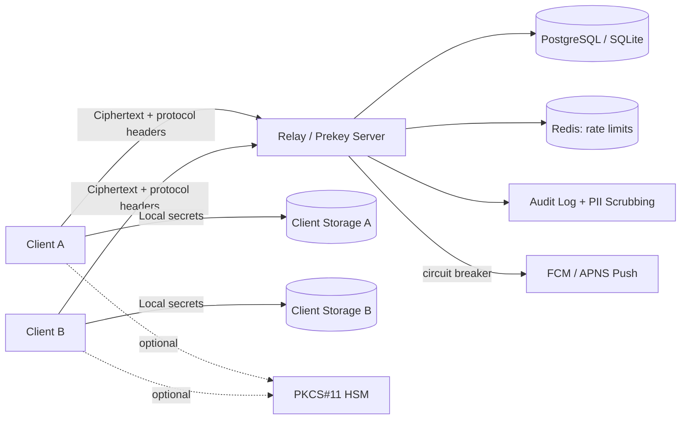

# THREAT_MODEL

## 1. Purpose

This document defines the adversary model and trust assumptions for the current prototype.

## 2. Assets

Primary assets:

1. client identity private keys,
2. signed/one-time prekey private material,
3. ratchet state (root, chain, skipped keys),
4. ciphertext payloads and protocol metadata,
5. directory bindings between `user_id` and identity keys.

## 3. Adversary Classes

- passive network observer,
- active network manipulator,
- compromised or malicious relay/directory server,
- replay/tamper adversary,
- endpoint compromise adversary.

## 4. Trust Boundaries

The server is explicitly not trusted with plaintext.

## 5. Explicit Threats and Controls

| Threat | Control |
|---|---|
| Identity takeover via re-registration | Immutable `user_id` identity binding (`409` on mutation) |
| Unauthorized identity key rotation | Challenge-confirm rotation signed by both current and new identity keys |
| Unauthorized prekey publication | Ed25519 signature verification on uploaded `SPK`/`PQSPK` |
| Unauthenticated inbox access / relay spoofing | Signed transport auth headers (`x-pqmsg-auth-*`) with device binding and nonce replay checks |
| Silent peer key substitution after first contact | Client-side peer identity fingerprint pinning with explicit trust prompt on key change |
| Suite/version downgrade | AD binding plus strict suite continuity checks |
| Ratchet metadata tampering (`pq_step_ct`, counters) | Ratchet header fields included in AEAD associated data |
| Parser-driven DoS | Strict TLV decode, critical-tag rejection, fuzz targets |
| Secret retention in memory | `zeroize` and zeroizing containers for keying material; explicit `Drop` implementations on all secret-bearing structs |
| Secret leakage from local state files | Encrypted-at-rest key/session persistence in CLI and Android client stores |
| Sealed sender anonymous abuse | IP-based rate limiting via `X-Forwarded-For`/`X-Real-IP` alongside per-recipient rate limiting |
| Push provider outage cascade | Circuit-breaker pattern on FCM/APNS dispatch; emits security audit events on circuit open |
| PII leakage in structured logs | Runtime PII scrubbing replaces user/device IDs with SHA-256 hash prefixes in log output |
| Algorithm downgrade via FIPS bypass | `fips` feature gate restricts suite to ML-KEM-768 only; compile-time conflict with `classical-only-INSECURE` |
| Replay of captured InitialMessage | DH4 one-time prekey consumption; server marks OTPKs as used and rejects replayed `otpk_id` references |
| Quantum forgery of identity signatures | Hybrid dual-signature verification (Ed25519 + ML-DSA-65); security holds if EITHER scheme is secure |
| Call media eavesdropping | PQ key exchange before WebRTC SDP; Insertable Streams encrypt RTP payloads with `media_key` + ChaCha20-Poly1305 |
| Unauthorized call signaling | Format-string authenticated endpoints; call offer/answer/ICE/hangup require Ed25519 signature |

## 6. Residual Risk

Residual risk remains substantial in:

- endpoint malware compromise,
- replay policy beyond current minimal semantics,
- global traffic analysis and social-graph extraction,
- trust-on-first-use UX and large-scale key lifecycle management.

## 7. Transport Security Assumption

Plain HTTP transport is accepted only for local demonstration environments.  
Operational deployments MUST use TLS and SHOULD implement certificate pinning to reduce key-directory substitution risk.
