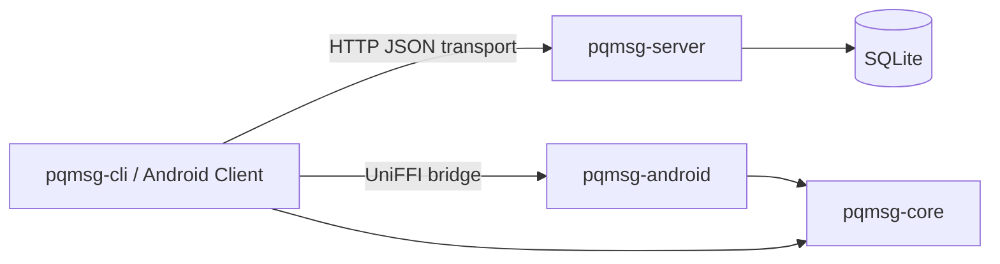
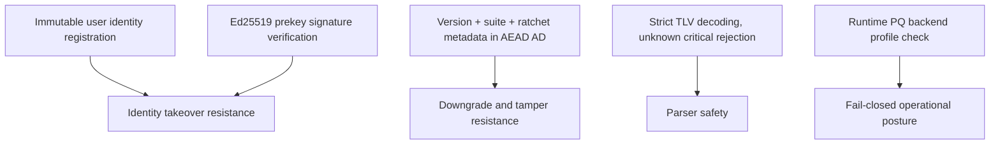

# Post-Quantum Messaging Prototype

## Abstract

This repository presents a research-grade prototype for hybrid post-quantum asynchronous messaging.  
The design composes X25519-based classical Diffie-Hellman with ML-KEM-family encapsulation in a PQXDH-style initiation path, followed by a minimal ratcheting channel.

The implementation objective is not product completeness; it is security-measurable protocol engineering with reproducible tests, strict parsers, and explicit failure modes.

## Research Positioning

The project is best interpreted as a:

**Hybrid Post-Quantum Messaging Protocol Prototype with Security Verification Harness**

The strongest contributions are:

- explicit protocol specification and wire framing,
- deterministic KAT coverage for handshake transcripts,
- strict TLV/wire parsing behavior and fuzz targets,
- hybrid handshake and ratchet state model suitable for further formalization.

## System Architecture



## Security-Critical Design Decisions



- Server registration is identity-immutable after first successful bind.
- Server prekey uploads require valid Ed25519 signatures under registered identity signature keys.
- Server provides authenticated identity rotation challenge/confirm endpoints and a versioned identity event log.
- Server relay/inbox/identity-log endpoints require signed request-auth headers bound to user/device identity keys.
- Session decryption enforces suite continuity and authenticates ratchet metadata, including optional `pq_step_ct`.
- Clients expose active crypto profile and fail closed when PQ backend is not available.
- Clients pin peer identity fingerprints and require explicit trust on key changes.
- CLI and Android persist key/session files encrypted at rest (CLI passphrase policy + Android keystore-backed encrypted files).

## Repository Layout

| Path | Role |
|---|---|
| `crates/pqmsg-core` | Cryptographic primitives, handshake, TLV, wire format, ratchet/session state |
| `crates/pqmsg-server` | Prekey publication and opaque ciphertext relay service |
| `crates/pqmsg-cli` | Local operator workflow (keygen, register, publish, send, poll) |
| `crates/pqmsg-android` | UniFFI-facing Rust bridge for Android clients |
| `mobile/android` | Minimal Kotlin demo UI and transport layer |
| `docs` | Normative and security documentation corpus |

## Build and Verification

```powershell
cargo fmt --all --check
cargo clippy --workspace --all-targets -- -D warnings
cargo test --workspace
```

### Security Profile Runtime Controls

`pqmsg-core` now enforces profile-aware runtime checks:

- `research`: allows local HTTP demo workflows,
- `high_assurance`: requires PQ backend and HTTPS transport in clients,
- `nss_aligned`: stricter suite allowlist plus high-assurance requirements.

CLI default profile is `high-assurance`.  
For local demo-only runs over HTTP, pass `--security-profile research`.

For non-research profiles, local CLI key/session files should be accessed with:

```powershell
--state-passphrase "<strong-passphrase>"
```

Legacy plaintext local files are blocked unless explicitly allowed with `--allow-plaintext-state`.

### PQ Backend Build (required for high-assurance/NSS runs)

```powershell
cargo run -p pqmsg-cli --features pqmsg-core/pq-oqs -- --help
```

The CLI performs an active runtime profile check and aborts when the PQ backend is not enabled.
`pqmsg-android` now fails closed if `pq-oqs` is not available.

## 15-Minute Quickstart (Windows + Android Emulator)

1. Start the relay server in one terminal:

```powershell
$env:PQMSG_DATABASE_URL='sqlite://./pqmsg-server.db?mode=rwc'
$env:PQMSG_BIND='127.0.0.1:3000'
$env:PQMSG_SECURITY_PROFILE='research'
cargo run -p pqmsg-server
```

2. Build Android Rust bridge and APK from repository root:

```powershell
cargo build -p pqmsg-android --features pqmsg-core/pq-oqs
cargo run -p pqmsg-android --bin uniffi-bindgen -- generate --library target/debug/pqmsg_android.dll --language kotlin --out-dir mobile/android/app/build/generated/uniffi/kotlin
cargo ndk -t arm64-v8a -t armeabi-v7a -t x86_64 -o mobile/android/app/src/main/jniLibs build -p pqmsg-android --release --features pqmsg-core/pq-oqs
cd mobile/android
.\gradlew.bat :app:assembleDebug
```

3. In Android Studio:

- open `mobile/android`,
- run configuration `app`,
- launch two emulators for Alice and Bob.

4. On each emulator Setup screen:

- use preset button (`Alice` or `Bob`),
- keep server URL as `http://10.0.2.2:3000`,
- execute steps in order:
  `Generate Identity Keys` -> `Register User` -> `Publish Prekeys` -> `Verify Server` -> `Open Chat`.

5. In Chat screen:

- Alice fetches Bob bundle and sends message,
- Bob polls inbox and decrypts.

## Production Transport Note

The Android emulator endpoint pattern (`http://10.0.2.2:...`) is demonstration-only.  
Operational deployment requires TLS and should include certificate pinning.  
Set `PQMSG_SECURITY_PROFILE=high_assurance` (or `nss_aligned`) with `PQMSG_TLS_CERT_PATH` and `PQMSG_TLS_KEY_PATH` on the server.

## Documentation Index

- [SPEC](docs/SPEC.md)
- [THREAT_MODEL](docs/THREAT_MODEL.md)
- [WIRE_FORMAT](docs/WIRE_FORMAT.md)
- [CRYPTO_AGILITY](docs/CRYPTO_AGILITY.md)
- [API](docs/API.md)
- [SECURITY_GATES](docs/SECURITY_GATES.md)
- [ANDROID](docs/ANDROID.md)
