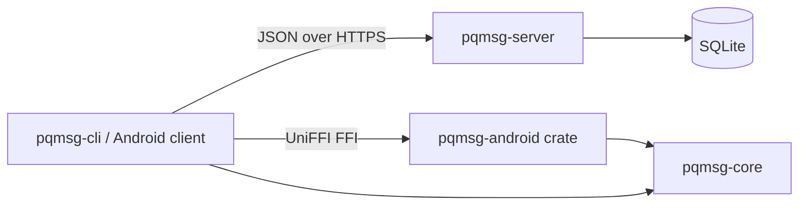
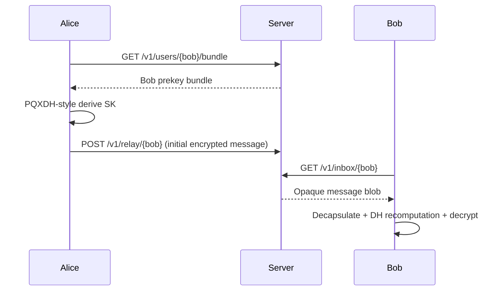

# Post-Quantum Messaging Prototype

## Abstract

This repository contains a research-oriented prototype of a hybrid post-quantum secure messaging stack.  
The design combines classical elliptic-curve Diffie-Hellman and lattice-based key encapsulation to support migration toward post-quantum confidentiality while preserving practical deployability.

The implementation is intentionally minimal and emphasizes:

- explicit protocol structure,
- strict parsing of untrusted inputs,
- testability and reproducibility,
- security gate documentation.

## System Architecture



## Repository Layout

| Path | Role |
|---|---|
| `crates/pqmsg-core` | Cryptographic primitives, handshake, TLV, wire format, ratchet/session logic |
| `crates/pqmsg-server` | Prekey publication service and opaque ciphertext relay |
| `crates/pqmsg-cli` | Developer utility for registration, prekey publication, send/poll workflows |
| `crates/pqmsg-android` | UniFFI bridge exposing Rust cryptographic/session APIs to Android |
| `mobile/android` | Demonstration Android application (Setup and Chat views) |
| `docs` | Protocol, wire, threat model, API, agility, and security gate documentation |

## Protocol Flow (High-Level)



## Cryptographic Baseline

- KEM: ML-KEM-768 (Kyber768 alias supported for compatibility paths)
- DH: X25519
- KDF: HKDF-SHA256
- AEAD: ChaCha20Poly1305
- Demo bundle signatures: abstracted interface, demo verifier in client flows

## Research Positioning

This codebase is a prototype and not a production Signal replacement.  
The focus is protocol clarity, downgrade resistance primitives, parser hardening, and test infrastructure (unit tests, KAT, and fuzz harnesses).

## Build and Test

```powershell
cargo fmt --all --check
cargo clippy --workspace --all-targets -- -D warnings
cargo test --workspace
```

## Documentation Index

- [SPEC](docs/SPEC.md)
- [THREAT_MODEL](docs/THREAT_MODEL.md)
- [WIRE_FORMAT](docs/WIRE_FORMAT.md)
- [CRYPTO_AGILITY](docs/CRYPTO_AGILITY.md)
- [API](docs/API.md)
- [SECURITY_GATES](docs/SECURITY_GATES.md)
- [ANDROID](docs/ANDROID.md)
