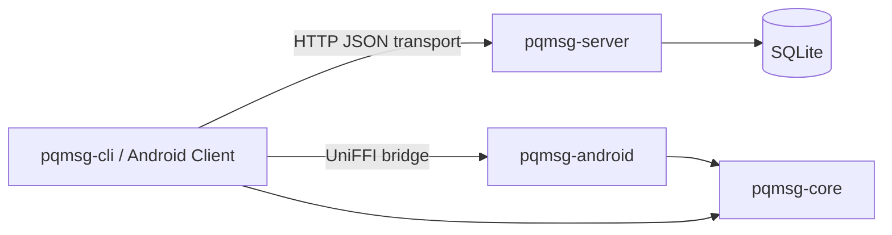
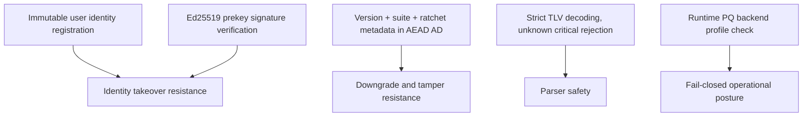

# Post-Quantum Messaging Prototype

## Abstract

This repository presents a research-grade prototype for hybrid post-quantum asynchronous messaging.  
The design composes X25519-based classical Diffie-Hellman with ML-KEM-family encapsulation in a PQXDH-style initiation path, followed by a minimal ratcheting channel.

The implementation objective is not product completeness; it is security-measurable protocol engineering with reproducible tests, strict parsers, and explicit failure modes.

## Research Positioning

The project is best interpreted as a:

**Hybrid Post-Quantum Messaging Protocol Prototype with Security Verification Harness**

The strongest contributions are:

- explicit protocol specification and wire framing,
- deterministic KAT coverage for handshake transcripts,
- strict TLV/wire parsing behavior and fuzz targets,
- hybrid handshake and ratchet state model suitable for further formalization.

## System Architecture



## Security-Critical Design Decisions



- Server registration is identity-immutable after first successful bind.
- Server prekey uploads require valid Ed25519 signatures under registered identity signature keys.
- Session decryption enforces suite continuity and authenticates ratchet metadata, including optional `pq_step_ct`.
- Clients expose active crypto profile and fail closed when PQ backend is not available.

## Repository Layout

| Path | Role |
|---|---|
| `crates/pqmsg-core` | Cryptographic primitives, handshake, TLV, wire format, ratchet/session state |
| `crates/pqmsg-server` | Prekey publication and opaque ciphertext relay service |
| `crates/pqmsg-cli` | Local operator workflow (keygen, register, publish, send, poll) |
| `crates/pqmsg-android` | UniFFI-facing Rust bridge for Android clients |
| `mobile/android` | Minimal Kotlin demo UI and transport layer |
| `docs` | Normative and security documentation corpus |

## Build and Verification

```powershell
cargo fmt --all --check
cargo clippy --workspace --all-targets -- -D warnings
cargo test --workspace
```

### PQ Backend Build (recommended for operational runs)

```powershell
cargo run -p pqmsg-cli --features pqmsg-core/pq-oqs -- --help
```

The CLI performs an active runtime profile check and aborts when the PQ backend is not enabled.

## Production Transport Note

The Android emulator endpoint pattern (`http://10.0.2.2:...`) is demonstration-only.  
Operational deployment requires TLS and should include certificate pinning.

## Documentation Index

- [SPEC](docs/SPEC.md)
- [THREAT_MODEL](docs/THREAT_MODEL.md)
- [WIRE_FORMAT](docs/WIRE_FORMAT.md)
- [CRYPTO_AGILITY](docs/CRYPTO_AGILITY.md)
- [API](docs/API.md)
- [SECURITY_GATES](docs/SECURITY_GATES.md)
- [ANDROID](docs/ANDROID.md)
