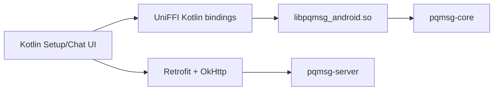

# ANDROID

## 1. Objective

This document defines a reproducible Android demonstration workflow in which transport remains Kotlin-native while cryptographic operations are executed in Rust via UniFFI.

## 2. Architecture



## 3. Rust FFI Surface

The Rust bridge exports functions for:

- identity and prekey generation,
- prekey payload construction,
- bundle parsing,
- handshake/session creation,
- message encryption/decryption,
- active crypto profile inspection (`active_crypto_profile`, `require_pq_backend_enabled`).

## 4. Prerequisites

- Android Studio (SDK 34 tooling),
- Android NDK installed from SDK manager,
- Rust toolchain,
- `cargo-ndk`,
- Gradle wrapper from `mobile/android`.

## 5. Environment Setup (PowerShell)

```powershell
$env:ANDROID_HOME="$env:LOCALAPPDATA\Android\Sdk"
$env:ANDROID_NDK_HOME=(Get-ChildItem "$env:ANDROID_HOME\ndk" | Sort-Object Name -Descending | Select-Object -First 1).FullName
rustup target add aarch64-linux-android armv7-linux-androideabi x86_64-linux-android
cargo install cargo-ndk
```

## 6. Build Commands

From repository root:

```powershell
cargo build -p pqmsg-android --features pqmsg-core/pq-oqs
cargo run -p pqmsg-android --bin uniffi-bindgen -- generate --library target/debug/pqmsg_android.dll --language kotlin --out-dir mobile/android/app/build/generated/uniffi/kotlin
cargo ndk -t arm64-v8a -t armeabi-v7a -t x86_64 -o mobile/android/app/src/main/jniLibs build -p pqmsg-android --release --features pqmsg-core/pq-oqs
```

Expected shared objects:

- `mobile/android/app/src/main/jniLibs/arm64-v8a/libpqmsg_android.so`
- `mobile/android/app/src/main/jniLibs/armeabi-v7a/libpqmsg_android.so`
- `mobile/android/app/src/main/jniLibs/x86_64/libpqmsg_android.so`

## 7. Build APK

From `mobile/android`:

```powershell
.\gradlew.bat assembleDebug
```

APK output:

- `mobile/android/app/build/outputs/apk/debug/app-debug.apk`

## 8. Emulator Demonstration

1. Start server: `cargo run -p pqmsg-server`
2. Launch two emulators (Alice, Bob).
3. On each client: generate keys, register, publish prekeys.
4. Alice fetches Bob bundle and sends encrypted message.
5. Bob polls inbox and decrypts.

## 9. Transport Security Requirement

The emulator URL form `http://10.0.2.2:...` is strictly demo-only.  
Operational deployments MUST use HTTPS and SHOULD enforce certificate pinning in OkHttp.
