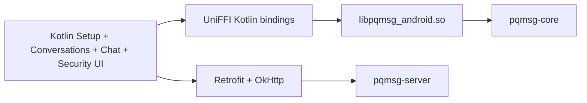
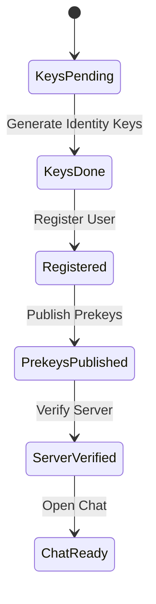
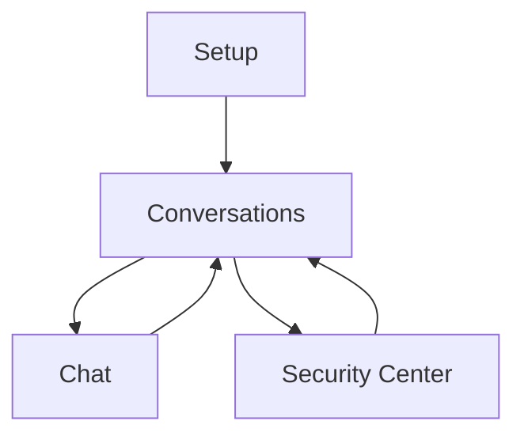
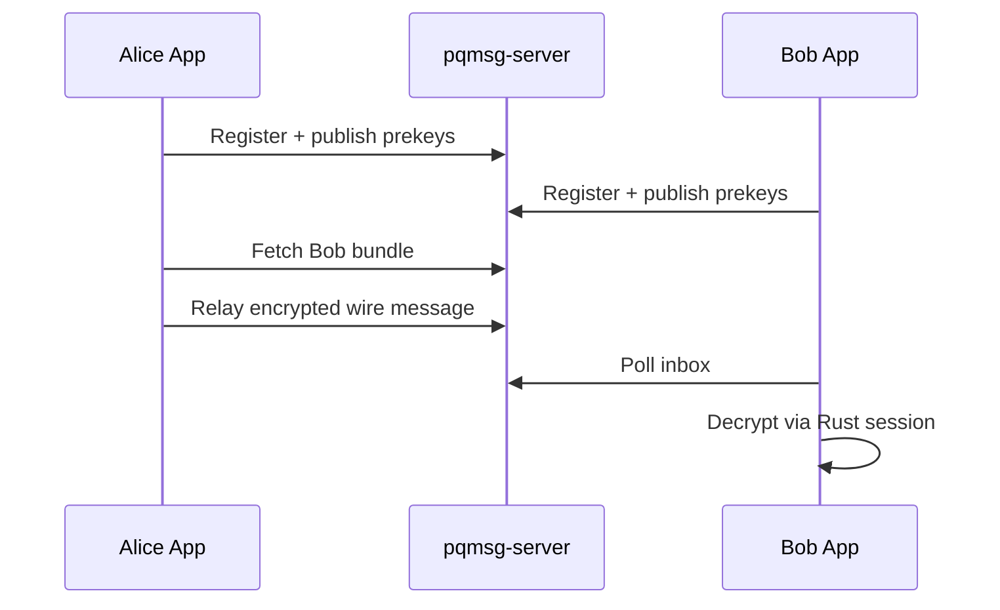

# ANDROID

## 1. Objective

This document specifies a reproducible Android demonstration workflow for the PQ messaging prototype, with a first-run target of under 15 minutes for a fresh Windows + emulator environment.

Current beta scope: Android private beta is messaging only. Voice and video calling remain out of scope for this release and are not part of the acceptance criteria below.

## 2. Architecture



## 3. Guided Setup State Model



The Android Setup screen enforces the ordering above and persists progress per user id.

## 3.2 Runtime Navigation Model



The Conversations screen now acts as the runtime hub after provisioning is complete.
The Chat screen is intentionally limited to messaging actions for the current beta cycle.

## 3.3 Security Enforcement in Client

- first-seen peer identity fingerprints are pinned locally,
- detected peer identity key changes trigger explicit user confirmation before send,
- HTTP transport is allowed only for local emulator/demo hosts in debug mode,
- HTTPS transport requires certificate pinning configured via `BuildConfig.TLS_PIN_SHA256`,
- relay and inbox requests include Ed25519-signed auth headers generated from local identity signing keys,
- inbox processing enforces per-peer monotonic transport message IDs and local seen-ciphertext replay rejection,
- chat send/poll flows perform authenticated prekey-inventory checks and auto-replenish one-time prekeys when inventory is low,
- optional push-token registration uses Ed25519-signed auth headers and binds token updates to the authenticated user/device pair,
- local key/session files are persisted through Android keystore-backed encrypted file storage,
- local setup, progress, cursor, identity-pin, and conversation metadata are persisted through encrypted shared preferences with lazy migration from legacy plaintext preferences,
- the Security Center can list linked devices, link a new device id, and revoke non-current linked devices with authenticated request headers,
- the Security Center can load the authenticated identity event log and rotate the current account identity to a fresh keypair/device id using the server challenge-confirm flow, then republish prekeys and reset local provisioning state for the new identity version,
- the Security Center can prepare a secondary-device onboarding package by linking a target device id, rebasing device-local prekeys while preserving the account identity keys, encrypting the package with a user-supplied passphrase, and copying it to the clipboard for transfer,
- the Setup screen can paste and import a secondary-device onboarding package, decrypt it locally, publish fresh prekeys for the linked device automatically, and mark the adopted device as provisioned without re-registering the user,
- the Security Center exposes a destructive reset action that first retires the authenticated current device on the server when keys are still present, then purges per-user keys, sessions, pins, cursors, and conversation metadata after confirmation,
- optional media attachments are encapsulated in the encrypted payload path and remain opaque to the server.

## 3.4 Calling Scope

Calling is not part of the Android messaging beta:

- the main Chat screen no longer exposes call entry points,
- beta validation covers onboarding, direct chat, groups, contacts, presence, typing, inbox sync, and receipts,
- any existing calling code should be treated as experimental signaling work, not a supported release surface.

## 4. Prerequisites

- Android Studio with SDK 34 tooling,
- Android SDK Platform-Tools,
- Android NDK installed from SDK manager,
- Rust toolchain,
- `cargo-ndk`.

For high-assurance deployment testing, configure `TLS_PIN_SHA256` in `mobile/android/app/build.gradle.kts` and use an HTTPS server endpoint.

## 5. Environment Setup (PowerShell)

```powershell
$env:ANDROID_HOME="$env:LOCALAPPDATA\Android\Sdk"
$env:ANDROID_NDK_HOME=(Get-ChildItem "$env:ANDROID_HOME\ndk" | Sort-Object Name -Descending | Select-Object -First 1).FullName
$env:PATH="$env:ANDROID_HOME\platform-tools;$env:PATH"
rustup target add aarch64-linux-android armv7-linux-androideabi x86_64-linux-android
cargo install cargo-ndk
```

## 6. Build Commands

From repository root:

```powershell
cargo build -p pqmsg-android --features pqmsg-core/pq-oqs
cargo run -p pqmsg-android --bin uniffi-bindgen -- generate --library target/debug/pqmsg_android.dll --language kotlin --out-dir mobile/android/app/build/generated/uniffi/kotlin
cargo ndk -t arm64-v8a -t armeabi-v7a -t x86_64 -o mobile/android/app/src/main/jniLibs build -p pqmsg-android --release --features pqmsg-core/pq-oqs
```

Expected shared objects:

- `mobile/android/app/src/main/jniLibs/arm64-v8a/libpqmsg_android.so`
- `mobile/android/app/src/main/jniLibs/armeabi-v7a/libpqmsg_android.so`
- `mobile/android/app/src/main/jniLibs/x86_64/libpqmsg_android.so`

The Android Rust bridge now fails closed when PQ backend support is unavailable.

## 7. Build APK

From `mobile/android`:

```powershell
.\gradlew.bat :app:testDebugUnitTest :app:assembleDebug
```

APK output:

- `mobile/android/app/build/outputs/apk/debug/app-debug.apk`

## 8. Emulator Demonstration

1. Start server:

```powershell
$env:PQMSG_DATABASE_URL='sqlite://./pqmsg-server.db?mode=rwc'
$env:PQMSG_BIND='127.0.0.1:3000'
$env:PQMSG_SECURITY_PROFILE='research'
$env:PQMSG_FCM_SERVER_KEY='<optional-fcm-legacy-server-key>'
cargo run -p pqmsg-server
```

2. Start two emulators and run the Android app.
3. Use Setup screen presets:
- Emulator A: preset Alice.
- Emulator B: preset Bob.
4. Keep server URL as `http://10.0.2.2:3000`.
5. Execute setup in order on both devices.
6. Optionally paste an FCM token in the Setup screen before `Verify Server` to register wake-signal push routing.
7. Alice opens Conversations, selects Bob, and sends a text or media-backed encrypted message.
8. Bob opens Conversations, enters Bob chat with Alice, polls inbox, and decrypts.

## 9. End-to-End Sequence



## 10. Troubleshooting Matrix

| Symptom | Diagnosis | Resolution |
|---|---|---|
| `adb` not recognized | Platform-tools not in shell PATH | Set `ANDROID_HOME`, prepend `platform-tools`, verify with `adb version` |
| `INSTALL_FAILED_NO_MATCHING_ABIS` | Emulator ABI not covered by shipped `libpqmsg_android.so` | Build matching ABI with `cargo ndk` and reinstall APK |
| `UniFFI contract version mismatch` or checksum mismatch | Kotlin bindings and native library are out of sync | Re-run `uniffi-bindgen`, rebuild NDK libs, then clean/reinstall app |
| Server bind error `10048` | Port already in use on host | Stop existing process on `:3000` or change `PQMSG_BIND` |
| Setup requests fail from emulator | Wrong host endpoint or server unavailable | Use `http://10.0.2.2:3000`, confirm server is listening |
| SQLite open failure in server startup | Invalid or non-writable DB path | Use `sqlite://./pqmsg-server.db?mode=rwc` from repo root |

## 11. Transport Security Constraint

The emulator URL pattern (`http://10.0.2.2:...`) is strictly demonstration-only.  
Operational deployment requires HTTPS and should include certificate pinning.

## 12. Certificate Pin Rotation

Production pin rotation should follow a dual-pin overlap window:

1. compute pin for next server certificate,
2. ship client build that accepts both current and next pin,
3. rotate server certificate,
4. verify production connectivity,
5. remove old pin in subsequent client release.

Operational details are specified in [TLS_ROTATION](TLS_ROTATION.md).
