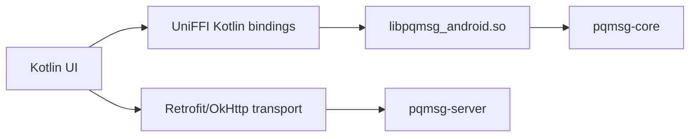

# ANDROID

## 1. Purpose

This document defines the reproducible Android build and demonstration workflow for the Rust-backed mobile prototype.

## 2. Architecture



Cryptography and session logic execute in Rust.  
The Android layer performs transport orchestration and view-state management.

## 3. Prerequisites

- Android Studio with SDK 34 components,
- Android NDK installed via SDK manager,
- Rust toolchain,
- `cargo-ndk`,
- Gradle wrapper from `mobile/android`.

## 4. Environment Setup (PowerShell)

```powershell
$env:ANDROID_HOME="$env:LOCALAPPDATA\Android\Sdk"
$env:ANDROID_NDK_HOME=(Get-ChildItem "$env:ANDROID_HOME\ndk" | Sort-Object Name -Descending | Select-Object -First 1).FullName
rustup target add aarch64-linux-android armv7-linux-androideabi x86_64-linux-android
cargo install cargo-ndk
```

## 5. Build Rust Artifacts

From repository root:

```powershell
cargo build -p pqmsg-android
cargo run -p pqmsg-android --bin uniffi-bindgen -- generate --library target/debug/pqmsg_android.dll --language kotlin --out-dir mobile/android/app/build/generated/uniffi/kotlin
cargo ndk -t arm64-v8a -t armeabi-v7a -t x86_64 -o mobile/android/app/src/main/jniLibs build -p pqmsg-android --release
```

Expected shared libraries:

- `mobile/android/app/src/main/jniLibs/arm64-v8a/libpqmsg_android.so`
- `mobile/android/app/src/main/jniLibs/armeabi-v7a/libpqmsg_android.so`
- `mobile/android/app/src/main/jniLibs/x86_64/libpqmsg_android.so`

## 6. Build APK

From `mobile/android`:

```powershell
.\gradlew.bat assembleDebug
```

Artifact:

- `mobile/android/app/build/outputs/apk/debug/app-debug.apk`

## 7. Emulator Demonstration Procedure

1. Start server: `cargo run -p pqmsg-server`
2. Open emulator A and emulator B.
3. Configure both clients with server URL `http://10.0.2.2:8080`.
4. On each device: generate keys, register user, publish prekeys.
5. In Chat view: fetch peer bundle and send encrypted message.
6. On recipient: poll inbox and verify Rust-side decryption output.

This process demonstrates Alice/Bob end-to-end encrypted exchange over the prototype relay.
