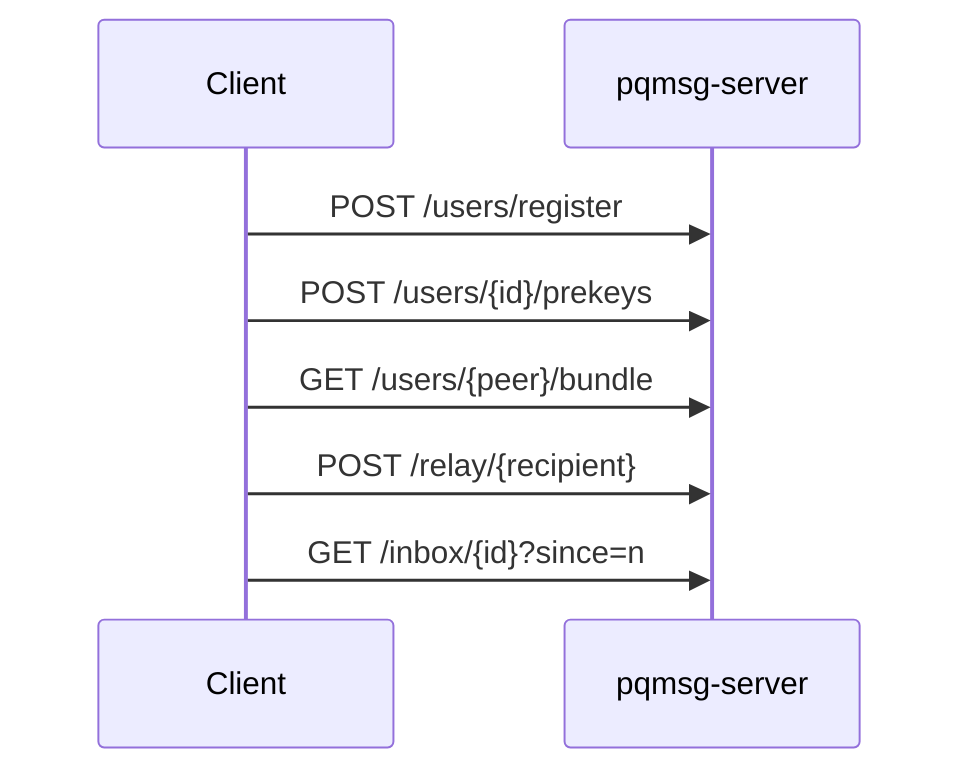

# API

## 1. Scope

This document describes the HTTP/JSON interface exposed by `pqmsg-server` under base path `/v1`.

- Content type: `application/json`
- Error type: `application/problem+json`
- Body size limit: approximately `1 MB`

## 2. Service Flow



## 3. Endpoint Definitions

### 3.1 Register User

`POST /v1/users/register`

Request body:

```json
{
  "user_id": "alice",
  "identity_x25519_pub": "base64...",
  "identity_sig_pub": "base64...",
  "device_id": "alice-device-1"
}
```

Response body:

```json
{
  "user_id": "alice",
  "device_id": "alice-device-1",
  "registered_at": "2026-03-04T12:00:00Z"
}
```

### 3.2 Publish Prekeys

`POST /v1/users/{user_id}/prekeys`

Request body:

```json
{
  "signed_prekey_x25519_pub": "base64...",
  "sig_over_spk": "base64...",
  "pq_signed_prekey_pub_mlkem768": "base64...",
  "sig_over_pqspk": "base64...",
  "one_time_prekeys_x25519": ["base64..."],
  "one_time_prekeys_mlkem768": ["base64..."]
}
```

Response body:

```json
{
  "user_id": "alice",
  "device_id": "alice-device-1",
  "uploaded_one_time_prekeys_x25519": 1,
  "uploaded_one_time_prekeys_mlkem768": 1,
  "updated_at": "2026-03-04T12:00:00Z"
}
```

### 3.3 Fetch Bundle

`GET /v1/users/{user_id}/bundle`

Response body:

```json
{
  "user_id": "alice",
  "device_id": "alice-device-1",
  "identity_x25519_pub": "base64...",
  "identity_sig_pub": "base64...",
  "signed_prekey_x25519_pub": "base64...",
  "sig_over_spk": "base64...",
  "pq_signed_prekey_pub_mlkem768": "base64...",
  "sig_over_pqspk": "base64...",
  "one_time_prekey_x25519": "base64...",
  "one_time_prekey_mlkem768": "base64...",
  "bundle_generated_at": "2026-03-04T12:00:00Z"
}
```

One-time fields may be `null` if exhausted.

### 3.4 Relay Message

`POST /v1/relay/{recipient_user_id}`

Request body:

```json
{
  "sender_user_id": "alice",
  "device_id": "alice-device-1",
  "message_bytes_base64": "base64..."
}
```

Response body:

```json
{
  "message_id": 42,
  "received_at": "2026-03-04T12:00:00Z"
}
```

### 3.5 Poll Inbox

`GET /v1/inbox/{user_id}?since=<message_id>`

Response body:

```json
{
  "user_id": "alice",
  "messages": [
    {
      "message_id": 42,
      "sender_user_id": "bob",
      "message_bytes_base64": "base64...",
      "received_at": "2026-03-04T12:00:00Z"
    }
  ]
}
```

## 4. Validation and Limits

- request body maximum: `1,048,576` bytes,
- decoded relay payload maximum: `1,000,000` bytes,
- one-time prekey list maximum: `256` entries per family,
- endpoint rate limiting via in-memory token bucket.

## 5. Error Semantics

Errors use problem JSON:

```json
{
  "type": "about:blank",
  "title": "Bad Request",
  "status": 400,
  "detail": "identity_x25519_pub decoded length must be between 32 and 32"
}
```

No plaintext message body is processed at the server beyond opaque blob validation and persistence.
