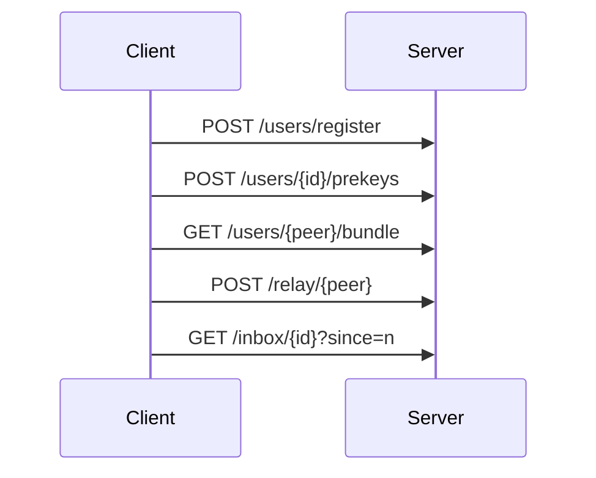
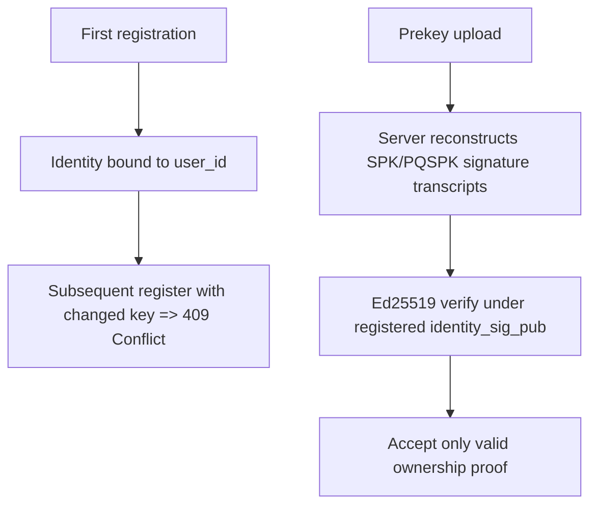

# API

## 1. Scope

This document specifies the HTTP/JSON interface for `pqmsg-server` under `/v1`.  
The service is intentionally minimal and stores only public key material plus opaque ciphertext blobs.

- Content type: `application/json`
- Error type: `application/problem+json`
- Request body limit: `1,048,576` bytes

## 2. Service Lifecycle



## 3. Identity and Prekey Security Semantics



- `user_id` identity bindings are immutable after first successful registration.
- Re-registration with changed identity material is rejected (`409 Conflict`).
- Prekey signatures are verified using Ed25519 before persistence.

## 4. Endpoint Definitions

### 4.1 Register User

`POST /v1/users/register`

Request:

```json
{
  "user_id": "alice",
  "identity_x25519_pub": "base64(32 bytes)",
  "identity_sig_pub": "base64(32-byte Ed25519 public key)",
  "device_id": "alice-device-1"
}
```

Success response:

```json
{
  "user_id": "alice",
  "device_id": "alice-device-1",
  "registered_at": "2026-03-04T12:00:00Z"
}
```

Conflict response (`identity_x25519_pub`, `identity_sig_pub`, or `device_id` changed for existing `user_id`):

```json
{
  "type": "about:blank",
  "title": "Conflict",
  "status": 409,
  "detail": "user_id is already registered with an immutable identity"
}
```

### 4.2 Publish Prekeys

`POST /v1/users/{user_id}/prekeys`

Request:

```json
{
  "signed_prekey_x25519_pub": "base64(32 bytes)",
  "sig_over_spk": "base64(64-byte Ed25519 signature)",
  "pq_signed_prekey_pub_mlkem768": "base64(variable)",
  "sig_over_pqspk": "base64(64-byte Ed25519 signature)",
  "one_time_prekeys_x25519": ["base64(32 bytes)"],
  "one_time_prekeys_mlkem768": ["base64(variable)"]
}
```

The server verifies:

1. `sig_over_spk` over protocol transcript for `SPK`,
2. `sig_over_pqspk` over protocol transcript for `PQSPK`,
3. both under registered `identity_sig_pub`.

### 4.3 Fetch Bundle

`GET /v1/users/{user_id}/bundle`

Response:

```json
{
  "user_id": "alice",
  "device_id": "alice-device-1",
  "identity_x25519_pub": "base64...",
  "identity_sig_pub": "base64...",
  "signed_prekey_x25519_pub": "base64...",
  "sig_over_spk": "base64...",
  "pq_signed_prekey_pub_mlkem768": "base64...",
  "sig_over_pqspk": "base64...",
  "one_time_prekey_x25519": "base64 or null",
  "one_time_prekey_mlkem768": "base64 or null",
  "bundle_generated_at": "2026-03-04T12:00:00Z"
}
```

### 4.4 Relay Message

`POST /v1/relay/{recipient_user_id}`

Request:

```json
{
  "sender_user_id": "alice",
  "device_id": "alice-device-1",
  "message_bytes_base64": "base64(ciphertext bytes)"
}
```

The payload is treated as opaque and persisted without server-side plaintext processing.

### 4.5 Poll Inbox

`GET /v1/inbox/{user_id}?since=<message_id>`

Response:

```json
{
  "user_id": "alice",
  "messages": [
    {
      "message_id": 42,
      "sender_user_id": "bob",
      "message_bytes_base64": "base64(...)",
      "received_at": "2026-03-04T12:00:00Z"
    }
  ]
}
```

## 5. Validation and Limits

- one-time prekey family maximum: `256` entries each,
- relay decoded blob maximum: `1,000,000` bytes,
- inbox page maximum: `200` messages,
- endpoint-level in-memory token bucket rate limiting.

## 6. Transport Requirement

Plain HTTP is acceptable only for local demonstration.  
Operational deployments must terminate TLS and should enforce certificate pinning at clients.
