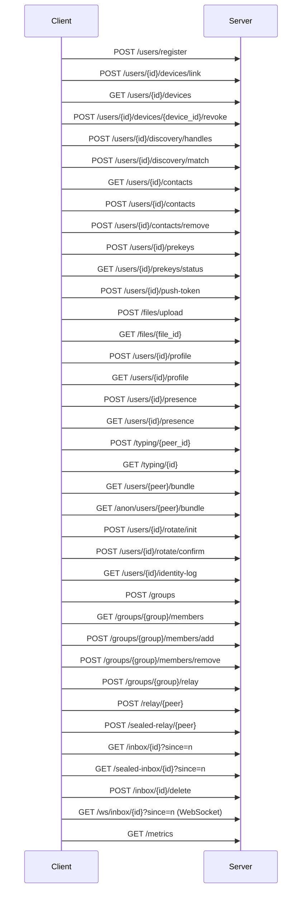
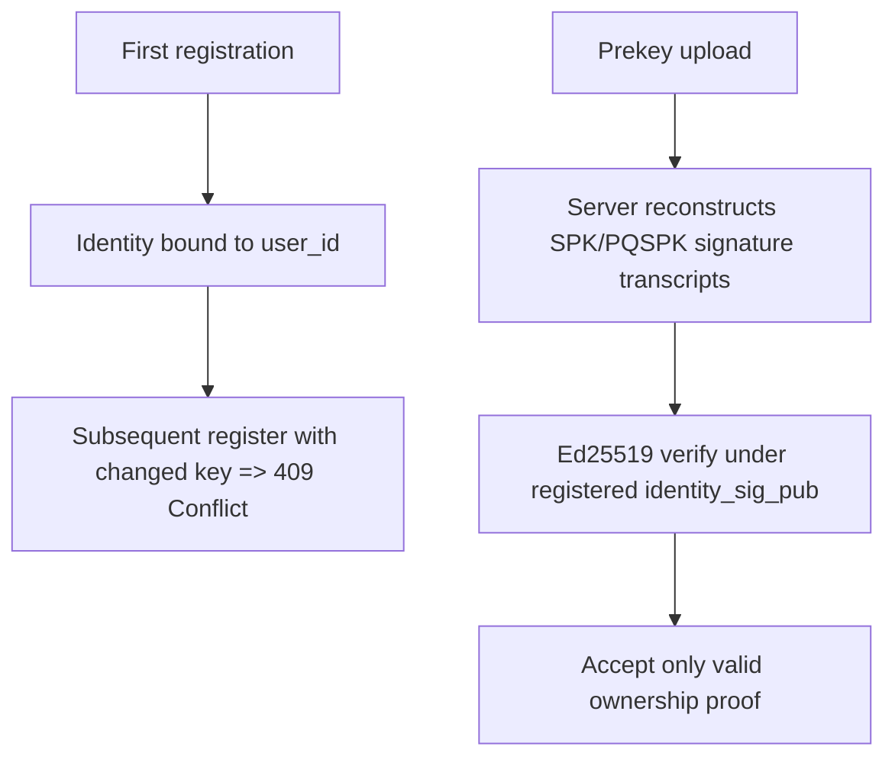

# API

## 1. Scope

This document specifies the HTTP/JSON interface for `pqmsg-server` under `/v1`.  
The service is intentionally minimal and stores only public key material plus opaque ciphertext blobs.

- Content type: `application/json`
- Error type: `application/problem+json`
- Request body limit: `1,048,576` bytes

## 2. Service Lifecycle



## 2.1 Security Profile Configuration

Server startup is controlled by environment variables:

- `PQMSG_SECURITY_PROFILE`: `research` | `high_assurance` | `nss_aligned` (default: `high_assurance`)
- `PQMSG_DATABASE_URL`: `sqlite://...` or `postgres://...`
- `PQMSG_TLS_CERT_PATH`: PEM certificate path
- `PQMSG_TLS_KEY_PATH`: PEM private key path
- `PQMSG_DB_MAX_CONNECTIONS`: pool max connections (default: `20`)
- `PQMSG_DB_MIN_CONNECTIONS`: pool min connections (default: `1`)
- `PQMSG_DB_ACQUIRE_TIMEOUT_SECS`: connection acquisition timeout seconds (default: `5`)
- `PQMSG_DB_IDLE_TIMEOUT_SECS`: idle connection timeout seconds (default: `300`)
- `PQMSG_FCM_SERVER_KEY`: optional FCM legacy server key for wake-signal dispatch
- `PQMSG_FCM_ENDPOINT`: optional override (default: `https://fcm.googleapis.com/fcm/send`)
- `PQMSG_LOG_FORMAT`: `json` (default) or `pretty`
- `PQMSG_AUDIT_LOG_PATH`: optional JSONL audit log file path
- `PQMSG_SENTRY_DSN`: optional Sentry DSN for server error telemetry
- `PQMSG_SENTRY_TRACES_SAMPLE_RATE`: optional tracing sample rate in `[0.0, 1.0]`
- `PQMSG_RATE_LIMIT_CAPACITY`: token bucket capacity (default: `60`)
- `PQMSG_RATE_LIMIT_REFILL_PER_SECOND`: token refill rate (default: `1`)
- `PQMSG_RATE_LIMIT_MAX_ENTRIES`: in-memory bucket map size (default: `20000`)
- `PQMSG_RATE_LIMIT_BUCKET_TTL_SECS`: bucket entry TTL seconds (default: `600`)
- `PQMSG_RATE_LIMIT_REDIS_URL`: optional Redis URL to enable distributed rate limiting
- `PQMSG_RATE_LIMIT_REDIS_KEY_PREFIX`: optional Redis key prefix (default: `pqmsg:ratelimit:`)
- `PQMSG_REGISTRATION_POW_BITS`: optional registration proof-of-work difficulty override
- `PQMSG_PREKEY_PUBLISH_MIN_INTERVAL_SECONDS`: optional minimum interval between prekey publishes per user/device
- `PQMSG_PREKEY_BUNDLE_RESERVE_COUNT`: optional one-time prekey reserve floor per device before returning last-resort bundle mode

In `high_assurance` and `nss_aligned`, server startup fails unless both TLS paths are provided.

## 3. Identity and Prekey Security Semantics



- `user_id` identity bindings are immutable after first successful registration.
- Re-registration with changed identity material is rejected (`409 Conflict`).
- Prekey signatures are verified using Ed25519 before persistence.

## 3.1 Authenticated Transport Headers

The following endpoints require request authentication headers:

- `GET /v1/users/{user_id}/identity-log`
- `GET /v1/users/{user_id}/prekeys/status`
- `GET /v1/users/{user_id}/devices`
- `POST /v1/users/{user_id}/discovery/handles`
- `POST /v1/users/{user_id}/discovery/match`
- `GET /v1/users/{user_id}/contacts`
- `POST /v1/users/{user_id}/contacts`
- `POST /v1/users/{user_id}/contacts/remove`
- `POST /v1/users/{user_id}/devices/link`
- `POST /v1/users/{user_id}/devices/{target_device_id}/revoke`
- `POST /v1/users/{user_id}/prekeys`
- `POST /v1/groups`
- `GET /v1/groups/{group_id}/members`
- `POST /v1/groups/{group_id}/members/add`
- `POST /v1/groups/{group_id}/members/remove`
- `POST /v1/groups/{group_id}/relay`
- `POST /v1/relay/{recipient_user_id}`
- `POST /v1/files/upload`
- `GET /v1/files/{file_id}`
- `POST /v1/users/{user_id}/profile`
- `GET /v1/users/{user_id}/profile`
- `POST /v1/users/{user_id}/presence`
- `GET /v1/users/{user_id}/presence`
- `POST /v1/typing/{peer_user_id}`
- `GET /v1/typing/{user_id}`
- `GET /v1/inbox/{user_id}`
- `GET /v1/sealed-inbox/{user_id}`
- `POST /v1/inbox/{user_id}/delete`
- `GET /v1/ws/inbox/{user_id}`
- `POST /v1/users/{user_id}/push-token`

Required headers:

- `x-pqmsg-auth-user`
- `x-pqmsg-auth-device`
- `x-pqmsg-auth-timestamp` (unix seconds)
- `x-pqmsg-auth-nonce` (single-use)
- `x-pqmsg-auth-signature` (`base64(64-byte Ed25519 signature)`)

Optional correlation header:

- `x-request-id` (if omitted, server generates one and echoes it in response headers)

The server verifies signatures under registered `identity_sig_pub`, enforces authenticated device binding against active `user_devices` records, applies timestamp skew checks, rejects nonce replay, enforces monotonic inbox cursors per authenticated `user_id` + `device_id`, and applies relay ciphertext deduplication with TTL.

## 4. Endpoint Definitions

### 4.1 Register User

`POST /v1/users/register`

Request:

```json
{
  "user_id": "alice",
  "identity_x25519_pub": "base64(32 bytes)",
  "identity_sig_pub": "base64(32-byte Ed25519 public key)",
  "device_id": "alice-device-1",
  "pow_nonce": "optional-when-pow-enabled"
}
```

When `registration_pow_bits > 0` (reported by `GET /health`), `pow_nonce` is mandatory and MUST satisfy the server proof-of-work predicate over the registration transcript.

Success response:

```json
{
  "user_id": "alice",
  "device_id": "alice-device-1",
  "registered_at": "2026-03-04T12:00:00Z"
}
```

Conflict response (`identity_x25519_pub`, `identity_sig_pub`, or `device_id` changed for existing `user_id`):

```json
{
  "type": "about:blank",
  "title": "Conflict",
  "status": 409,
  "detail": "user_id is already registered with an immutable identity"
}
```

### 4.2 Publish Prekeys

`POST /v1/users/{user_id}/prekeys`

Request:

```json
{
  "signed_prekey_x25519_pub": "base64(32 bytes)",
  "sig_over_spk": "base64(64-byte Ed25519 signature)",
  "pq_signed_prekey_pub_mlkem768": "base64(variable)",
  "sig_over_pqspk": "base64(64-byte Ed25519 signature)",
  "one_time_prekeys_x25519": ["base64(32 bytes)"],
  "one_time_prekeys_mlkem768": ["base64(variable)"]
}
```

The server verifies:

1. `sig_over_spk` over protocol transcript for `SPK`,
2. `sig_over_pqspk` over protocol transcript for `PQSPK`,
3. both under registered `identity_sig_pub`.

Success response fields also include remaining one-time prekey counts and low-inventory advisory flags.
If `prekey_publish_min_interval_seconds > 0`, repeated uploads for the same `user_id` + `device_id` inside that window are rejected with `429`.

### 4.2A Device Management

`GET /v1/users/{user_id}/devices`

Returns all linked devices with active/revoked state:

```json
{
  "user_id": "alice",
  "devices": [
    {
      "device_id": "alice-device-1",
      "active": true,
      "linked_at": "2026-03-04T12:00:00Z",
      "revoked_at": null
    }
  ]
}
```

`POST /v1/users/{user_id}/devices/link`

Request:

```json
{
  "new_device_id": "alice-device-2"
}
```

Response:

```json
{
  "user_id": "alice",
  "linked_device_id": "alice-device-2",
  "linked_at": "2026-03-04T12:10:00Z"
}
```

`POST /v1/users/{user_id}/devices/{target_device_id}/revoke`

Response:

```json
{
  "user_id": "alice",
  "revoked_device_id": "alice-device-2",
  "revoked_at": "2026-03-04T12:20:00Z"
}
```

Device-link auth signature transcript fields:

1. endpoint label (`devices-link`),
2. auth user id,
3. auth device id,
4. auth timestamp,
5. auth nonce,
6. target user id,
7. linked device id.

Device-revoke auth signature transcript fields:

1. endpoint label (`devices-revoke`),
2. auth user id,
3. auth device id,
4. auth timestamp,
5. auth nonce,
6. target user id,
7. revoked device id.

### 4.3 Prekey Inventory Status

`GET /v1/users/{user_id}/prekeys/status`

Requires authenticated transport headers (Section 3.1).

Prekeys-status auth signature transcript fields:

1. endpoint label (`prekeys-status`),
2. auth user id,
3. auth device id,
4. auth timestamp,
5. auth nonce,
6. target user id.

Response:

```json
{
  "user_id": "alice",
  "device_id": "alice-device-1",
  "remaining_one_time_prekeys_x25519": 12,
  "remaining_one_time_prekeys_mlkem768": 12,
  "low_one_time_prekeys": false,
  "minimum_recommended_one_time_prekeys": 16,
  "checked_at": "2026-03-04T12:00:00Z"
}
```

### 4.4 Fetch Bundle

`GET /v1/users/{user_id}/bundle[?device_id=<device_id>]`

If `device_id` is omitted, the server selects the earliest active linked device with published prekeys.
If `device_id` is present, the server returns a bundle only for that active device.
If one-time key inventory is at or below `prekey_bundle_reserve_count`, the server returns signed-prekey-only (last-resort) bundles to reduce exhaustion risk.

Response:

```json
{
  "user_id": "alice",
  "device_id": "alice-device-1",
  "identity_x25519_pub": "base64...",
  "identity_sig_pub": "base64...",
  "signed_prekey_x25519_pub": "base64...",
  "sig_over_spk": "base64...",
  "pq_signed_prekey_pub_mlkem768": "base64...",
  "sig_over_pqspk": "base64...",
  "one_time_prekey_x25519": "base64 or null",
  "one_time_prekey_mlkem768": "base64 or null",
  "remaining_one_time_prekeys_x25519": 11,
  "remaining_one_time_prekeys_mlkem768": 11,
  "low_one_time_prekeys": false,
  "minimum_recommended_one_time_prekeys": 16,
  "last_resort_prekey_only": false,
  "identity_key_version": 1,
  "identity_fingerprint_sha256": "hex(sha256(identity_x25519_pub))",
  "bundle_generated_at": "2026-03-04T12:00:00Z"
}
```

When `PQMSG_FCM_SERVER_KEY` is configured, relay delivery triggers an FCM wake-only push payload (`data: {"wake":"1","v":"1"}`) to registered recipient tokens.

### 4.5 Register Push Token

`POST /v1/users/{user_id}/push-token`

Requires authenticated transport headers (Section 3.1).

Request:

```json
{
  "device_id": "alice-device-1",
  "fcm_token": "fcm-registration-token"
}
```

Push-token auth signature transcript fields:

1. endpoint label (`push-token`),
2. auth user id,
3. auth device id,
4. auth timestamp,
5. auth nonce,
6. target user id,
7. device id,
8. SHA-256 hash of `fcm_token` bytes.

Response:

```json
{
  "user_id": "alice",
  "device_id": "alice-device-1",
  "provider": "fcm",
  "registered_at": "2026-03-04T12:00:00Z"
}
```

### 4.6 Initiate Identity Rotation

`POST /v1/users/{user_id}/rotate/init`

Request:

```json
{
  "new_identity_x25519_pub": "base64(32 bytes)",
  "new_identity_sig_pub": "base64(32-byte Ed25519 public key)",
  "new_device_id": "alice-device-2"
}
```

Response:

```json
{
  "user_id": "alice",
  "challenge_id": "uuid-v4",
  "challenge_nonce": "base64(32 bytes)",
  "expires_at": "2026-03-04T12:10:00Z"
}
```

### 4.7 Confirm Identity Rotation

`POST /v1/users/{user_id}/rotate/confirm`

Request:

```json
{
  "challenge_id": "uuid-v4",
  "sig_by_current_identity": "base64(64-byte Ed25519 signature)",
  "sig_by_new_identity": "base64(64-byte Ed25519 signature)"
}
```

The signatures are computed over a server-defined rotation transcript containing:

1. `user_id`,
2. `challenge_id`,
3. `challenge_nonce`,
4. `new_identity_x25519_pub`,
5. `new_identity_sig_pub`,
6. `new_device_id`.

Response:

```json
{
  "user_id": "alice",
  "identity_key_version": 2,
  "identity_fingerprint_sha256": "hex(sha256(new_identity_x25519_pub))",
  "rotated_at": "2026-03-04T12:01:00Z"
}
```

### 4.8 Identity Event Log

`GET /v1/users/{user_id}/identity-log`

Requires authenticated transport headers (Section 3.1).

Identity-log auth signature transcript fields:

1. endpoint label (`identity-log`),
2. auth user id,
3. auth device id,
4. auth timestamp,
5. auth nonce,
6. target user id.

Response:

```json
{
  "user_id": "alice",
  "events": [
    {
      "version": 2,
      "identity_x25519_pub": "base64...",
      "identity_sig_pub": "base64...",
      "device_id": "alice-device-2",
      "event_type": "rotation",
      "changed_at": "2026-03-04T12:01:00Z",
      "identity_fingerprint_sha256": "hex..."
    }
  ]
}
```

### 4.8A Discovery and Contacts

`POST /v1/users/{user_id}/discovery/handles`

Request:

```json
{
  "phone_hashes_sha256": ["hex(sha256(e164_phone))"],
  "email_hashes_sha256": ["hex(sha256(lowercase_email))"]
}
```

`POST /v1/users/{user_id}/discovery/match`

Request:

```json
{
  "hashes_sha256": ["hex(sha256(contact_handle))"]
}
```

Response:

```json
{
  "user_id": "alice",
  "matches": [
    {
      "hash_sha256": "hex...",
      "matched_user_id": "bob",
      "handle_kind": "phone"
    }
  ],
  "checked_at": "2026-03-05T12:00:00Z"
}
```

`GET /v1/users/{user_id}/contacts`

Response:

```json
{
  "user_id": "alice",
  "contacts": [
    {
      "contact_user_id": "bob",
      "alias": "Bobby",
      "verified_by_qr": true,
      "verified_fingerprint_sha256": "hex...",
      "created_at": "2026-03-05T12:00:00Z",
      "updated_at": "2026-03-05T12:00:00Z"
    }
  ]
}
```

`POST /v1/users/{user_id}/contacts`

Request:

```json
{
  "contact_user_id": "bob",
  "alias": "Bobby",
  "verified_by_qr": true,
  "verified_fingerprint_sha256": "hex(sha256(identity_x25519_pub))"
}
```

`POST /v1/users/{user_id}/contacts/remove`

Request:

```json
{
  "contact_user_id": "bob"
}
```

### 4.8B Group Membership and Fan-Out Relay

`POST /v1/groups`

Request:

```json
{
  "group_id": "alpha",
  "member_user_ids": ["bob", "carol"]
}
```

Response:

```json
{
  "group_id": "alpha",
  "owner_user_id": "alice",
  "member_count": 3,
  "created_at": "2026-03-05T12:00:00Z"
}
```

`GET /v1/groups/{group_id}/members`

Response:

```json
{
  "group_id": "alpha",
  "members": [
    {
      "user_id": "alice",
      "joined_at": "2026-03-05T12:00:00Z"
    },
    {
      "user_id": "bob",
      "joined_at": "2026-03-05T12:00:00Z"
    }
  ]
}
```

`POST /v1/groups/{group_id}/members/add`

Request:

```json
{
  "member_user_id": "carol"
}
```

`POST /v1/groups/{group_id}/members/remove`

Request:

```json
{
  "member_user_id": "bob"
}
```

`POST /v1/groups/{group_id}/relay`

Request:

```json
{
  "sender_user_id": "alice",
  "device_id": "alice-device-1",
  "message_bytes_base64": "base64(group_ciphertext_blob)"
}
```

Response:

```json
{
  "group_id": "alpha",
  "delivered_message_count": 2,
  "delivered_user_count": 2,
  "first_message_id": 81,
  "received_at": "2026-03-05T12:00:00Z"
}
```

The relay payload remains opaque to the server. Delivery fan-out is computed from active group membership and active recipient devices.

### 4.8C Sealed Sender Transport

`GET /v1/anon/users/{user_id}/bundle[?device_id=<device_id>]`

This endpoint is an anonymous bundle-fetch alias to the standard bundle endpoint and returns the same response schema as `GET /v1/users/{user_id}/bundle`.

`POST /v1/sealed-relay/{recipient_user_id}`

Request:

```json
{
  "message_bytes_base64": "base64(sealed_sender_envelope_bytes)"
}
```

Response:

```json
{
  "delivered_device_count": 2,
  "first_message_id": 101,
  "received_at": "2026-03-05T12:00:00Z"
}
```

Server behavior:

- payload remains opaque blob storage only,
- sender identity is not provided in request body or persistence schema,
- routing is recipient-only fan-out to active recipient devices.

`GET /v1/sealed-inbox/{user_id}?since=<message_id>`

Requires authenticated transport headers (Section 3.1).

Sealed-inbox auth signature transcript fields:

1. endpoint label (`sealed-inbox`),
2. auth user id,
3. auth device id,
4. auth timestamp,
5. auth nonce,
6. target user id,
7. `since` value.

Response:

```json
{
  "user_id": "bob",
  "messages": [
    {
      "message_id": 101,
      "message_bytes_base64": "base64(sealed_sender_envelope_bytes)",
      "received_at": "2026-03-05T12:00:00Z"
    }
  ]
}
```

### 4.8D Rich Media, Profiles, Presence, and Typing

`POST /v1/files/upload`

Requires authenticated transport headers (Section 3.1).

Request:

```json
{
  "recipient_user_id": "bob",
  "device_id": "alice-device-1",
  "mime_type": "application/octet-stream",
  "file_bytes_base64": "base64(opaque_encrypted_file_blob)"
}
```

Response:

```json
{
  "file_id": "f91e8bc80b4f4f149c2f2cb34b56d3dd",
  "owner_user_id": "alice",
  "recipient_user_id": "bob",
  "mime_type": "application/octet-stream",
  "byte_len": 4217,
  "uploaded_at": "2026-03-05T12:00:00Z"
}
```

File-upload auth signature transcript fields:

1. endpoint label (`files-upload`),
2. auth user id,
3. auth device id,
4. auth timestamp,
5. auth nonce,
6. recipient user id,
7. SHA-256 hash of decoded file blob bytes,
8. SHA-256 hash of MIME string.

`GET /v1/files/{file_id}`

Requires authenticated transport headers. Access is restricted to `owner_user_id` and `recipient_user_id`.

Response:

```json
{
  "file_id": "f91e8bc80b4f4f149c2f2cb34b56d3dd",
  "owner_user_id": "alice",
  "recipient_user_id": "bob",
  "mime_type": "application/octet-stream",
  "file_bytes_base64": "base64(opaque_encrypted_file_blob)",
  "uploaded_at": "2026-03-05T12:00:00Z"
}
```

`POST /v1/users/{user_id}/profile`

Requires authenticated transport headers and `auth.user_id == {user_id}`.

Request:

```json
{
  "display_name": "Alice Example",
  "avatar_mime": "image/png",
  "avatar_bytes_base64": "base64(opaque_avatar_blob)"
}
```

Both `avatar_mime` and `avatar_bytes_base64` MUST be supplied together or omitted together.

`GET /v1/users/{user_id}/profile`

Requires authenticated transport headers.

Response:

```json
{
  "user_id": "alice",
  "display_name": "Alice Example",
  "avatar_mime": "image/png",
  "avatar_bytes_base64": "base64(opaque_avatar_blob)",
  "updated_at": "2026-03-05T12:00:00Z"
}
```

`POST /v1/users/{user_id}/presence`

Requires authenticated transport headers and `auth.user_id == {user_id}`.

Request:

```json
{
  "status": "online"
}
```

Allowed status values: `offline`, `online`, `away`, `busy`.

`GET /v1/users/{user_id}/presence`

Requires authenticated transport headers.

Response:

```json
{
  "user_id": "alice",
  "status": "online",
  "active": true,
  "updated_at": "2026-03-05T12:00:00Z",
  "expires_at": "2026-03-05T12:03:00Z"
}
```

`POST /v1/typing/{peer_user_id}`

Requires authenticated transport headers.

Request:

```json
{
  "is_typing": true
}
```

`peer_user_id` MUST differ from authenticated `user_id`.

`GET /v1/typing/{user_id}`

Requires authenticated transport headers and `auth.user_id == {user_id}`.

Response:

```json
{
  "user_id": "bob",
  "typing": [
    {
      "sender_user_id": "alice",
      "sender_device_id": "alice-device-1",
      "updated_at": "2026-03-05T12:00:00Z",
      "expires_at": "2026-03-05T12:00:15Z"
    }
  ],
  "checked_at": "2026-03-05T12:00:01Z"
}
```

### 4.9 Relay Message

`POST /v1/relay/{recipient_user_id}`

Requires authenticated transport headers (Section 3.1).

Request:

```json
{
  "sender_user_id": "alice",
  "device_id": "alice-device-1",
  "message_bytes_base64": "base64(ciphertext bytes)"
}
```

The payload is treated as opaque and persisted without server-side plaintext processing.
The server computes a deduplication key over `sender_user_id || recipient_user_id || message_blob` and rejects duplicates while the relay dedup window remains active.
Relay storage and delivery are performed per active recipient device.

Relay auth signature transcript fields:

1. endpoint label (`relay`),
2. auth user id,
3. auth device id,
4. auth timestamp,
5. auth nonce,
6. recipient user id,
7. decoded relay message blob bytes.

Duplicate relay submissions within the dedup window are rejected with `409 Conflict`.

Success response:

```json
{
  "message_id": 42,
  "delivered_device_count": 2,
  "received_at": "2026-03-04T12:00:00Z"
}
```

### 4.10 Poll Inbox

`GET /v1/inbox/{user_id}?since=<message_id>`

Requires authenticated transport headers (Section 3.1).

Inbox auth signature transcript fields:

1. endpoint label (`inbox`),
2. auth user id,
3. auth device id,
4. auth timestamp,
5. auth nonce,
6. target user id,
7. `since` value.

Inbox views are device-scoped: the authenticated `x-pqmsg-auth-device` selects the recipient device mailbox.
`since` is monotonic per authenticated `(user_id, device_id)` session.  
If `since` regresses below the stored server cursor for that session, the request is rejected with `409 Conflict`.

Response:

```json
{
  "user_id": "alice",
  "messages": [
    {
      "message_id": 42,
      "sender_user_id": "bob",
      "message_bytes_base64": "base64(...)",
      "received_at": "2026-03-04T12:00:00Z"
    }
  ]
}
```

### 4.11 WebSocket Inbox

`GET /v1/ws/inbox/{user_id}?since=<message_id>`

Requires authenticated transport headers (Section 3.1) and a standard WebSocket handshake.

WebSocket auth signature transcript fields:

1. endpoint label (`ws-inbox`),
2. auth user id,
3. auth device id,
4. auth timestamp,
5. auth nonce,
6. target user id,
7. `since` value.

The same monotonic `since` rule is enforced for WebSocket session establishment per authenticated `(user_id, device_id)`.

Server messages are JSON text frames:

```json
{
  "event": "sync",
  "user_id": "bob",
  "messages": [
    {
      "message_id": 42,
      "sender_user_id": "alice",
      "message_bytes_base64": "base64(...)",
      "received_at": "2026-03-04T12:00:00Z"
    }
  ]
}
```

- `event = "sync"` carries the initial catch-up window from `since`.
- `event = "relay"` carries newly relayed ciphertexts in near real time.
- Clients should still keep HTTP polling (`GET /v1/inbox/{user_id}`) as degraded/offline fallback.

### 4.11A Delete Inbox Messages

`POST /v1/inbox/{user_id}/delete`

Requires authenticated transport headers (Section 3.1).

Request:

```json
{
  "message_ids": [41, 42],
  "delete_before_id": 100
}
```

Rules:

- At least one of `message_ids` or `delete_before_id` must be provided.
- Deletions are device-scoped to the authenticated `(user_id, device_id)` mailbox.
- `message_ids` is capped (`<= 512`) and values must be positive integers.

Inbox-delete auth signature transcript fields:

1. endpoint label (`inbox-delete`),
2. auth user id,
3. auth device id,
4. auth timestamp,
5. auth nonce,
6. target user id,
7. SHA-256 hash of sorted unique `message_ids` (`i64` big-endian encoding),
8. optional `delete_before_id` (`i64` big-endian).

Response:

```json
{
  "user_id": "alice",
  "device_id": "alice-device-1",
  "deleted_count": 2,
  "deleted_at": "2026-03-05T12:00:00Z"
}
```

### 4.12 Health

`GET /health`

Response:

```json
{
  "status": "ok",
  "security_profile": "research",
  "db_backend": "sqlite",
  "db_ready": true,
  "db_pool_size": 1,
  "db_pool_idle": 1,
  "push_enabled": false,
  "audit_logger_enabled": false,
  "rate_limiter_mode": "in_memory",
  "registration_pow_bits": 0,
  "prekey_publish_min_interval_seconds": 0,
  "prekey_bundle_reserve_count": 0
}
```

### 4.13 Prometheus Metrics

`GET /metrics`

Returns Prometheus text exposition with:

- `pqmsg_http_in_flight_requests`
- `pqmsg_http_requests_total{method,path,status}`
- `pqmsg_http_request_duration_seconds_sum{method,path,status}`
- `pqmsg_http_request_duration_seconds_count{method,path,status}`
- `pqmsg_security_events_total{event}`

## 5. Validation and Limits

- one-time prekey family maximum: `256` entries each,
- relay decoded blob maximum: `1,000,000` bytes,
- group relay decoded blob maximum: `1,000,000` bytes,
- sealed relay decoded blob maximum: `1,000,000` bytes,
- group member maximum: `512`,
- inbox page maximum: `200` messages,
- relay ciphertext dedup window: `900` seconds,
- endpoint-level token bucket rate limiting (`in_memory` or Redis-backed distributed mode),
- optional registration proof-of-work gate (`pow_nonce`) with server-reported difficulty,
- optional prekey publish cooldown per authenticated `user_id` + `device_id`,
- optional one-time prekey reserve floor to mitigate exhaustion attacks,
- per-request correlation IDs (`x-request-id`) propagated through responses and logs.

## 6. Transport Requirement

Plain HTTP is acceptable only for local demonstration.  
Operational deployments must terminate TLS and should enforce certificate pinning at clients.
