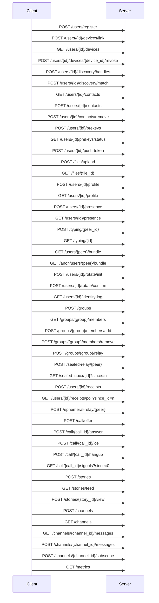
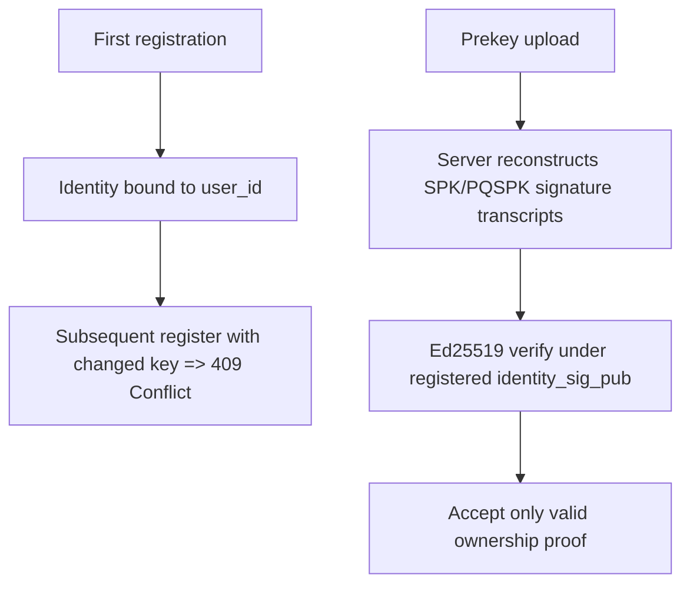

# API

## 1. Scope

This document specifies the HTTP/JSON interface for `pqmsg-server` under `/v1`.  
The service is intentionally minimal and stores only public key material plus opaque ciphertext blobs.

- Content type: `application/json`
- Error type: `application/problem+json`
- Request body limit: `1,048,576` bytes

## 2. Service Lifecycle



Not every route shown in the lifecycle/reference sections below is part of the hardened supported profile. Use `GET /v1/capabilities` as the source of truth for live support. Legacy authenticated direct messaging, presence, typing, receipts, ephemeral relay, stories, channels, and clear-roster groups remain compatibility/reference-only surfaces and are disabled on hardened deployments.

## 2.1 Security Profile Configuration

Server startup is controlled by environment variables:

- `PQMSG_SECURITY_PROFILE`: `research` | `high_assurance` | `nss_aligned` (default: `high_assurance`)
- `PQMSG_DEPLOYMENT_MODE`: `development` (default) | `pilot` | `production`
- `PQMSG_DATABASE_URL`: `sqlite://...` or `postgres://...`
- `PQMSG_SQLITE_ENCRYPTION_KEY_B64`: optional base64-encoded 32-byte raw SQLCipher key for SQLite-backed at-rest page encryption
- `PQMSG_SQLITE_MIGRATE_PLAINTEXT`: optional boolean (`true`/`false`) enabling explicit one-way plaintext SQLite to SQLCipher migration at startup when a key is configured
- `PQMSG_SQLITE_ROTATE_KEY`: optional boolean (`true`/`false`) enabling explicit SQLCipher key rotation at startup
- `PQMSG_SQLITE_ROTATE_FROM_KEY_B64`: optional base64-encoded 32-byte raw SQLCipher key for the currently active SQLite key when `PQMSG_SQLITE_ROTATE_KEY=true`; `PQMSG_SQLITE_ENCRYPTION_KEY_B64` becomes the new target key
- `PQMSG_SQLITE_CIPHER_COMPATIBILITY`: optional SQLCipher compatibility mode (`1`..`4`) applied on every SQLite connection when page encryption is enabled
- `PQMSG_SQLITE_CIPHER_PAGE_SIZE`: optional SQLCipher page size (power of two between `512` and `65536`) applied on every SQLite connection when page encryption is enabled
- `PQMSG_POSTGRES_STORAGE_ENCRYPTION`: Postgres at-rest storage declaration for hardened deployments: `managed_service`, `filesystem`, `block`, or `tde_extension`
- `PQMSG_POSTGRES_BACKUP_ENCRYPTION`: boolean attestation that Postgres backups are encrypted (`true`/`false`)
- `PQMSG_TLS_CERT_PATH`: PEM certificate path
- `PQMSG_TLS_KEY_PATH`: PEM private key path
- `PQMSG_DB_MAX_CONNECTIONS`: pool max connections (default: `20`)
- `PQMSG_DB_MIN_CONNECTIONS`: pool min connections (default: `1`)
- `PQMSG_DB_ACQUIRE_TIMEOUT_SECS`: connection acquisition timeout seconds (default: `5`)
- `PQMSG_DB_IDLE_TIMEOUT_SECS`: idle connection timeout seconds (default: `300`)
- `PQMSG_FCM_SERVER_KEY`: optional FCM legacy server key for wake-signal dispatch
- `PQMSG_FCM_ENDPOINT`: optional override (default: `https://fcm.googleapis.com/fcm/send`)
- `PQMSG_APNS_BEARER_TOKEN`: optional APNs bearer token for wake-signal dispatch
- `PQMSG_APNS_TOPIC`: optional APNs app topic/bundle identifier (required when APNs token is set)
- `PQMSG_APNS_ENDPOINT`: optional override (default: `https://api.push.apple.com`)
- `PQMSG_LOG_FORMAT`: `json` (default) or `pretty`
- `PQMSG_AUDIT_LOG_PATH`: optional JSONL audit log file path
- `PQMSG_SENTRY_DSN`: optional Sentry DSN for server error telemetry
- `PQMSG_SENTRY_TRACES_SAMPLE_RATE`: optional tracing sample rate in `[0.0, 1.0]`
- `PQMSG_RATE_LIMIT_CAPACITY`: token bucket capacity (default: `60`)
- `PQMSG_RATE_LIMIT_REFILL_PER_SECOND`: token refill rate (default: `1`)
- `PQMSG_RATE_LIMIT_MAX_ENTRIES`: in-memory bucket map size (default: `20000`)
- `PQMSG_RATE_LIMIT_BUCKET_TTL_SECS`: bucket entry TTL seconds (default: `600`)
- `PQMSG_RATE_LIMIT_REDIS_URL`: optional Redis URL to enable distributed rate limiting
- `PQMSG_RATE_LIMIT_REDIS_KEY_PREFIX`: optional Redis key prefix (default: `pqmsg:ratelimit:`)
- `PQMSG_CONTACT_DISCOVERY_SERVICE_ORIGIN`: optional dedicated private contact discovery service origin (for example `https://cdsi.example`)
- `PQMSG_REGISTRATION_POW_BITS`: optional registration proof-of-work difficulty override
- `PQMSG_PREKEY_PUBLISH_MIN_INTERVAL_SECONDS`: optional minimum interval between prekey publishes per user/device
- `PQMSG_PREKEY_BUNDLE_RESERVE_COUNT`: optional one-time prekey reserve floor per device before returning last-resort bundle mode

Notes:

- The SQLite encryption key is only used when `PQMSG_DATABASE_URL` points at SQLite.
- Existing plaintext SQLite databases now require explicit opt-in migration. If a key is configured against a legacy plaintext file, startup fails closed until `PQMSG_SQLITE_MIGRATE_PLAINTEXT=true` is set for that migration run.
- SQLCipher key rotation is explicit and offline-at-startup. Set `PQMSG_SQLITE_ROTATE_KEY=true`, provide the current key in `PQMSG_SQLITE_ROTATE_FROM_KEY_B64`, and set `PQMSG_SQLITE_ENCRYPTION_KEY_B64` to the target key. Rotation keeps the existing cipher compatibility/page-size settings; format changes still require export/migration.
- `PQMSG_DEPLOYMENT_MODE=pilot` and `production` now require an explicit Postgres at-rest encryption declaration plus encrypted backups via `PQMSG_POSTGRES_STORAGE_ENCRYPTION` and `PQMSG_POSTGRES_BACKUP_ENCRYPTION=true`.
- On Windows source builds, `pqmsg-server` defaults to the vendored-OpenSSL SQLCipher path. Install Perl plus the normal MSVC build tools; `nasm` is optional for assembly acceleration. `scripts/dev/check_sqlcipher_server_prereqs.ps1` can discover common local Perl and Visual Studio paths, and `scripts/dev/run_sqlcipher_server_tests_windows.ps1` wraps the full SQLCipher test run.

In `high_assurance` and `nss_aligned`, server startup fails unless both TLS paths are provided. In `pilot` and `production` deployment modes, startup also fails unless PostgreSQL, Redis-backed rate limiting, JSON logs, audit logging, and a PQ-enabled runtime are all active.

## 3. Identity and Prekey Security Semantics



- `user_id` identity bindings are immutable after first successful registration.
- Re-registration with changed identity material is rejected (`409 Conflict`).
- Prekey signatures are verified using Ed25519 before persistence.

## 3.1 Authenticated Transport Headers

The following endpoints require request authentication headers:

- `GET /v1/users/{user_id}/identity-log`
- `GET /v1/users/{user_id}/prekeys/status`
- `GET /v1/users/{user_id}/devices`
- `POST /v1/users/{user_id}/discovery/handles`
- `POST /v1/users/{user_id}/discovery/match`
- `POST /v1/users/{user_id}/contact-discovery/ticket`
- `GET /v1/users/{user_id}/contacts`
- `POST /v1/users/{user_id}/contacts`
- `POST /v1/users/{user_id}/contacts/remove`
- `POST /v1/users/{user_id}/devices/link`
- `POST /v1/users/{user_id}/devices/{target_device_id}/revoke`
- `POST /v1/users/{user_id}/prekeys`
- `POST /v1/groups`
- `GET /v1/groups/{group_id}/members`
- `POST /v1/groups/{group_id}/members/add`
- `POST /v1/groups/{group_id}/members/remove`
- `POST /v1/groups/{group_id}/relay`
- `POST /v1/files/upload`
- `GET /v1/files/{file_id}`
- `POST /v1/users/{user_id}/profile`
- `GET /v1/users/{user_id}/profile`
- `POST /v1/users/{user_id}/presence`
- `GET /v1/users/{user_id}/presence`
- `POST /v1/typing/{peer_user_id}`
- `GET /v1/typing/{user_id}`
- `GET /v1/sealed-inbox/{user_id}`
- `POST /v1/users/{user_id}/push-token`
- `POST /v1/call/offer`
- `POST /v1/call/{call_id}/answer`
- `POST /v1/call/{call_id}/ice`
- `POST /v1/call/{call_id}/hangup`
- `GET /v1/call/{call_id}/signals`
- `POST /v1/stories`
- `GET /v1/stories/feed`
- `POST /v1/stories/{story_id}/view`
- `POST /v1/channels`
- `GET /v1/channels`
- `GET /v1/channels/{channel_id}/messages`
- `POST /v1/channels/{channel_id}/messages`
- `POST /v1/channels/{channel_id}/subscribe`

Required headers:

- `x-pqmsg-auth-user`
- `x-pqmsg-auth-device`
- `x-pqmsg-auth-timestamp` (unix seconds)
- `x-pqmsg-auth-nonce` (single-use)
- `x-pqmsg-auth-signature` (`base64(64-byte Ed25519 signature)`)

Optional correlation header:

- `x-request-id` (if omitted, server generates one and echoes it in response headers)

The server verifies signatures under registered `identity_sig_pub`, enforces authenticated device binding against active `user_devices` records, applies timestamp skew checks, rejects nonce replay, enforces monotonic inbox cursors per authenticated `user_id` + `device_id`, and applies relay ciphertext deduplication with TTL.

Legacy authenticated direct-message endpoints (`/v1/relay`, `/v1/inbox`, `/v1/inbox/{user_id}/delete`, and `/v1/ws/inbox`) remain compatibility-only and are disabled by default on the hardened profile.

## 4. Endpoint Definitions

### 4.1 Register User

`POST /v1/users/register`

Request:

```json
{
  "user_id": "alice",
  "identity_x25519_pub": "base64(32 bytes)",
  "identity_sig_pub": "base64(32-byte Ed25519 public key)",
  "device_id": "alice-device-1",
  "pow_nonce": "optional-when-pow-enabled"
}
```

When `registration_pow_bits > 0` (reported by `GET /v1/capabilities`), `pow_nonce` is mandatory and MUST satisfy the server proof-of-work predicate over the registration transcript.

Success response:

```json
{
  "user_id": "alice",
  "device_id": "alice-device-1",
  "registered_at": "2026-03-04T12:00:00Z"
}
```

Conflict response (`identity_x25519_pub`, `identity_sig_pub`, or `device_id` changed for existing `user_id`):

```json
{
  "type": "about:blank",
  "title": "Conflict",
  "status": 409,
  "detail": "user_id is already registered with an immutable identity"
}
```

### 4.2 Publish Prekeys

`POST /v1/users/{user_id}/prekeys`

Request:

```json
{
  "signed_prekey_x25519_pub": "base64(32 bytes)",
  "sig_over_spk": "base64(64-byte Ed25519 signature)",
  "pq_signed_prekey_pub_mlkem768": "base64(variable)",
  "sig_over_pqspk": "base64(64-byte Ed25519 signature)",
  "one_time_prekeys_x25519": ["base64(32 bytes)"],
  "one_time_prekeys_mlkem768": ["base64(variable)"]
}
```

The server verifies:

1. `sig_over_spk` over protocol transcript for `SPK`,
2. `sig_over_pqspk` over protocol transcript for `PQSPK`,
3. both under registered `identity_sig_pub`.

Success response fields also include remaining one-time prekey counts and low-inventory advisory flags.
If `prekey_publish_min_interval_seconds > 0`, repeated uploads for the same `user_id` + `device_id` inside that window are rejected with `429`.

### 4.2A Device Management

`GET /v1/users/{user_id}/devices`

Returns all linked devices with active/revoked state:

```json
{
  "user_id": "alice",
  "devices": [
    {
      "device_id": "alice-device-1",
      "active": true,
      "linked_at": "2026-03-04T12:00:00Z",
      "revoked_at": null
    }
  ]
}
```

`POST /v1/users/{user_id}/devices/link`

Request:

```json
{
  "new_device_id": "alice-device-2"
}
```

Response:

```json
{
  "user_id": "alice",
  "linked_device_id": "alice-device-2",
  "linked_at": "2026-03-04T12:10:00Z"
}
```

`POST /v1/users/{user_id}/devices/current/retire`

Retires the authenticated current device, clears device-scoped relay, prekey, cursor, push-token, and presence state, and returns the remaining active device count.

Response:

```json
{
  "user_id": "alice",
  "retired_device_id": "alice-device-1",
  "retired_at": "2026-03-04T12:15:00Z",
  "remaining_active_devices": 1
}
```

`POST /v1/users/{user_id}/devices/{target_device_id}/revoke`

Response:

```json
{
  "user_id": "alice",
  "revoked_device_id": "alice-device-2",
  "revoked_at": "2026-03-04T12:20:00Z"
}
```

Device-link auth signature transcript fields:

1. endpoint label (`devices-link`),
2. auth user id,
3. auth device id,
4. auth timestamp,
5. auth nonce,
6. target user id,
7. linked device id.

Device-revoke auth signature transcript fields:

1. endpoint label (`devices-revoke`),
2. auth user id,
3. auth device id,
4. auth timestamp,
5. auth nonce,
6. target user id,
7. revoked device id.

Current-device retire auth signature transcript fields:

1. endpoint label (`devices-retire`),
2. auth user id,
3. auth device id,
4. auth timestamp,
5. auth nonce,
6. target user id,
7. revoked device id (the authenticated current device id).

### 4.3 Prekey Inventory Status

`GET /v1/users/{user_id}/prekeys/status`

Requires authenticated transport headers (Section 3.1).

Prekeys-status auth signature transcript fields:

1. endpoint label (`prekeys-status`),
2. auth user id,
3. auth device id,
4. auth timestamp,
5. auth nonce,
6. target user id.

Response:

```json
{
  "user_id": "alice",
  "device_id": "alice-device-1",
  "remaining_one_time_prekeys_x25519": 12,
  "remaining_one_time_prekeys_mlkem768": 12,
  "low_one_time_prekeys": false,
  "minimum_recommended_one_time_prekeys": 16,
  "checked_at": "2026-03-04T12:00:00Z"
}
```

### 4.4 Fetch Bundle

`GET /v1/users/{user_id}/bundle[?device_id=<device_id>]`

If `device_id` is omitted, the server selects the earliest active linked device with published prekeys.
If `device_id` is present, the server returns a bundle only for that active device.
If one-time key inventory is at or below `prekey_bundle_reserve_count`, the server returns signed-prekey-only (last-resort) bundles to reduce exhaustion risk.

Response:

```json
{
  "user_id": "alice",
  "device_id": "alice-device-1",
  "identity_x25519_pub": "base64...",
  "identity_sig_pub": "base64...",
  "signed_prekey_x25519_pub": "base64...",
  "sig_over_spk": "base64...",
  "pq_signed_prekey_pub_mlkem768": "base64...",
  "sig_over_pqspk": "base64...",
  "one_time_prekey_x25519": "base64 or null",
  "one_time_prekey_mlkem768": "base64 or null",
  "remaining_one_time_prekeys_x25519": 11,
  "remaining_one_time_prekeys_mlkem768": 11,
  "low_one_time_prekeys": false,
  "minimum_recommended_one_time_prekeys": 16,
  "last_resort_prekey_only": false,
  "identity_key_version": 1,
  "identity_fingerprint_sha256": "hex(sha256(identity_x25519_pub))",
  "bundle_generated_at": "2026-03-04T12:00:00Z"
}
```

When push provider credentials are configured, relay delivery triggers wake-only push payloads to registered recipient tokens:

- FCM (`provider="fcm"`): `data: {"wake":"1","v":"1"}`
- APNs (`provider="apns"`): `{"aps":{"content-available":1},"wake":"1","v":"1"}`

### 4.5 Register Push Token

`POST /v1/users/{user_id}/push-token`

Requires authenticated transport headers (Section 3.1).

Request:

```json
{
  "device_id": "alice-device-1",
  "provider": "apns",
  "token": "hex-apns-device-token"
}
```

Backward-compatible request shape is also accepted:

```json
{
  "device_id": "alice-device-1",
  "fcm_token": "fcm-registration-token"
}
```

If `provider` is omitted, server defaults to `fcm`.

Push-token auth signature transcript fields:

1. endpoint label (`push-token`),
2. auth user id,
3. auth device id,
4. auth timestamp,
5. auth nonce,
6. target user id,
7. device id,
8. SHA-256 hash of effective push token bytes.

Response:

```json
{
  "user_id": "alice",
  "device_id": "alice-device-1",
  "provider": "apns",
  "registered_at": "2026-03-04T12:00:00Z"
}
```

### 4.6 Initiate Identity Rotation

`POST /v1/users/{user_id}/rotate/init`

Request:

```json
{
  "new_identity_x25519_pub": "base64(32 bytes)",
  "new_identity_sig_pub": "base64(32-byte Ed25519 public key)",
  "new_device_id": "alice-device-2"
}
```

Response:

```json
{
  "user_id": "alice",
  "challenge_id": "uuid-v4",
  "challenge_nonce": "base64(32 bytes)",
  "expires_at": "2026-03-04T12:10:00Z"
}
```

### 4.7 Confirm Identity Rotation

`POST /v1/users/{user_id}/rotate/confirm`

Request:

```json
{
  "challenge_id": "uuid-v4",
  "sig_by_current_identity": "base64(64-byte Ed25519 signature)",
  "sig_by_new_identity": "base64(64-byte Ed25519 signature)"
}
```

The signatures are computed over a server-defined rotation transcript containing:

1. `user_id`,
2. `challenge_id`,
3. `challenge_nonce`,
4. `new_identity_x25519_pub`,
5. `new_identity_sig_pub`,
6. `new_device_id`.

Response:

```json
{
  "user_id": "alice",
  "identity_key_version": 2,
  "identity_fingerprint_sha256": "hex(sha256(new_identity_x25519_pub))",
  "rotated_at": "2026-03-04T12:01:00Z"
}
```

### 4.8 Identity Event Log

`GET /v1/users/{user_id}/identity-log`

Requires authenticated transport headers (Section 3.1).

Identity-log auth signature transcript fields:

1. endpoint label (`identity-log`),
2. auth user id,
3. auth device id,
4. auth timestamp,
5. auth nonce,
6. target user id.

Response:

```json
{
  "user_id": "alice",
  "events": [
    {
      "version": 2,
      "identity_x25519_pub": "base64...",
      "identity_sig_pub": "base64...",
      "device_id": "alice-device-2",
      "event_type": "rotation",
      "changed_at": "2026-03-04T12:01:00Z",
      "identity_fingerprint_sha256": "hex..."
    }
  ]
}
```

### 4.8A Discovery and Contacts

`POST /v1/users/{user_id}/discovery/handles`

Compatibility-only raw-hash route on the main app server. It remains disabled in the privacy-hardened profile; supported clients use the separate discovery service flow described below instead.

Request:

```json
{
  "phone_hashes_sha256": ["hex(sha256(e164_phone))"],
  "email_hashes_sha256": ["hex(sha256(lowercase_email))"]
}
```

`POST /v1/users/{user_id}/discovery/match`

Compatibility-only raw-hash route on the main app server. It remains disabled in the privacy-hardened profile; supported clients use the separate discovery service flow described below instead.

Request:

```json
{
  "hashes_sha256": ["hex(sha256(contact_handle))"]
}
```

Response:

```json
{
  "user_id": "alice",
  "matches": [
    {
      "hash_sha256": "hex...",
      "matched_user_id": "bob",
      "handle_kind": "phone"
    }
  ],
  "checked_at": "2026-03-05T12:00:00Z"
}
```

`GET /v1/users/{user_id}/contacts`

Response:

```json
{
  "user_id": "alice",
  "contacts": [
    {
      "contact_user_id": "bob",
      "username": "bob.secure",
      "alias": "Bobby",
      "verified_by_qr": true,
      "verified_fingerprint_sha256": "hex...",
      "created_at": "2026-03-05T12:00:00Z",
      "updated_at": "2026-03-05T12:00:00Z"
    }
  ]
}
```

`username` is optional and, when present, is the contact's shareable server-local `@username` without the leading `@`.

`POST /v1/users/{user_id}/contacts`

Request:

```json
{
  "contact_user_id": "bob",
  "alias": "Bobby",
  "verified_by_qr": true,
  "verified_fingerprint_sha256": "hex(sha256(identity_x25519_pub))"
}
```

`POST /v1/users/{user_id}/contacts/remove`

Request:

```json
{
  "contact_user_id": "bob"
}
```

`POST /v1/users/{user_id}/contact-invites`

Authenticated request with no body. Returns a single active opaque invite token for the user.

Response:

```json
{
  "user_id": "alice",
  "invite_token": "4d7f8d1c7f2042d9b2f7e98c6d3f0a12",
  "expires_at": "2026-03-26T12:00:00Z"
}
```

`POST /v1/users/{user_id}/contact-discovery/ticket`

Authenticated request with a required purpose body. This does not enable raw-hash discovery on the app server. Instead, when `contact_discovery_mode` is `private_service`, it mints a short-lived opaque ticket for a separate private discovery service. The signed ticket now also carries the app-server-pinned `manifest_contract_sha256`, a dedicated opaque bootstrap invite token for discovery matches, a per-ticket nonce, and a small signed operation budget, so the discovery service can reject stale/cross-contract tickets and does not need to return a stable `user_id` directly.

Request:

```json
{
  "purpose": "match"
}
```

Allowed purposes:

- `upload`: valid for `/v1/discovery/evaluate` and `/v1/discovery/handles`
- `match`: valid for `/v1/discovery/evaluate` and `/v1/discovery/match`

The signed ticket use budget is also purpose-scoped in the current preview:

- `upload`: `max_uses = 3`
- `match`: `max_uses = 2`

The separate discovery service now purges token rows once their bound bootstrap invite expires instead of keeping them indefinitely and merely filtering them during match.

Response:

```json
{
  "user_id": "alice",
  "device_id": "alice-dev-1",
  "service_origin": "https://cdsi.example",
  "ticket": "base64(json-payload).base64(ed25519-signature)",
  "ticket_nonce": "uuid-v4 string echoed from the signed payload",
  "expires_at": "2026-03-26T12:05:00Z"
}
```

`GET {contact_discovery_service_origin}/v1/manifest`

Separate discovery-service manifest. Current signed preview contract:

```json
{
  "service": "pqmsg-discovery",
  "protocol_version": 1,
  "attestation_mode": "attested_enclave_v1",
  "attestation_verifier": null,
  "enclave_measurement_hex": null,
  "attestation_pcrs_sha384": null,
  "attestation_document_format": null,
  "attestation_document_sha256": null,
  "attestation_challenge_mode": null,
  "ticket_format": "base64(json-payload).base64(ed25519-signature)",
  "ticket_issuer_ed25519_pub": "base64(32-byte Ed25519 public key)",
  "ticket_max_ttl_seconds": 300,
  "lookup_protocol": "attested_enclave_voprf_directory_v1",
  "privacy_mode": "enclave_backed_private_discovery_v1",
  "directory_backend": "attested_enclave_directory_v1",
  "host_enclave_protocol_version": 1,
  "enclave_release_id": "attested-enclave-v1",
  "match_result_format": "contact_invite_token",
  "oprf_suite": "ristretto255-sha512-v1",
  "evaluation_proof_mode": "dleq_per_element_v1",
  "oprf_public_key_ristretto255": "base64(32-byte compressed ristretto point)",
  "signed_at": "2026-03-26T12:00:00Z",
  "expires_at": "2026-03-26T13:00:00Z",
  "manifest_issuer_ed25519_pub": "base64(32-byte Ed25519 public key)",
  "manifest_signature_ed25519": "base64(64-byte Ed25519 signature)"
}
```

The current supported Android and web client contract verifies both:

- `ticket_issuer_ed25519_pub` against the app-server capabilities document
- `manifest_issuer_ed25519_pub` / `manifest_signature_ed25519` against the signed manifest payload
- `contact_discovery_expected_manifest_contract_sha256` from app-server capabilities must match the locally computed stable manifest contract hash
- if the app server advertises them, `attestation_verifier`, `enclave_measurement_hex`, `attestation_pcrs_sha384`, `attestation_document_sha256`, and `contact_discovery_attestation_max_age_seconds` must also match the expected discovery-service contract
- if the manifest advertises attestation evidence, it must also advertise `attestation_challenge_mode = nonce_b64_required_v1`
- `match_result_format = contact_invite_token`
- `directory_backend = attested_enclave_directory_v1`
- `host_enclave_protocol_version = 1`
- `host_release_id = attested-host-v1`
- `enclave_release_id = attested-enclave-v1`
- `manifest_contract_sha256 = sha256(stable signed manifest contract fields)`
- `oprf_suite = ristretto255-sha512-v1`
- `evaluation_proof_mode = dleq_per_element_v1`
- `lookup_protocol = attested_enclave_voprf_directory_v1` / `privacy_mode = enclave_backed_private_discovery_v1`

If the signed manifest carries `attestation_document_sha256`, supported clients also fetch:

`GET {contact_discovery_service_origin}/v1/attestation?nonce_b64={base64(16..=64 random bytes)}`

```json
{
  "attestation_mode": "attested_enclave_v1",
  "attestation_verifier": "aws-nitro-root-v1",
  "enclave_measurement_hex": "64-hex measurement",
  "attested_pcrs_sha384": {
    "pcr0": "96-hex sha384",
    "pcr8": "96-hex sha384"
  },
  "directory_backend": "attested_enclave_directory_v1",
  "host_enclave_protocol_version": 1,
  "host_release_id": "attested-host-v1",
  "enclave_release_id": "attested-enclave-v1",
  "manifest_contract_sha256": "64-hex sha256 over the stable manifest contract",
  "attested_oprf_public_key_ristretto255": "base64(32-byte ristretto point)",
  "document_format": "opaque_b64_v1",
  "document_base64": "base64(enclave attestation document bytes)",
  "document_sha256": "64-hex sha256",
  "published_at": "2026-03-26T12:00:00Z",
  "challenge_nonce_base64": "base64(16..=64 random bytes)",
  "attestation_signature_ed25519": "base64(64-byte Ed25519 signature over the attestation payload)"
}
```

Clients verify that the returned attestation document hash matches the signed manifest and the app-server capabilities contract, that `host_release_id` matches the manifest-pinned host release, that `manifest_contract_sha256` matches the stable contract hash of the signed manifest, that `attested_oprf_public_key_ristretto255` matches the manifest-pinned blind-evaluation key, that any advertised `attested_pcrs_sha384` map matches the manifest/app-server-pinned PCR set, that `challenge_nonce_base64` matches the per-request client nonce, that `attestation_signature_ed25519` verifies under `manifest_issuer_ed25519_pub`, and reject documents older than `contact_discovery_attestation_max_age_seconds`.

`POST {contact_discovery_service_origin}/v1/discovery/evaluate`

Current separate-service blind-evaluation preview. Request:

```json
{
  "ticket": "base64(json-payload).base64(ed25519-signature)",
  "blinded_elements_base64": ["base64(32-byte compressed ristretto point)"]
}
```

Response:

```json
{
  "user_id": "alice",
  "device_id": "alice-device-1",
  "ticket_nonce": "uuid-v4 string echoed from the validated ticket",
  "manifest_contract_sha256": "64-hex sha256 over the stable signed manifest contract",
  "evaluation_proof_mode": "dleq_per_element_v1",
  "evaluated_elements_base64": ["base64(32-byte compressed ristretto point)"],
  "dleq_proofs": [
    {
      "challenge_scalar_base64": "base64(32-byte little-endian scalar)",
      "response_scalar_base64": "base64(32-byte little-endian scalar)",
      "commitment_base_base64": "base64(32-byte compressed ristretto point)",
      "commitment_blinded_base64": "base64(32-byte compressed ristretto point)"
    }
  ],
  "evaluated_at": "2026-03-26T12:02:30Z"
}
```

Supported Android and web clients now verify `dleq_proofs` against the manifest-pinned
`oprf_public_key_ristretto255` before they locally finalize evaluated elements into discovery tokens,
and they reject the response if `manifest_contract_sha256` does not match the already-verified
signed discovery manifest contract or if `ticket_nonce` does not match the exact discovery ticket
they just issued.

`POST {contact_discovery_service_origin}/v1/discovery/handles`

Current separate-service upload flow. Request:

```json
{
  "ticket": "base64(json-payload).base64(ed25519-signature)",
  "phone_tokens_sha256": ["hex(sha256(finalized_oprf_output))"],
  "email_tokens_sha256": ["hex(sha256(finalized_oprf_output))"]
}
```

Response:

```json
{
  "user_id": "alice",
  "device_id": "alice-device-1",
  "ticket_nonce": "uuid-v4 string echoed from the validated ticket",
  "manifest_contract_sha256": "64-hex sha256 over the stable signed manifest contract",
  "uploaded_phone_tokens": 1,
  "uploaded_email_tokens": 1,
  "updated_at": "2026-03-26T12:03:00Z"
}
```

`POST {contact_discovery_service_origin}/v1/discovery/match`

Current separate-service match flow. Request:

```json
{
  "ticket": "base64(json-payload).base64(ed25519-signature)",
  "tokens_sha256": ["hex(sha256(finalized_oprf_output))"]
}
```

Response:

```json
{
  "user_id": "alice",
  "ticket_nonce": "uuid-v4 string echoed from the validated ticket",
  "manifest_contract_sha256": "64-hex sha256 over the stable signed manifest contract",
  "matches": [
    {
      "token_sha256": "hex...",
      "contact_invite_token": "opaque-bootstrap-token",
      "handle_kind": "phone"
    }
  ],
  "checked_at": "2026-03-26T12:04:00Z"
}
```

Supported Android and web clients reject `handles` and `match` responses if
`manifest_contract_sha256` drifts from the signed manifest contract they already verified before
issuing the request, or if `ticket_nonce` does not match the exact discovery ticket used for that
request.

This current separate-service lookup mode is intentionally limited to `privacy_mode = "enclave_backed_private_discovery_v1"` and is not a production claim of full private contact discovery. The service no longer returns stable account IDs directly; clients resolve the returned opaque bootstrap invite through `/v1/contact-invites/{invite_token}` or `/v1/contact-invites/{invite_token}/bundle` only when the user chooses to continue. The longer-term goal remains a fuller enclave-backed discovery deployment, but the contract documented here is the narrower supported preview that Android and web currently enforce.

`GET /v1/contact-invites/{invite_token}`

Resolves an opaque invite token to the underlying user ID.

Response:

```json
{
  "invite_token": "4d7f8d1c7f2042d9b2f7e98c6d3f0a12",
  "user_id": "alice",
  "expires_at": "2026-03-26T12:00:00Z"
}
```

`GET /v1/contact-invites/{invite_token}/bundle`

Returns the current prekey bundle for an opaque invite token so invite-based bootstrap does not need to fall back to `/v1/users/{user_id}/bundle`.

Response:

```json
{
  "user_id": "alice",
  "device_id": "alice-dev-1",
  "identity_x25519_pub": "base64...",
  "identity_sig_pub": "base64...",
  "identity_pq_sig_pub": "base64...",
  "signed_prekey_x25519_pub": "base64...",
  "sig_over_spk": "base64...",
  "pq_signed_prekey_pub_mlkem768": "base64...",
  "sig_over_pqspk": "base64...",
  "pq_sig_over_spk": "base64...",
  "pq_sig_over_pqspk": "base64...",
  "one_time_prekey_x25519": "base64...",
  "one_time_prekey_mlkem768": "base64...",
  "identity_key_version": 1,
  "identity_fingerprint_sha256": "hex...",
  "bundle_generated_at": "2026-03-12T12:00:00Z"
}
```

`GET /v1/usernames/{username}`

Resolves a shareable `@username` to the underlying account `user_id`.
Returns `404` when the target account has disabled exact `@username` lookup.

Response:

```json
{
  "username": "alice.secure",
  "user_id": "alice"
}
```

`GET /v1/usernames/{username}/bundle`

Returns the current prekey bundle for a shareable `@username` so manual contact bootstrap does not need a separate username-resolution call followed by `/v1/users/{user_id}/bundle`.
Returns `404` when the target account has disabled exact `@username` lookup.

Response:

```json
{
  "user_id": "alice",
  "device_id": "alice-dev-1",
  "identity_x25519_pub": "base64...",
  "identity_sig_pub": "base64...",
  "identity_pq_sig_pub": "base64...",
  "signed_prekey_x25519_pub": "base64...",
  "sig_over_spk": "base64...",
  "pq_signed_prekey_pub_mlkem768": "base64...",
  "sig_over_pqspk": "base64...",
  "pq_sig_over_spk": "base64...",
  "pq_sig_over_pqspk": "base64...",
  "one_time_prekey_x25519": "base64...",
  "one_time_prekey_mlkem768": "base64...",
  "identity_key_version": 1,
  "identity_fingerprint_sha256": "hex...",
  "bundle_generated_at": "2026-03-12T12:00:00Z"
}
```

### 4.8B Group Membership and Fan-Out Relay

Legacy clear-roster group routes remain compatibility-only and are disabled on the hardened profile pending the opaque private-group flow.

`POST /v1/groups`

Request:

```json
{
  "group_id": "alpha",
  "member_user_ids": ["bob", "carol"]
}
```

Response:

```json
{
  "group_id": "alpha",
  "owner_user_id": "alice",
  "member_count": 3,
  "created_at": "2026-03-05T12:00:00Z"
}
```

`GET /v1/groups/{group_id}/members`

Response:

```json
{
  "group_id": "alpha",
  "members": [
    {
      "user_id": "alice",
      "joined_at": "2026-03-05T12:00:00Z"
    },
    {
      "user_id": "bob",
      "joined_at": "2026-03-05T12:00:00Z"
    }
  ]
}
```

`POST /v1/groups/{group_id}/members/add`

Request:

```json
{
  "member_user_id": "carol"
}
```

`POST /v1/groups/{group_id}/members/remove`

Request:

```json
{
  "member_user_id": "bob"
}
```

`POST /v1/groups/{group_id}/relay`

Request:

```json
{
  "sender_user_id": "alice",
  "device_id": "alice-device-1",
  "message_bytes_base64": "base64(group_ciphertext_blob)"
}
```

Response:

```json
{
  "group_id": "alpha",
  "delivered_message_count": 2,
  "delivered_user_count": 2,
  "first_message_id": 81,
  "received_at": "2026-03-05T12:00:00Z"
}
```

The relay payload remains opaque to the server. Delivery fan-out is computed from active group membership and active recipient devices.

### 4.8C Opaque Private Group State

These endpoints back the new private-group storage layer without restoring the old clear-roster API surface.

`POST /v1/private-groups/state/publish`

Request:

```json
{
  "group_id": "alpha-private",
  "epoch": 1,
  "state_commitment_sha256": "hex(sha256(encrypted_state))",
  "ciphertext_nonce_base64": "base64(12 bytes)",
  "ciphertext_base64": "base64(encrypted_group_state)",
  "ciphertext_aad_base64": "base64(optional_associated_data)",
  "authorizing_membership_handle_sha256": "hex(sha256(member_handle))",
  "authorizing_publish_key_base64": "base64(32 bytes)",
  "members": [
    {
      "membership_handle_sha256": "hex(sha256(member_handle))",
      "member_commitment_sha256": "hex(sha256(member_commitment))",
      "fetch_key_sha256": "hex(sha256(fetch_key))",
      "publish_key_sha256": "hex(sha256(publish_key))"
    }
  ]
}
```

Response:

```json
{
  "group_id": "alpha-private",
  "epoch": 1,
  "stored_member_count": 2,
  "published_at": "2026-03-23T12:00:00Z"
}
```

Rules:

- Bootstrap publish must start at `epoch = 1`.
- Later publishes must advance exactly one epoch at a time.
- The authorizing publish capability must match the latest active stored membership handle for that group.
- On successful publish, previous epoch membership handles are revoked and replaced by the submitted epoch state.

`POST /v1/private-groups/state/fetch`

Request:

```json
{
  "membership_handle_sha256": "hex(sha256(member_handle))",
  "fetch_key_base64": "base64(32 bytes)"
}
```

Response:

```json
{
  "group_id": "alpha-private",
  "epoch": 1,
  "state_commitment_sha256": "hex(sha256(encrypted_state))",
  "ciphertext_nonce_base64": "base64(12 bytes)",
  "ciphertext_base64": "base64(encrypted_group_state)",
  "ciphertext_aad_base64": "base64(optional_associated_data)",
  "published_at": "2026-03-23T12:00:00Z"
}
```

The server stores only opaque encrypted group-state blobs plus hashed membership handles and hashed fetch/publish capabilities. This is the state/authorization layer for the newer private-group flow; dedicated group-message transport is described below.

### 4.8D Opaque Private Group Invites

These endpoints distribute join material without restoring the legacy clear-roster group API.

`POST /v1/private-groups/invites`

Request:

```json
{
  "group_id": "alpha-private",
  "epoch": 1,
  "invite_commitment_sha256": "hex(sha256(invite_secret))",
  "invite_ciphertext_nonce_base64": "base64(12 bytes)",
  "invite_ciphertext_base64": "base64(opaque_encrypted_join_package)",
  "invite_ciphertext_aad_base64": "base64(optional_associated_data)",
  "authorizing_membership_handle_sha256": "hex(sha256(member_handle))",
  "authorizing_publish_key_base64": "base64(32 bytes)",
  "expires_in_seconds": 3600
}
```

Response:

```json
{
  "invite_token": "3b1f0ab8f29d4f4fb3e3b7b6c7fd7e02",
  "group_id": "alpha-private",
  "epoch": 1,
  "expires_at": "2026-03-23T13:00:00Z",
  "created_at": "2026-03-23T12:00:00Z"
}
```

`GET /v1/private-groups/invites/{invite_token}`

Response:

```json
{
  "invite_token": "3b1f0ab8f29d4f4fb3e3b7b6c7fd7e02",
  "group_id": "alpha-private",
  "epoch": 1,
  "invite_commitment_sha256": "hex(sha256(invite_secret))",
  "invite_ciphertext_nonce_base64": "base64(12 bytes)",
  "invite_ciphertext_base64": "base64(opaque_encrypted_join_package)",
  "invite_ciphertext_aad_base64": "base64(optional_associated_data)",
  "created_at": "2026-03-23T12:00:00Z",
  "expires_at": "2026-03-23T13:00:00Z"
}
```

`POST /v1/private-groups/invites/{invite_token}`

Response:

```json
{
  "invite_token": "3b1f0ab8f29d4f4fb3e3b7b6c7fd7e02",
  "consumed": true,
  "revoked_at": "2026-03-23T12:05:00Z"
}
```

Rules:

- Invite issuance is authorized by the current epoch's active publish capability.
- Invite resolution fails when the invite is expired, revoked, or tied to a stale group epoch.
- Invite consumption revokes the token so it cannot be resolved again.
- The server stores only opaque invite ciphertext plus epoch metadata; it does not interpret the join package. In `pqmsg-core`, that opaque payload is now represented by `PrivateGroupJoinPackage`.
- For shareable group links, the intended client contract is `invite_token` in the server-visible URL path and `invite_secret` in the client-held link fragment / QR payload. The server sees the token and commitment, but not the decryption secret.

### 4.8E Opaque Private Group Messages

These endpoints carry encrypted/authenticated private-group messages without restoring the legacy clear-roster `/groups` relay surface.

`POST /v1/private-groups/messages/publish`

Request:

```json
{
  "group_id": "alpha-private",
  "epoch": 2,
  "sent_at_unix_ms": 1775000000000,
  "ciphertext_nonce_base64": "base64(12 bytes)",
  "ciphertext_base64": "base64(encrypted_group_message)",
  "ciphertext_aad_base64": "base64(group_message_aad)",
  "sender_hybrid_signature_base64": "base64(hybrid_sender_signature)",
  "authorizing_membership_handle_sha256": "hex(sha256(member_handle))",
  "authorizing_fetch_key_base64": "base64(32 bytes)"
}
```

Response:

```json
{
  "message_id": 41,
  "group_id": "alpha-private",
  "epoch": 2,
  "received_at": "2026-03-26T12:00:00Z"
}
```

`POST /v1/private-groups/messages/fetch`

Request:

```json
{
  "membership_handle_sha256": "hex(sha256(member_handle))",
  "fetch_key_base64": "base64(32 bytes)",
  "since_message_id": 40
}
```

Response:

```json
{
  "group_id": "alpha-private",
  "epoch": 2,
  "messages": [
    {
      "message_id": 41,
      "group_id": "alpha-private",
      "epoch": 2,
      "sent_at_unix_ms": 1775000000000,
      "ciphertext_nonce_base64": "base64(12 bytes)",
      "ciphertext_base64": "base64(encrypted_group_message)",
      "ciphertext_aad_base64": "base64(group_message_aad)",
      "sender_hybrid_signature_base64": "base64(hybrid_sender_signature)",
      "received_at": "2026-03-26T12:00:00Z"
    }
  ],
  "fetched_at": "2026-03-26T12:00:01Z"
}
```

Rules:

- Publish is authorized by the current epoch's active membership handle plus fetch capability.
- Publish rejects stale epochs; clients must refresh opaque state before sending after a membership/epoch change.
- Publish no longer carries clear `sender_user_id`; the server authorizes the current member capability transiently and does not persist sender identifiers on stored private-group message rows.
- Fetch is authorized by the current epoch's active membership handle plus fetch capability.
- Fetch no longer returns clear `sender_user_id`; supported clients recover the sender locally by verifying the signed group envelope against the current member set.
- Message ciphertext remains opaque to the server, but the current interim transport still stores per-group message rows and still sees per-member access patterns through publish/fetch capabilities. This is better than legacy clear-roster fanout, but not yet the final lowest-metadata design.

### 4.8F Sealed Sender Transport

This is the supported direct-message transport on the hardened profile.

`GET /v1/anon/users/{user_id}/bundle[?device_id=<device_id>]`

This endpoint is an anonymous bundle-fetch alias to the standard bundle endpoint and returns the same response schema as `GET /v1/users/{user_id}/bundle`.

`POST /v1/sealed-relay/{recipient_user_id}`

Request:

```json
{
  "delivery_token": "base64(12-byte recipient delivery token)",
  "message_bytes_base64": "base64(sealed_sender_envelope_bytes)"
}
```

Response:

```json
{
  "delivered_device_count": 2,
  "first_message_id": 101,
  "received_at": "2026-03-05T12:00:00Z"
}
```

Server behavior:

- payload remains opaque blob storage only,
- request uses the recipient's delivery token instead of explicit sender identity fields,
- sender identity is not provided in request body or persistence schema,
- routing is recipient-only fan-out to active recipient devices.

Recipients obtain the delivery token from an authenticated profile read:

`GET /v1/users/{user_id}/profile`

The `display_name`, `username`, `avatar_*`, and `sealed_delivery_token` fields are only returned to the target user themself or to callers who have explicitly added that user as a contact.

`GET /v1/sealed-inbox/{user_id}?since=<message_id>`

Requires authenticated transport headers (Section 3.1).

Sealed-inbox auth signature transcript fields:

1. endpoint label (`sealed-inbox`),
2. auth user id,
3. auth device id,
4. auth timestamp,
5. auth nonce,
6. target user id,
7. `since` value.

Response:

```json
{
  "user_id": "bob",
  "messages": [
    {
      "message_id": 101,
      "message_bytes_base64": "base64(sealed_sender_envelope_bytes)",
      "received_at": "2026-03-05T12:00:00Z"
    }
  ]
}
```

### 4.8D Rich Media, Profiles, Presence, and Typing

`POST /v1/files/upload`

Requires authenticated transport headers (Section 3.1).

Request:

```json
{
  "recipient_user_id": "bob",
  "device_id": "alice-device-1",
  "mime_type": "application/octet-stream",
  "file_bytes_base64": "base64(opaque_encrypted_file_blob)"
}
```

Response:

```json
{
  "file_id": "f91e8bc80b4f4f149c2f2cb34b56d3dd",
  "owner_user_id": "alice",
  "recipient_user_id": "bob",
  "mime_type": "application/octet-stream",
  "byte_len": 4217,
  "uploaded_at": "2026-03-05T12:00:00Z"
}
```

File-upload auth signature transcript fields:

1. endpoint label (`files-upload`),
2. auth user id,
3. auth device id,
4. auth timestamp,
5. auth nonce,
6. recipient user id,
7. SHA-256 hash of decoded file blob bytes,
8. SHA-256 hash of MIME string.

`GET /v1/files/{file_id}`

Requires authenticated transport headers. Access is restricted to `owner_user_id` and `recipient_user_id`.

Response:

```json
{
  "file_id": "f91e8bc80b4f4f149c2f2cb34b56d3dd",
  "owner_user_id": "alice",
  "recipient_user_id": "bob",
  "mime_type": "application/octet-stream",
  "file_bytes_base64": "base64(opaque_encrypted_file_blob)",
  "uploaded_at": "2026-03-05T12:00:00Z"
}
```

`POST /v1/users/{user_id}/profile`

Requires authenticated transport headers and `auth.user_id == {user_id}`.

Request:

```json
{
  "display_name": "Alice Example",
  "username": "alice.secure",
  "username_lookup_enabled": true,
  "avatar_mime": "image/png",
  "avatar_bytes_base64": "base64(opaque_avatar_blob)"
}
```

`username` is optional. When present it is normalized to lowercase, must be 3..=32 characters, and is unique per server.
`username_lookup_enabled` is optional. When `true`, exact `GET /v1/usernames/{username}` lookup stays enabled. When `false`, the account keeps its shareable `@username` for manual sharing, but exact server-side username lookup and username-bundle bootstrap return `404`.

Both `avatar_mime` and `avatar_bytes_base64` MUST be supplied together or omitted together.

`GET /v1/users/{user_id}/profile`

Requires authenticated transport headers.

`display_name`, `username`, `avatar_*`, and `sealed_delivery_token` are withheld unless the caller is `{user_id}` or has explicitly added `{user_id}` as a contact.

Response:

```json
{
  "user_id": "alice",
  "display_name": "Alice Example",
  "username": "alice.secure",
  "username_lookup_enabled": true,
  "avatar_mime": "image/png",
  "avatar_bytes_base64": "base64(opaque_avatar_blob)",
  "sealed_delivery_token": "base64(12-byte recipient delivery token)",
  "updated_at": "2026-03-05T12:00:00Z"
}
```

`POST /v1/users/{user_id}/presence`

Requires authenticated transport headers and `auth.user_id == {user_id}`.

Request:

```json
{
  "status": "online"
}
```

Allowed status values: `offline`, `online`, `away`, `busy`.

`GET /v1/users/{user_id}/presence`

Requires authenticated transport headers.

Response:

```json
{
  "user_id": "alice",
  "status": "online",
  "active": true,
  "updated_at": "2026-03-05T12:00:00Z",
  "expires_at": "2026-03-05T12:03:00Z"
}
```

`POST /v1/typing/{peer_user_id}`

Requires authenticated transport headers.

Request:

```json
{
  "is_typing": true
}
```

`peer_user_id` MUST differ from authenticated `user_id`.

`GET /v1/typing/{user_id}`

Requires authenticated transport headers and `auth.user_id == {user_id}`.

Response:

```json
{
  "user_id": "bob",
  "typing": [
    {
      "sender_user_id": "alice",
      "sender_device_id": "alice-device-1",
      "updated_at": "2026-03-05T12:00:00Z",
      "expires_at": "2026-03-05T12:00:15Z"
    }
  ],
  "checked_at": "2026-03-05T12:00:01Z"
}
```

### 4.9 Legacy Authenticated Relay (Compatibility Only)

`POST /v1/relay/{recipient_user_id}`

Disabled by default. Supported Android/web clients do not use this path.

Requires authenticated transport headers (Section 3.1).

Request:

```json
{
  "sender_user_id": "alice",
  "device_id": "alice-device-1",
  "message_bytes_base64": "base64(ciphertext bytes)"
}
```

The payload is treated as opaque and persisted without server-side plaintext processing.
The server computes a deduplication key over `sender_user_id || recipient_user_id || message_blob` and rejects duplicates while the relay dedup window remains active.
Relay storage and delivery are performed per active recipient device.

Relay auth signature transcript fields:

1. endpoint label (`relay`),
2. auth user id,
3. auth device id,
4. auth timestamp,
5. auth nonce,
6. recipient user id,
7. decoded relay message blob bytes.

Duplicate relay submissions within the dedup window are rejected with `409 Conflict`.

Success response:

```json
{
  "message_id": 42,
  "delivered_device_count": 2,
  "received_at": "2026-03-04T12:00:00Z"
}
```

### 4.10 Legacy Authenticated Inbox Poll (Compatibility Only)

`GET /v1/inbox/{user_id}?since=<message_id>`

Disabled by default. Supported Android/web clients do not use this path.

Requires authenticated transport headers (Section 3.1).

Inbox auth signature transcript fields:

1. endpoint label (`inbox`),
2. auth user id,
3. auth device id,
4. auth timestamp,
5. auth nonce,
6. target user id,
7. `since` value.

Inbox views are device-scoped: the authenticated `x-pqmsg-auth-device` selects the recipient device mailbox.
`since` is monotonic per authenticated `(user_id, device_id)` session.  
If `since` regresses below the stored server cursor for that session, the request is rejected with `409 Conflict`.

Response:

```json
{
  "user_id": "alice",
  "messages": [
    {
      "message_id": 42,
      "sender_user_id": "bob",
      "message_bytes_base64": "base64(...)",
      "received_at": "2026-03-04T12:00:00Z"
    }
  ]
}
```

### 4.11 Legacy Authenticated WebSocket Inbox (Compatibility Only)

`GET /v1/ws/inbox/{user_id}?since=<message_id>`

Disabled by default. Supported Android/web clients do not use this path.

Requires authenticated transport headers (Section 3.1) and a standard WebSocket handshake.

WebSocket auth signature transcript fields:

1. endpoint label (`ws-inbox`),
2. auth user id,
3. auth device id,
4. auth timestamp,
5. auth nonce,
6. target user id,
7. `since` value.

The same monotonic `since` rule is enforced for WebSocket session establishment per authenticated `(user_id, device_id)`.

Server messages are JSON text frames:

```json
{
  "event": "sync",
  "user_id": "bob",
  "messages": [
    {
      "message_id": 42,
      "sender_user_id": "alice",
      "message_bytes_base64": "base64(...)",
      "received_at": "2026-03-04T12:00:00Z"
    }
  ]
}
```

- `event = "sync"` carries the initial catch-up window from `since`.
- `event = "relay"` carries newly relayed ciphertexts in near real time.
### 4.11A Legacy Inbox Deletion (Compatibility Only)

`POST /v1/inbox/{user_id}/delete`

Disabled by default. Supported Android/web clients do not use this path.

Requires authenticated transport headers (Section 3.1).

Request:

```json
{
  "message_ids": [41, 42],
  "delete_before_id": 100
}
```

Rules:

- At least one of `message_ids` or `delete_before_id` must be provided.
- Deletions are device-scoped to the authenticated `(user_id, device_id)` mailbox.
- `message_ids` is capped (`<= 512`) and values must be positive integers.

Inbox-delete auth signature transcript fields:

1. endpoint label (`inbox-delete`),
2. auth user id,
3. auth device id,
4. auth timestamp,
5. auth nonce,
6. target user id,
7. SHA-256 hash of sorted unique `message_ids` (`i64` big-endian encoding),
8. optional `delete_before_id` (`i64` big-endian).

Response:

```json
{
  "user_id": "alice",
  "device_id": "alice-device-1",
  "deleted_count": 2,
  "deleted_at": "2026-03-05T12:00:00Z"
}
```

### 4.12 Health

`GET /health`

Response:

```json
{
  "status": "ok",
  "security_profile": "research",
  "deployment_mode": "development",
  "db_backend": "sqlite",
  "db_ready": true,
  "db_pool_size": 1,
  "db_pool_idle": 1,
  "push_enabled": false,
  "push_providers": [],
  "audit_logger_enabled": false,
  "tls_enabled": false,
  "rate_limiter_mode": "in_memory",
  "replay_cache_mode": "in_memory",
  "realtime_mode": "in_memory",
  "supported_suite_ids": [1, 2],
  "runtime_crypto_profile": {
    "protocol_version": 1,
    "suite_id": 1,
    "kem": "MlKem768",
    "dh": "X25519",
    "kdf": "HkdfSha256",
    "aead": "ChaCha20Poly1305",
    "signature": "External",
    "pq_oqs_enabled": true,
    "fips_mode": false
  },
  "production_baseline_met": false,
  "supported_beta_clients": ["android"],
  "registration_pow_bits": 0,
  "prekey_publish_min_interval_seconds": 0,
  "prekey_bundle_reserve_count": 0,
  "pq_ratchet_interval": 1,
  "contact_discovery_supported": false,
  "contact_discovery_mode": "manual_only",
  "contact_discovery_ticket_supported": false,
  "contact_discovery_service_origin": null,
  "contact_discovery_manifest_issuer_ed25519_pub": null,
  "contact_discovery_attestation_verifier": null,
  "contact_discovery_expected_measurement_hex": null,
  "contact_discovery_expected_pcrs_sha384": null,
  "contact_discovery_attestation_document_sha256": null,
  "contact_discovery_attestation_max_age_seconds": null,
  "contact_discovery_ticket_issuer_ed25519_pub": "base64(32-byte Ed25519 public key)",
  "group_messaging_supported": false,
  "private_group_state_supported": true,
  "private_group_messaging_supported": true,
  "sealed_sender_required": true,
  "sender_certificate_supported": true,
  "key_transparency_supported": true,
  "sealed_delivery_tokens_supported": true,
  "sender_certificate_issuer_ed25519_pub": "base64(32-byte Ed25519 public key)",
  "transparency_log_issuer_ed25519_pub": "base64(32-byte Ed25519 public key)",
  "authenticated_direct_messaging_supported": false,
  "ephemeral_messaging_supported": false,
  "web_client_policy": "demo_only"
}
```

### 4.13 Capabilities

`GET /v1/capabilities`

Response:

```json
{
  "capability_schema_version": 1,
  "security_profile": "high_assurance",
  "deployment_mode": "pilot",
  "tls_required": true,
  "tls_enabled": true,
  "supported_beta_clients": ["android"],
  "supported_suite_ids": [1, 2],
  "runtime_crypto_profile": {
    "protocol_version": 1,
    "suite_id": 1,
    "kem": "MlKem768",
    "dh": "X25519",
    "kdf": "HkdfSha256",
    "aead": "ChaCha20Poly1305",
    "signature": "External",
    "pq_oqs_enabled": true,
    "fips_mode": false
  },
  "production_baseline_met": true,
  "registration_pow_bits": 18,
  "prekey_bundle_reserve_count": 2,
  "pq_ratchet_interval": 1,
  "contact_discovery_supported": false,
  "contact_discovery_mode": "manual_only",
  "contact_discovery_ticket_supported": false,
  "contact_discovery_service_origin": null,
  "contact_discovery_manifest_issuer_ed25519_pub": null,
  "contact_discovery_attestation_verifier": null,
  "contact_discovery_expected_measurement_hex": null,
  "contact_discovery_expected_pcrs_sha384": null,
  "contact_discovery_attestation_document_sha256": null,
  "contact_discovery_attestation_max_age_seconds": null,
  "contact_discovery_ticket_issuer_ed25519_pub": "base64(32-byte Ed25519 public key)",
  "group_messaging_supported": false,
  "private_group_state_supported": true,
  "private_group_messaging_supported": true,
  "sealed_sender_required": true,
  "sender_certificate_supported": true,
  "key_transparency_supported": true,
  "sealed_delivery_tokens_supported": true,
  "sender_certificate_issuer_ed25519_pub": "base64(32-byte Ed25519 public key)",
  "transparency_log_issuer_ed25519_pub": "base64(32-byte Ed25519 public key)",
  "authenticated_direct_messaging_supported": false,
  "ephemeral_messaging_supported": false,
  "web_client_policy": "demo_only"
}
```

Important capability flags:

- `contact_discovery_supported`: whether a separate private discovery service is available on the current deployment.
- `contact_discovery_mode`: `manual_only` or `private_service`.
- `contact_discovery_ticket_supported`: whether the server can mint short-lived tickets for a dedicated private discovery service.
- `contact_discovery_manifest_issuer_ed25519_pub`: Ed25519 public key clients use to verify the separate discovery service manifest.
- `contact_discovery_directory_backend`: expected private-discovery backend contract for the separate service.
- `contact_discovery_host_enclave_protocol_version`: expected host/enclave protocol version for the separate discovery service.
- `contact_discovery_host_release_id`: expected host-side release identifier for the separate discovery service. Supported clients continuity-pin it alongside the rest of the discovery contract so silent host rollbacks/upgrades fail closed.
- `contact_discovery_attestation_verifier`: attestation verifier identifier clients must match against the signed discovery manifest and attestation payload.
- `contact_discovery_expected_measurement_hex`: 64-hex enclave/build measurement clients must match against the signed discovery manifest and attestation payload.
- `contact_discovery_expected_pcrs_sha384`: optional JSON object of pinned Nitro-style PCR values (`pcr0`, `pcr1`, `pcr2`, `pcr3`, `pcr4`, `pcr8`) that clients must match against the signed discovery manifest and `/v1/attestation` payload.
- `contact_discovery_attestation_document_sha256`: 64-hex SHA-256 digest of the discovery service attestation document. Supported clients fetch `/v1/attestation`, verify the returned document hash, and continuity-pin it alongside the rest of the discovery-service contract.
- `contact_discovery_attestation_max_age_seconds`: positive freshness window for `/v1/attestation`. Supported clients reject stale attestation documents even if the hash still matches.
- `contact_discovery_ticket_issuer_ed25519_pub`: Ed25519 public key the separate discovery service must trust for ticket verification.
- `private_service` discovery now requires the full attested enclave-style contract. The app server will only advertise it when the separate service origin, signed-manifest issuer, manifest contract hash, host/enclave release ids, attestation verifier, enclave measurement, attestation document hash, and attestation freshness window are all configured together.
- Supported clients require a signed discovery manifest whose issuer matches `contact_discovery_manifest_issuer_ed25519_pub`.
- Supported Android/web clients keep a local continuity checkpoint for the discovery service contract and fail closed if the signed manifest changes `service_origin`, issuer keys, protocol fields, `host_release_id`, attestation mode, attestation verifier, enclave measurement, attestation PCR set, attestation document hash/format, or the OPRF public key on the same device.
- `group_messaging_supported`: legacy clear-roster group API. Hardened deployments report `false`.
- `private_group_state_supported`: opaque private-group state storage is available.
- `private_group_messaging_supported`: the newer opaque private-group create/join/send flows are available.
- `sealed_sender_required`: supported direct messaging must use sealed transport.
- `sender_certificate_supported`: certified sealed-sender envelopes are available.
- `sealed_delivery_tokens_supported`: sealed-relay ingress requires recipient delivery tokens.
- `supported_beta_clients`: machine-readable supported client list for the current server profile. Default hardened posture is `["android"]`; `web` is added only when the server opts into the hardened web path.
- `authenticated_direct_messaging_supported`: legacy authenticated DM compatibility surface. Hardened deployments report `false`.
- `web_client_policy`: `demo_only` blocks outbound web messaging; `interop_candidate` permits the hardened web direct/private-group path.
- `docs/SUPPORT_MATRIX.json`: canonical repo artifact for the current beta support posture; capability examples and prose docs should stay aligned with it.

### 4.14 Prometheus Metrics

`GET /metrics`

Returns Prometheus text exposition with:

- `pqmsg_http_in_flight_requests`
- `pqmsg_http_requests_total{method,path,status}`
- `pqmsg_http_request_duration_seconds_sum{method,path,status}`
- `pqmsg_http_request_duration_seconds_count{method,path,status}`
- `pqmsg_security_events_total{event}`

### 4.15 Delivery/Read Receipts

#### `POST /v1/users/{user_id}/receipts`

Send a delivery or read receipt for a message. Requires authenticated headers.

**Request body:**

```json
{
  "message_id": 42,
  "receipt_type": "delivered"
}
```

`receipt_type` must be `"delivered"` or `"read"`.

**Auth message:** `receipt:{user_id}:{device_id}:{message_id}:{receipt_type}`

**Response 200:**

```json
{
  "message_id": 42,
  "receipt_type": "delivered",
  "created_at": "2025-01-15T12:00:00+00:00"
}
```

Receipts are upserted: sending the same receipt type for the same message from the same device updates the timestamp.

#### `GET /v1/users/{user_id}/receipts/poll?since_id=0`

Poll receipts for messages that the authenticated user has sent. Returns receipts from all recipients' devices. Paginated by `since_id` (receipt row ID), max 200 per page.

**Auth message:** `get-receipts:{user_id}:{device_id}:{since_id}`

**Response 200:**

```json
{
  "sender_user_id": "alice",
  "receipts": [
    {
      "message_id": 42,
      "recipient_user_id": "bob",
      "recipient_device_id": "bob-dev-1",
      "receipt_type": "delivered",
      "created_at": "2025-01-15T12:00:00+00:00"
    }
  ]
}
```

### 4.15 Ephemeral (Disappearing) Messages

#### `POST /v1/ephemeral-relay/{recipient_user_id}`

Relay a message with a server-enforced expiry TTL. The server inserts expiry metadata and a background reaper deletes expired messages every 60 seconds. Requires authenticated headers.

**Request body:**

```json
{
  "sender_user_id": "alice",
  "device_id": "alice-dev-1",
  "message_bytes_base64": "<base64-encoded ciphertext>",
  "ttl_seconds": 3600
}
```

`ttl_seconds` must be between 1 and 604800 (7 days).

**Auth message:** `ephemeral-relay:{sender_user_id}:{device_id}:{recipient_user_id}:{ttl_seconds}`

**Response 200:**

```json
{
  "message_id": 99,
  "delivered_device_count": 2,
  "received_at": "2025-01-15T12:00:00+00:00"
}
```

Messages are fanned out to all active recipient devices. Duplicate detection uses SHA-256 of sender + recipient + ciphertext.

## 5. Validation and Limits

- one-time prekey family maximum: `256` entries each,
- relay decoded blob maximum: `1,000,000` bytes,
- group relay decoded blob maximum: `1,000,000` bytes,
- sealed relay decoded blob maximum: `1,000,000` bytes,
- group member maximum: `512`,
- inbox page maximum: `200` messages,
- relay ciphertext dedup window: `900` seconds,
- endpoint-level token bucket rate limiting (`in_memory` or Redis-backed distributed mode),
- optional registration proof-of-work gate (`pow_nonce`) with server-reported difficulty,
- optional prekey publish cooldown per authenticated `user_id` + `device_id`,
- optional one-time prekey reserve floor to mitigate exhaustion attacks,
- per-request correlation IDs (`x-request-id`) propagated through responses and logs.

## 6. Transport Requirement

Plain HTTP is acceptable only for local demonstration.  
Operational deployments must terminate TLS and should enforce certificate pinning at clients.

## 7. Call Signaling Endpoints

All call endpoints use format-string authentication where the signature message is constructed as `{action}:{user_id}:{device_id}:{target}`.

### 7.1 Create Call Offer

`POST /v1/call/offer`

Auth message format: `call-offer:{user_id}:{device_id}:{callee_user_id}`

Request:

```json
{
  "callee_user_id": "bob",
  "sdp_offer_base64": "base64(SDP offer)",
  "call_type": "audio"
}
```

Response:

```json
{
  "call_id": "uuid-v4",
  "created_at": "2026-03-08T12:00:00Z"
}
```

### 7.2 Answer Call

`POST /v1/call/{call_id}/answer`

Auth message format: `call-answer:{user_id}:{device_id}:{call_id}`

Request:

```json
{
  "sdp_answer_base64": "base64(SDP answer)"
}
```

### 7.3 ICE Candidate

`POST /v1/call/{call_id}/ice`

Auth message format: `call-ice:{user_id}:{device_id}:{call_id}`

Request:

```json
{
  "candidate_base64": "base64(ICE candidate)"
}
```

### 7.4 Hangup Call

`POST /v1/call/{call_id}/hangup`

Auth message format: `call-hangup:{user_id}:{device_id}:{call_id}`

Request:

```json
{
  "reason": "user_ended"
}
```

### 7.5 Poll Call Signals

`GET /v1/call/{call_id}/signals?since=0`

Auth message format: `call-signals:{user_id}:{device_id}:{call_id}`

Response:

```json
{
  "signals": [
    {
      "signal_id": 1,
      "signal_type": "answer",
      "from_user_id": "bob",
      "payload_base64": "base64(...)",
      "created_at": "2026-03-08T12:00:01Z"
    }
  ]
}
```

## 8. Stories Endpoints

All stories endpoints use format-string authentication.

### 8.1 Create Story

`POST /v1/stories`

Auth message format: `story-create:{user_id}:{device_id}`

Request:

```json
{
  "author_user_id": "alice",
  "device_id": "alice-device-1",
  "content_base64": "base64(encrypted story content, max 512KB)",
  "media_type": "text"
}
```

Valid `media_type` values: `text`, `image`, `video`.

Response:

```json
{
  "story_id": "uuid-v4",
  "expires_at": "2026-03-09T12:00:00Z"
}
```

### 8.2 Get Stories Feed

`GET /v1/stories/feed[?user_id=alice]`

Auth message format: `story-feed:{user_id}:{device_id}`

Response:

```json
{
  "stories": [
    {
      "story_id": "uuid-v4",
      "author_user_id": "alice",
      "content_base64": "base64(...)",
      "media_type": "text",
      "created_at": "2026-03-08T12:00:00Z",
      "expires_at": "2026-03-09T12:00:00Z",
      "view_count": 5
    }
  ]
}
```

### 8.3 View Story

`POST /v1/stories/{story_id}/view`

Auth message format: `story-view:{user_id}:{device_id}:{story_id}`

Request:

```json
{
  "viewer_user_id": "bob",
  "device_id": "bob-device-1"
}
```

Response:

```json
{
  "viewed": true
}
```

## 9. Channel Endpoints

All channel endpoints use format-string authentication.

### 9.1 Create Channel

`POST /v1/channels`

Auth message format: `channel-create:{user_id}:{device_id}`

Request:

```json
{
  "owner_user_id": "alice",
  "device_id": "alice-device-1",
  "display_name": "PQ Crypto News",
  "description": "Post-quantum cryptography updates"
}
```

Validation: `display_name` max 128 chars, `description` max 1024 chars.

Response:

```json
{
  "channel_id": "uuid-v4",
  "created_at": "2026-03-08T12:00:00Z"
}
```

### 9.2 List Channels

`GET /v1/channels`

Auth message format: `channel-list:{user_id}:{device_id}`

Response:

```json
{
  "channels": [
    {
      "channel_id": "uuid-v4",
      "owner_user_id": "alice",
      "display_name": "PQ Crypto News",
      "description": "Post-quantum cryptography updates",
      "subscriber_count": 42,
      "created_at": "2026-03-08T12:00:00Z"
    }
  ]
}
```

### 9.3 Get Channel Messages

`GET /v1/channels/{channel_id}/messages[?since=0]`

Auth message format: `channel-messages:{user_id}:{device_id}:{channel_id}`

Requires the requesting user to be a subscriber. Returns up to 100 messages.

Response:

```json
{
  "messages": [
    {
      "message_id": 1,
      "content_base64": "base64(encrypted message)",
      "created_at": "2026-03-08T12:00:00Z"
    }
  ]
}
```

### 9.4 Post Channel Message

`POST /v1/channels/{channel_id}/messages`

Auth message format: `channel-post:{user_id}:{device_id}:{channel_id}`

Only the channel owner (admin) can post messages. Max 256KB content.

Request:

```json
{
  "author_user_id": "alice",
  "device_id": "alice-device-1",
  "content_base64": "base64(encrypted message)"
}
```

Response:

```json
{
  "message_id": 1
}
```

### 9.5 Subscribe to Channel

`POST /v1/channels/{channel_id}/subscribe`

Auth message format: `channel-subscribe:{user_id}:{device_id}:{channel_id}`

Request:

```json
{
  "subscriber_user_id": "bob",
  "device_id": "bob-device-1"
}
```

Response:

```json
{
  "subscribed": true
}
```

