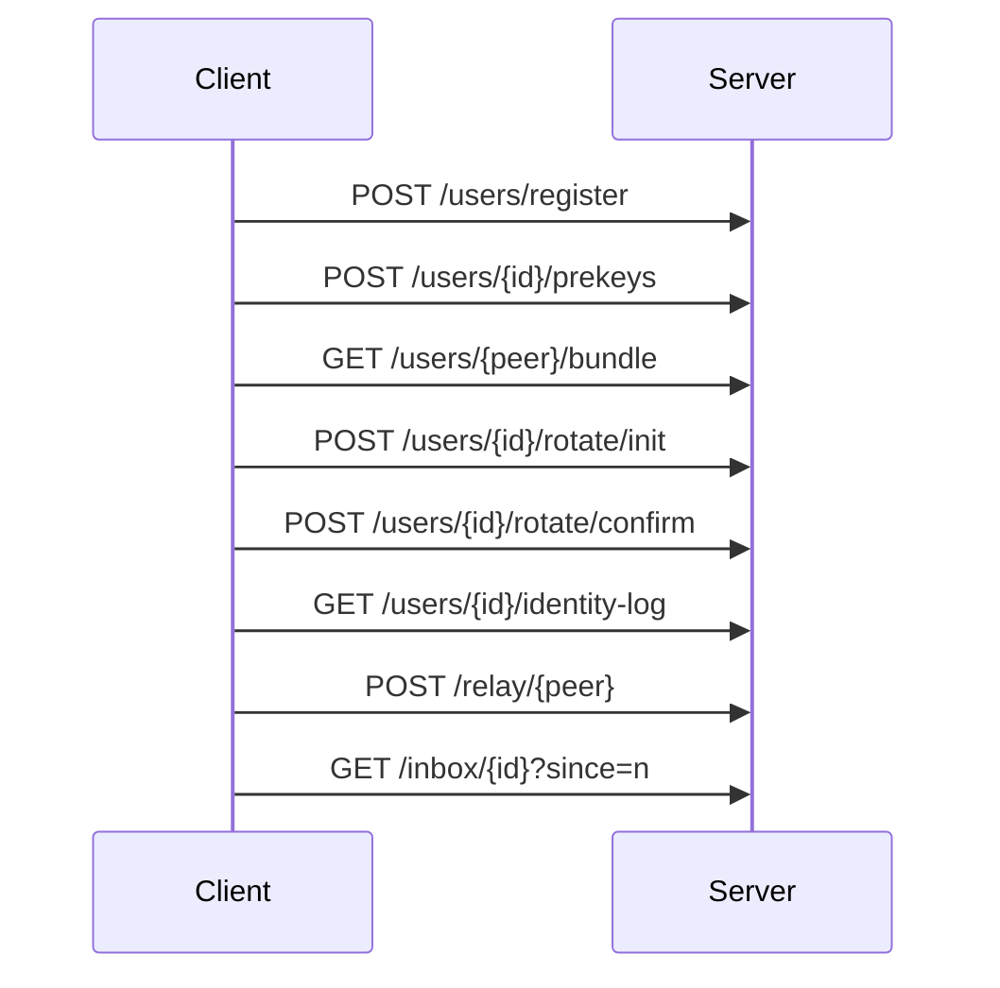
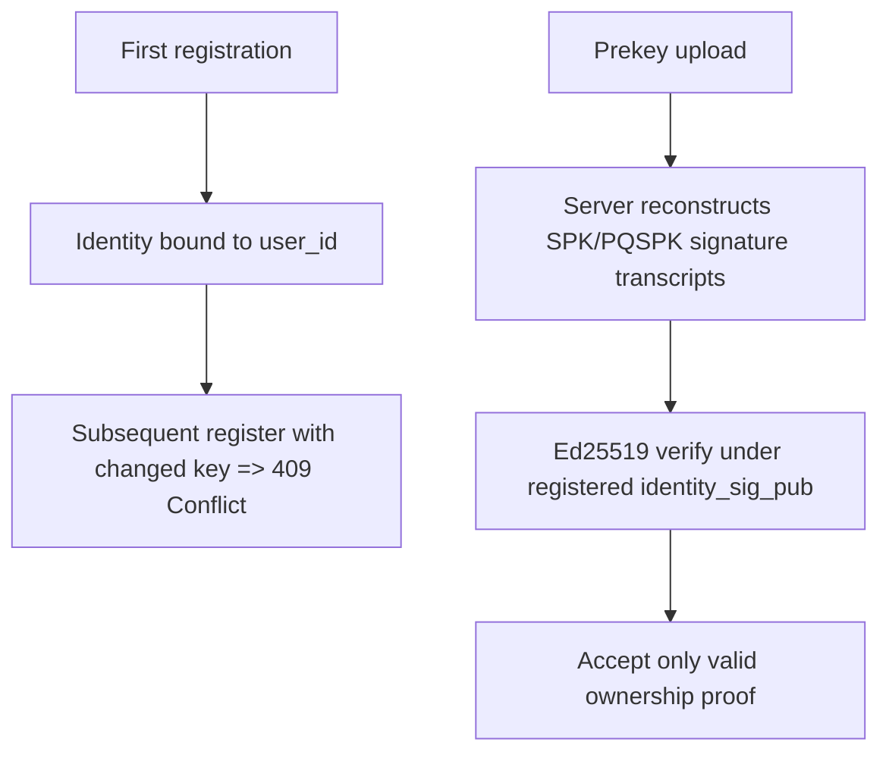

# API

## 1. Scope

This document specifies the HTTP/JSON interface for `pqmsg-server` under `/v1`.  
The service is intentionally minimal and stores only public key material plus opaque ciphertext blobs.

- Content type: `application/json`
- Error type: `application/problem+json`
- Request body limit: `1,048,576` bytes

## 2. Service Lifecycle



## 2.1 Security Profile Configuration

Server startup is controlled by environment variables:

- `PQMSG_SECURITY_PROFILE`: `research` | `high_assurance` | `nss_aligned` (default: `research`)
- `PQMSG_TLS_CERT_PATH`: PEM certificate path
- `PQMSG_TLS_KEY_PATH`: PEM private key path

In `high_assurance` and `nss_aligned`, server startup fails unless both TLS paths are provided.

## 3. Identity and Prekey Security Semantics



- `user_id` identity bindings are immutable after first successful registration.
- Re-registration with changed identity material is rejected (`409 Conflict`).
- Prekey signatures are verified using Ed25519 before persistence.

## 3.1 Authenticated Transport Headers

The following endpoints require request authentication headers:

- `GET /v1/users/{user_id}/identity-log`
- `POST /v1/relay/{recipient_user_id}`
- `GET /v1/inbox/{user_id}`

Required headers:

- `x-pqmsg-auth-user`
- `x-pqmsg-auth-device`
- `x-pqmsg-auth-timestamp` (unix seconds)
- `x-pqmsg-auth-nonce` (single-use)
- `x-pqmsg-auth-signature` (`base64(64-byte Ed25519 signature)`)

The server verifies signatures under registered `identity_sig_pub`, enforces device binding, applies timestamp skew checks, and rejects nonce replay.

## 4. Endpoint Definitions

### 4.1 Register User

`POST /v1/users/register`

Request:

```json
{
  "user_id": "alice",
  "identity_x25519_pub": "base64(32 bytes)",
  "identity_sig_pub": "base64(32-byte Ed25519 public key)",
  "device_id": "alice-device-1"
}
```

Success response:

```json
{
  "user_id": "alice",
  "device_id": "alice-device-1",
  "registered_at": "2026-03-04T12:00:00Z"
}
```

Conflict response (`identity_x25519_pub`, `identity_sig_pub`, or `device_id` changed for existing `user_id`):

```json
{
  "type": "about:blank",
  "title": "Conflict",
  "status": 409,
  "detail": "user_id is already registered with an immutable identity"
}
```

### 4.2 Publish Prekeys

`POST /v1/users/{user_id}/prekeys`

Request:

```json
{
  "signed_prekey_x25519_pub": "base64(32 bytes)",
  "sig_over_spk": "base64(64-byte Ed25519 signature)",
  "pq_signed_prekey_pub_mlkem768": "base64(variable)",
  "sig_over_pqspk": "base64(64-byte Ed25519 signature)",
  "one_time_prekeys_x25519": ["base64(32 bytes)"],
  "one_time_prekeys_mlkem768": ["base64(variable)"]
}
```

The server verifies:

1. `sig_over_spk` over protocol transcript for `SPK`,
2. `sig_over_pqspk` over protocol transcript for `PQSPK`,
3. both under registered `identity_sig_pub`.

### 4.3 Fetch Bundle

`GET /v1/users/{user_id}/bundle`

Response:

```json
{
  "user_id": "alice",
  "device_id": "alice-device-1",
  "identity_x25519_pub": "base64...",
  "identity_sig_pub": "base64...",
  "signed_prekey_x25519_pub": "base64...",
  "sig_over_spk": "base64...",
  "pq_signed_prekey_pub_mlkem768": "base64...",
  "sig_over_pqspk": "base64...",
  "one_time_prekey_x25519": "base64 or null",
  "one_time_prekey_mlkem768": "base64 or null",
  "identity_key_version": 1,
  "identity_fingerprint_sha256": "hex(sha256(identity_x25519_pub))",
  "bundle_generated_at": "2026-03-04T12:00:00Z"
}
```

### 4.4 Initiate Identity Rotation

`POST /v1/users/{user_id}/rotate/init`

Request:

```json
{
  "new_identity_x25519_pub": "base64(32 bytes)",
  "new_identity_sig_pub": "base64(32-byte Ed25519 public key)",
  "new_device_id": "alice-device-2"
}
```

Response:

```json
{
  "user_id": "alice",
  "challenge_id": "uuid-v4",
  "challenge_nonce": "base64(32 bytes)",
  "expires_at": "2026-03-04T12:10:00Z"
}
```

### 4.5 Confirm Identity Rotation

`POST /v1/users/{user_id}/rotate/confirm`

Request:

```json
{
  "challenge_id": "uuid-v4",
  "sig_by_current_identity": "base64(64-byte Ed25519 signature)",
  "sig_by_new_identity": "base64(64-byte Ed25519 signature)"
}
```

The signatures are computed over a server-defined rotation transcript containing:

1. `user_id`,
2. `challenge_id`,
3. `challenge_nonce`,
4. `new_identity_x25519_pub`,
5. `new_identity_sig_pub`,
6. `new_device_id`.

Response:

```json
{
  "user_id": "alice",
  "identity_key_version": 2,
  "identity_fingerprint_sha256": "hex(sha256(new_identity_x25519_pub))",
  "rotated_at": "2026-03-04T12:01:00Z"
}
```

### 4.6 Identity Event Log

`GET /v1/users/{user_id}/identity-log`

Requires authenticated transport headers (Section 3.1).

Identity-log auth signature transcript fields:

1. endpoint label (`identity-log`),
2. auth user id,
3. auth device id,
4. auth timestamp,
5. auth nonce,
6. target user id.

Response:

```json
{
  "user_id": "alice",
  "events": [
    {
      "version": 2,
      "identity_x25519_pub": "base64...",
      "identity_sig_pub": "base64...",
      "device_id": "alice-device-2",
      "event_type": "rotation",
      "changed_at": "2026-03-04T12:01:00Z",
      "identity_fingerprint_sha256": "hex..."
    }
  ]
}
```

### 4.7 Relay Message

`POST /v1/relay/{recipient_user_id}`

Requires authenticated transport headers (Section 3.1).

Request:

```json
{
  "sender_user_id": "alice",
  "device_id": "alice-device-1",
  "message_bytes_base64": "base64(ciphertext bytes)"
}
```

The payload is treated as opaque and persisted without server-side plaintext processing.

Relay auth signature transcript fields:

1. endpoint label (`relay`),
2. auth user id,
3. auth device id,
4. auth timestamp,
5. auth nonce,
6. recipient user id,
7. decoded relay message blob bytes.

### 4.8 Poll Inbox

`GET /v1/inbox/{user_id}?since=<message_id>`

Requires authenticated transport headers (Section 3.1).

Inbox auth signature transcript fields:

1. endpoint label (`inbox`),
2. auth user id,
3. auth device id,
4. auth timestamp,
5. auth nonce,
6. target user id,
7. `since` value.

Response:

```json
{
  "user_id": "alice",
  "messages": [
    {
      "message_id": 42,
      "sender_user_id": "bob",
      "message_bytes_base64": "base64(...)",
      "received_at": "2026-03-04T12:00:00Z"
    }
  ]
}
```

### 4.9 Health

`GET /health`

Response:

```json
{
  "status": "ok",
  "security_profile": "research"
}
```

## 5. Validation and Limits

- one-time prekey family maximum: `256` entries each,
- relay decoded blob maximum: `1,000,000` bytes,
- inbox page maximum: `200` messages,
- endpoint-level in-memory token bucket rate limiting.

## 6. Transport Requirement

Plain HTTP is acceptable only for local demonstration.  
Operational deployments must terminate TLS and should enforce certificate pinning at clients.
