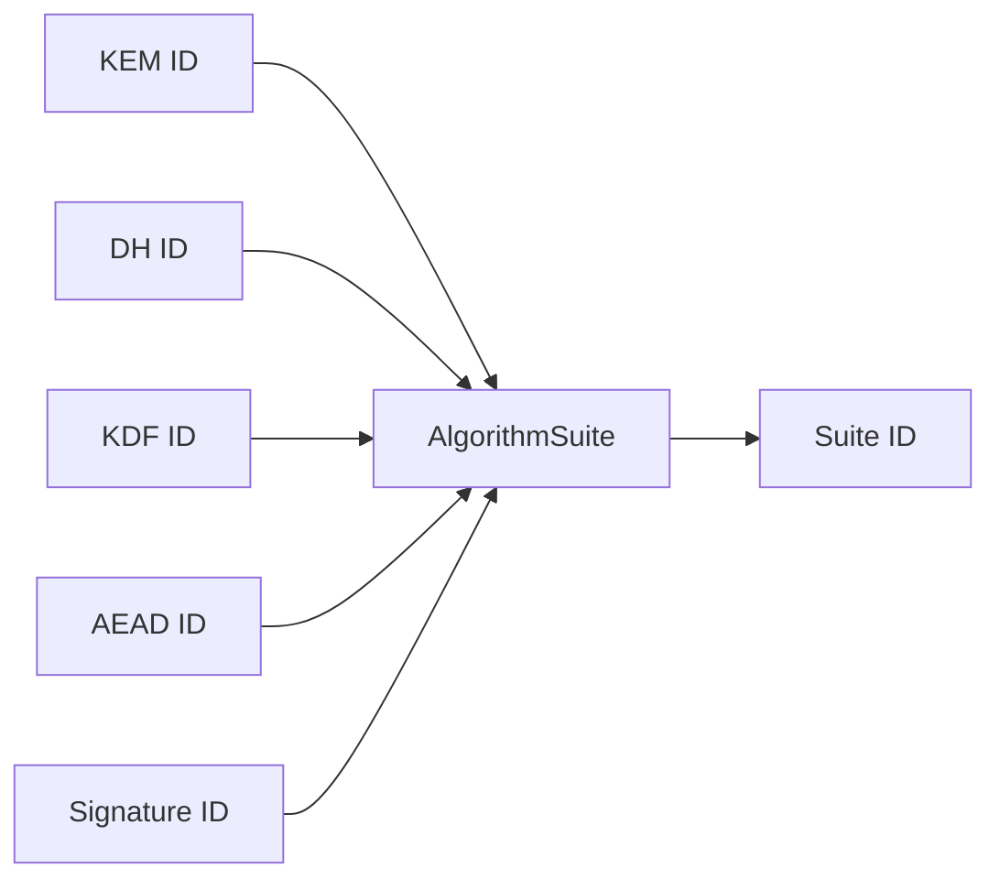

# CRYPTO_AGILITY

## 1. Objective

Crypto agility in this prototype is designed to permit controlled suite evolution without implicit fallback or silent downgrade.

## 2. Registry Model

Algorithm identifiers are represented in code as versioned identifiers and combined into a suite descriptor.

## 3. Current Suite IDs

| Suite ID | KEM | DH | KDF | AEAD | Signature Interface |
|---|---|---|---|---|---|
| `1` | ML-KEM-768 | X25519 | HKDF-SHA256 | ChaCha20Poly1305 | External abstraction |
| `2` | Kyber768 alias | X25519 | HKDF-SHA256 | ChaCha20Poly1305 | External abstraction |

## 4. Fail-Closed Behavior

The implementation rejects:

1. unknown suite identifiers,
2. suite mismatch between wire message and established session state,
3. unsupported protocol version values.

This behavior is intentional to prevent permissive downgrade paths.

## 5. Runtime Profile Exposure

`pqmsg-core` exposes a runtime crypto profile with:

- protocol version,
- effective default suite,
- algorithm components,
- PQ backend availability flag (`pq_oqs_enabled`).

Client front-ends use this profile to enforce fail-closed startup behavior when PQ backend support is unavailable.

## 6. Migration Strategy (Prototype Guidance)

A migration SHOULD proceed through:

1. dual publication of acceptable suites in bundle metadata,
2. deterministic preference ordering at client side,
3. telemetry and interoperability validation prior to deprecating legacy suites.

## 7. Validation Requirements

Any new suite introduction MUST include:

- positive interop tests,
- negative tests for unsupported suite rejection,
- updated deterministic vectors where handshake transcript changes.
