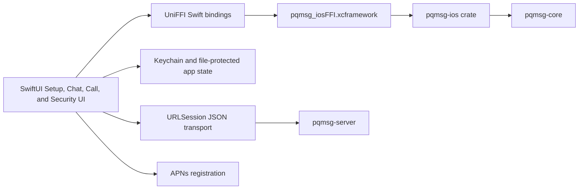

# IOS

## 1. Objective

This document specifies the reproducible path for running the iOS demo client with UniFFI Swift bindings, Keychain-backed secret storage, file-protected local metadata, guided secondary-device onboarding, and APNs token capture.

## 2. Architecture



## 3. Client Security Baseline

- private keys, session snapshots, and APNs token are persisted in iOS Keychain,
- setup, progress, cursor, bundle, identity-pin, and conversation metadata are persisted under Application Support with `completeUntilFirstUserAuthentication` file protection,
- protocol operations are executed in Rust (`pqmsg-ios` -> `pqmsg-core`),
- first-seen identity keys are pinned and key changes are blocked by default,
- relay and inbox requests use Ed25519 request-auth headers from Rust,
- the Security tab can list linked devices, link a new device id, and revoke non-current linked devices through authenticated server requests,
- the Security tab can rotate the current device identity to fresh keys and a new device id via `/rotate/init` + `/rotate/confirm`, automatically republish prekeys for the new identity, and inspect `/identity-log` rotation history,
- the Security tab can prepare a portable linked-device onboarding package by first linking the target device id on the server and then sealing regenerated device prekeys with the existing identity keys using the `WrappedSecret` Argon2id + AES-256-GCM storage format,
- the Setup tab can import that sealed onboarding package on the secondary device, persist the adopted keys, publish fresh prekeys automatically, and leave the final local step as `Verify server`,
- APNs token registration is integrated and exposed through setup/security screens,
- the Security tab exposes a destructive reset action that first retires the authenticated current device on the server when keys are still present, then removes per-user keys, sessions, pins, cursors, conversation metadata, and the stored APNs token,
- HTTP transport is accepted only for local debug hosts; production builds require HTTPS.

## 3A. Voice and Video Calling

The iOS client includes PQ-encrypted 1:1 voice and video calling:

- **CallView**: SwiftUI sheet with dark gradient background, peer avatar, call status, timer, and PQ-Protected badge,
- **Call buttons**: phone and video icons in the Chat toolbar trigger `startOutgoingCall(peerUserId:callType:)`,
- **Incoming calls**: accept/decline buttons with polling-based signal detection,
- **PQ key exchange**: UniFFI `buildFormatStringAuthHeaders()` signs call signaling requests with the user's Ed25519 identity key,
- **Signaling**: REST-based call signaling via `callOffer()`, `callAnswer()`, `callIceCandidate()`, `callHangup()`, and `pollCallSignals()` on `ApiClient`,
- **State management**: `AppState` manages call lifecycle with `@Published` properties (`activeCallId`, `callStatus`, `callElapsedSeconds`, `showCallView`).

## 4. Prerequisites

- macOS with Xcode 15+,
- Rust toolchain,
- `xcodegen` (`brew install xcodegen`),
- iOS simulator or physical device,
- optional Apple Developer account for APNs entitlement signing.

## 5. Build Rust Bridge and Swift Bindings

From repository root:

```bash
cd mobile/ios
chmod +x scripts/build_rust_ios.sh scripts/generate_project.sh
./scripts/build_rust_ios.sh
```

This script performs:

1. target installation (`aarch64-apple-ios`, `aarch64-apple-ios-sim`, `x86_64-apple-ios`),
2. release builds for `pqmsg-ios` with `pqmsg-core/pq-oqs`,
3. UniFFI Swift binding generation into `mobile/ios/PQMsgDemo/Generated`,
4. XCFramework assembly at `mobile/ios/Frameworks/pqmsg_iosFFI.xcframework`.

When `crates/pqmsg-ios/src/lib.rs` changes, rerun this script before opening Xcode so the Swift bindings and XCFramework include the latest bridge exports.

## 6. Generate and Open Xcode Project

```bash
cd mobile/ios
./scripts/generate_project.sh
open PQMsgDemo.xcodeproj
```

## 7. Run Demo

1. Start server:

```bash
PQMSG_DATABASE_URL='sqlite://./pqmsg-server.db?mode=rwc' \
PQMSG_BIND='127.0.0.1:3000' \
PQMSG_SECURITY_PROFILE='research' \
cargo run -p pqmsg-server
```

2. In the iOS app:
- Setup tab:
  - set server URL to `http://127.0.0.1:3000` for simulator-local demo,
  - generate keys, register user, publish prekeys, verify server,
  - for a secondary device, paste the sealed package from the primary device into `Import Linked Device`, provide the passphrase, then run `Verify Server`,
  - request APNs token if push entitlements are configured.
- Chats tab:
  - open peer conversation,
  - fetch bundle, send encrypted message, poll inbox,
  - tap phone or video icon in the chat toolbar to initiate a PQ-encrypted call.
- Security tab:
  - inspect active crypto profile, transport validity, pinned identities, and local state counts.
  - use `Secondary Device Onboarding` to enter a target device id, seal a passphrase-protected onboarding package, and copy the resulting package text to the secondary device.
  - use the Devices section to list linked devices, manually link a new device id, or revoke a non-current device.
  - use `Rotate Identity` with a fresh managed device id to generate new identity keys for the current device, complete the server challenge-confirm rotation, republish prekeys, and return the setup flow to `Verify Server`.
  - use `Load Identity Log` to inspect server-recorded initial and rotation identity events.
  - use `Reset Local State` to retire the current device on the server when possible and then purge the current user's local device material when rotating or revoking the account.

## 8. APNs Integration Notes

- The app requests notification permission and registers for APNs via `UIApplicationDelegate`.
- APNs token is surfaced in Setup/Security and optionally submitted to `/v1/users/{user_id}/push-token`.
- For APNs registration payloads, use `provider: "apns"` and `token: <apns-device-token-hex>` on `/v1/users/{user_id}/push-token`.
- Server-side APNs wake dispatch requires `PQMSG_APNS_BEARER_TOKEN` and `PQMSG_APNS_TOPIC`.

## 9. App Store Submission Checklist

1. Replace debug HTTP endpoint with production HTTPS endpoint.
2. Configure certificate pinning policy in client transport.
3. Switch entitlement from development to production APS environment.
4. Verify push behavior on physical devices.
5. Produce release archive, validate in Organizer, and submit through App Store Connect.
