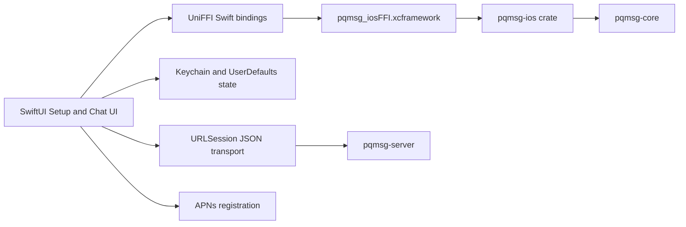

# IOS

## 1. Objective

This document specifies the reproducible path for running the iOS demo client with UniFFI Swift bindings, Keychain-backed local secret storage, and APNs token capture.

## 2. Architecture



## 3. Client Security Baseline

- private keys and session snapshots are persisted in iOS Keychain,
- protocol operations are executed in Rust (`pqmsg-ios` -> `pqmsg-core`),
- first-seen identity keys are pinned and key changes are blocked by default,
- relay and inbox requests use Ed25519 request-auth headers from Rust,
- APNs token registration is integrated and exposed through setup/security screens,
- HTTP transport is accepted only for local debug hosts; production builds require HTTPS.

## 4. Prerequisites

- macOS with Xcode 15+,
- Rust toolchain,
- `xcodegen` (`brew install xcodegen`),
- iOS simulator or physical device,
- optional Apple Developer account for APNs entitlement signing.

## 5. Build Rust Bridge and Swift Bindings

From repository root:

```bash
cd mobile/ios
chmod +x scripts/build_rust_ios.sh scripts/generate_project.sh
./scripts/build_rust_ios.sh
```

This script performs:

1. target installation (`aarch64-apple-ios`, `aarch64-apple-ios-sim`, `x86_64-apple-ios`),
2. release builds for `pqmsg-ios` with `pqmsg-core/pq-oqs`,
3. UniFFI Swift binding generation into `mobile/ios/PQMsgDemo/Generated`,
4. XCFramework assembly at `mobile/ios/Frameworks/pqmsg_iosFFI.xcframework`.

## 6. Generate and Open Xcode Project

```bash
cd mobile/ios
./scripts/generate_project.sh
open PQMsgDemo.xcodeproj
```

## 7. Run Demo

1. Start server:

```bash
PQMSG_DATABASE_URL='sqlite://./pqmsg-server.db?mode=rwc' \
PQMSG_BIND='127.0.0.1:3000' \
PQMSG_SECURITY_PROFILE='research' \
cargo run -p pqmsg-server
```

2. In the iOS app:
- Setup tab:
  - set server URL to `http://127.0.0.1:3000` for simulator-local demo,
  - generate keys, register user, publish prekeys, verify server,
  - request APNs token if push entitlements are configured.
- Chats tab:
  - open peer conversation,
  - fetch bundle, send encrypted message, poll inbox.
- Security tab:
  - inspect active crypto profile, transport validity, pinned identities, and local state counts.

## 8. APNs Integration Notes

- The app requests notification permission and registers for APNs via `UIApplicationDelegate`.
- APNs token is surfaced in Setup/Security and optionally submitted to `/v1/users/{user_id}/push-token`.
- For APNs registration payloads, use `provider: "apns"` and `token: <apns-device-token-hex>` on `/v1/users/{user_id}/push-token`.
- Server-side APNs wake dispatch requires `PQMSG_APNS_BEARER_TOKEN` and `PQMSG_APNS_TOPIC`.

## 9. App Store Submission Checklist

1. Replace debug HTTP endpoint with production HTTPS endpoint.
2. Configure certificate pinning policy in client transport.
3. Switch entitlement from development to production APS environment.
4. Verify push behavior on physical devices.
5. Produce release archive, validate in Organizer, and submit through App Store Connect.
