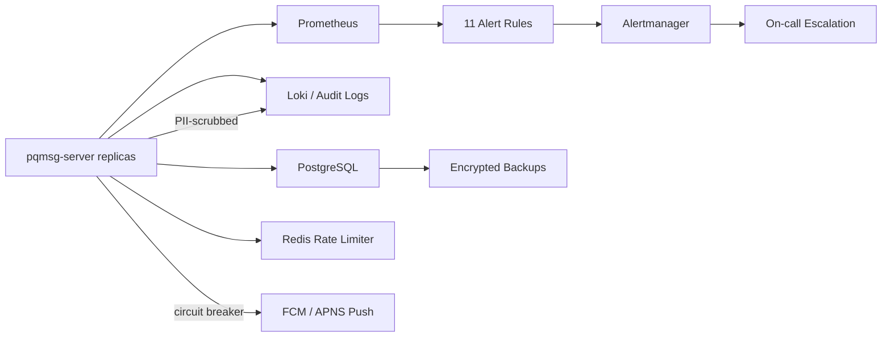

# OPERATIONS

## 1. Objective

This runbook defines minimum operational controls for high-assurance deployment of `pqmsg-server`.

Primary goals:

1. sustain service availability under abuse and partial failure,
2. preserve security-event visibility and response capability,
3. recover to a defined recovery point objective (RPO) and recovery time objective (RTO).

## 2. Control Topology

## 3. SLO and Alert Baselines

Production baselines:

1. availability SLO: `>= 99.9%` per rolling 30 days,
2. 95th percentile request latency target: `<= 250ms` for authenticated API paths,
3. authenticated reject anomaly target: sustained spikes investigated within incident window.

Prometheus alert rules are defined in:

- `observability/prometheus/alert-rules.yml`

Current baseline alerts (11 rules):

1. sustained 5xx ratio above `2%` for `10m` (critical),
2. auth reject spike for signature/replay/skew events (high),
3. sustained rate-limit reject spike (high),
4. sustained high in-flight request pressure (medium),
5. push circuit breaker open — FCM/APNS (critical),
6. signed prekey staleness — rotation failures (high),
7. PQ prekey pool depletion — last-resort bundle served (high),
8. device revocation spike (high),
9. PQ ratchet stall — no progress while messages flow (high),
10. nonce replay burst — active attack signal (critical),
11. registration spike — bot activity (medium).

Escalation routing is defined in:

- `observability/alertmanager/alertmanager.yml`

Receiver mapping:

1. `oncall-critical`: `severity=critical`,
2. `oncall-high`: `severity=high`,
3. `oncall-standard`: `severity in {medium, low}`.

Production deployment must bind SMTP settings and receiver mailbox targets:

1. `ALERT_EMAIL_SMARTHOST`,
2. `ALERT_EMAIL_FROM`,
3. `ALERT_EMAIL_CRITICAL_TO`,
4. `ALERT_EMAIL_HIGH_TO`,
5. `ALERT_EMAIL_STANDARD_TO`.

## 4. Incident Response Model

### 4.1 Severity

1. `SEV-1`: confidentiality/integrity risk, active exploitation, or full service outage.
2. `SEV-2`: major degradation or sustained security control failure.
3. `SEV-3`: localized degradation or non-exploited hardening gap.

### 4.2 Target Response

1. `SEV-1`: acknowledge within `15m`; mitigation owner assigned immediately.
2. `SEV-2`: acknowledge within `30m`.
3. `SEV-3`: acknowledge within `4h`.

### 4.3 Response Sequence

1. confirm signal validity from Prometheus metrics + audit log evidence,
2. isolate scope (affected users/devices/regions/build version),
3. execute mitigation playbook (rate-limit hardening, credential rotation, rollback),
4. preserve forensic artifacts (request IDs, audit JSONL, deployment digest),
5. publish incident timeline and closure criteria.

### 4.4 Escalation Drill Requirement

Run an escalation drill at least once per release cycle:

1. ensure observability stack is running (`docker-compose.observability.yml`),
2. execute:
   - `./scripts/security/alert_drill.sh` or
   - `./scripts/security/alert_drill.ps1`,
3. verify alert fan-out in sink logs:
   - query Mailpit API (`http://127.0.0.1:8025/api/v1/messages`) in local stack,
4. attach drill evidence (timestamp + captured output) to release record.

## 5. Backup and Recovery

### 5.1 Recovery Targets

1. RPO: `<= 15 minutes`,
2. RTO: `<= 60 minutes`.

### 5.2 Data Classes

1. PostgreSQL persistent state: mandatory backup,
2. Redis limiter state: ephemeral and reconstructable,
3. audit logs: append-only retention with off-host copy.

### 5.3 Backup Cadence

1. PostgreSQL base backup: daily,
2. WAL/archive incremental: every `5-15m`,
3. audit JSONL export: near-real-time or every `15m`.

### 5.4 Recovery Drill Cadence

1. restore test to isolated environment: monthly,
2. full disaster simulation (database + node replacement): quarterly.

## 6. Required Operational Evidence

Maintain these artifacts per release cycle:

1. alert history export and resolved incident records,
2. backup success logs and restore drill output,
3. on-call handoff log with unresolved risks,
4. deployment manifest digest and rollback artifact mapping.

## 7. SQLite Key Rotation

If a hardened non-production deployment still uses SQLite, rotate SQLCipher keys offline:

1. stop all writers,
2. take a backup or snapshot,
3. run the offline rotation tool from [SQLITE_KEY_ROTATION.md](/C:/projects/post-quantum-messaging-app/docs/SQLITE_KEY_ROTATION.md),
4. update the secret/config to the new key only,
5. restart and validate `/health`.

Do not treat SQLite key rotation as an online procedure. The supported operational model is
maintenance-window rotation with a verified rollback path.
