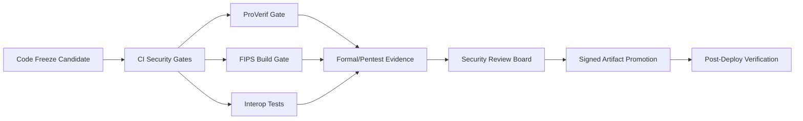

# RELEASE_GOVERNANCE

## 1. Purpose

This document defines release-control policy for production promotion of `pqmsg`.

The policy objective is to prevent uncontrolled security regressions and ensure auditable go/no-go decisions.

## 2. Release Gate Pipeline

## 3. Mandatory Go/No-Go Gates

A release candidate is promotable only when all conditions are true:

1. CI green:
   - `cargo fmt --all --check`,
   - `cargo clippy --workspace --all-targets -- -D warnings`,
   - `cargo test --workspace`.
2. dependency policy checks pass:
   - `cargo audit`,
   - `cargo deny check advisories licenses bans sources`.
3. security smoke checks pass:
   - parser fuzz smoke job,
   - penetration smoke script,
   - formal verification smoke,
   - alert escalation drill evidence (`scripts/security/alert_drill.*`) including mailbox-delivery proof.
4. hardened deployment candidates document explicit browser origins:
   - no wildcard CORS entries for `pilot` / `production`,
   - `production` candidates include runtime error telemetry configuration.
5. the hardened Helm chart renders only when those deployment-contract values are present:
   - `secretEnv.PQMSG_SENTRY_DSN` for `production`,
   - no wildcard `env.PQMSG_CORS_ALLOWED_ORIGINS`,
   - explicit Postgres encryption + backup declarations.
6. threat-model-impacting changes include updated docs in:
   - `docs/SPEC.md`,
   - `docs/THREAT_MODEL.md`,
   - `docs/SECURITY_GATES.md`.
7. raw Kubernetes and rendered Helm deployment manifests pass hardened manifest policy:
   - `automountServiceAccountToken: false`,
   - `enableServiceLinks: false`,
   - `seccompProfile.type: RuntimeDefault`,
   - `runAsNonRoot: true`,
   - `allowPrivilegeEscalation: false`,
   - `readOnlyRootFilesystem: true`,
   - `capabilities.drop: [ALL]`.
8. release artifact includes a signed checksum manifest, a machine-readable `release-manifest.json`, and GitHub artifact attestations for the server binary, release manifest, and SBOM archive (`release.yml`).

## 4. Security Exception Policy

Any exception to a mandatory gate requires a signed risk record with:

1. finding reference and severity,
2. explicit compensating controls,
3. expiry date for exception,
4. accountable owner and closure milestone.

Exceptions are invalid after expiry and block subsequent promotions until renewed or closed.

## 5. Change Classification

Classify each release candidate:

1. `Class A`: crypto/protocol/auth/routing changes,
2. `Class B`: transport/storage/observability control changes,
3. `Class C`: UI/docs/non-security-functional changes.

`Class A` changes require dual reviewer approval including a security reviewer.

## 6. Rollback Governance

Every production promotion must define:

1. rollback target artifact digest,
2. rollback execution owner,
3. rollback trigger thresholds,
4. post-rollback validation checklist.

Minimum rollback triggers:

1. sustained 5xx alert breach post-deploy,
2. unexpected auth reject spike attributable to candidate build,
3. detected integrity policy violation.

## 7. Post-Release Security Review

Within `48h` of promotion:

1. review security-event counters for abnormal deltas,
2. verify audit-log continuity and ingestion,
3. confirm release-bundle verification succeeded from the published assets (`scripts/release/verify_release_bundle.*`),
4. confirm no unresolved critical/high findings were introduced,
5. store release evidence package (CI logs, artifact signatures/attestations, incident notes).
