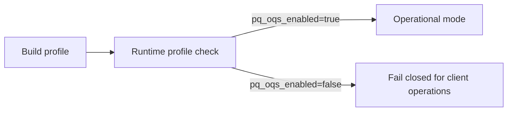

# SECURITY_GATES

## 1. Intent

This document defines minimum security quality gates for ongoing development and review.

## 2. Constant-Time Dependency Policy

1. Secret-dependent arithmetic MUST be delegated to vetted libraries.
2. Project code MUST NOT introduce ad hoc cryptographic primitives.
3. New cryptographic dependencies MUST document side-channel assumptions.

## 3. Zeroization Policy

1. Shared secrets and KDF intermediates SHOULD use zeroizing containers.
2. Temporary key buffers MUST be wiped after use where feasible.
3. Secret-bearing structures SHOULD use `SecretBytes`/`Zeroizing` patterns.
4. Client-side key/session persistence SHOULD default to encrypted-at-rest storage using Argon2id-derived keys and AES-256-GCM wrapping where local passphrases are used.

## 4. Parsing Policy

1. All wire parsing MUST be length-delimited and fallible.
2. Strict decoders MUST reject unknown critical TLV types.
3. Strict decoders MUST reject duplicate critical fields.
4. Parser entry points MUST be panic-free on adversarial input.
5. Cross-client associated-data construction MUST be canonical and shared from `pqmsg-core`.

## 5. Identity and Directory Policy

1. Server identity bindings for `user_id` MUST be immutable after first registration unless authenticated rotation protocol exists.
2. Prekey uploads MUST include ownership proof under registered identity signature keys.
3. Signature verification stubs are prohibited outside explicit test harnesses.
4. Identity rotation MUST require challenge-based proof from both current and new identity signing keys.
5. Clients MUST pin peer identity fingerprints and require explicit trust decisions on key changes.
6. Relay/inbox transport endpoints MUST enforce authenticated user/device request signatures with replay resistance.
7. Push-token registration MUST be authenticated with the same user/device signature model as relay/inbox endpoints.
8. Inbox `since` cursors MUST be monotonic per authenticated user/device session and cursor regressions MUST be rejected.
9. Relay ciphertext submissions MUST be deduplicated server-side with a bounded TTL window.
10. Clients MUST track seen ciphertexts and reject replayed transport message identifiers.
11. Server MUST expose authenticated one-time prekey inventory status and low-inventory signaling.
12. Clients SHOULD auto-replenish one-time prekeys when low-inventory signals are observed.
13. Registration endpoints SHOULD enforce adaptive abuse controls such as proof-of-work or CAPTCHA in hardened profiles.
14. Prekey upload endpoints SHOULD enforce per-device publish cooldowns to constrain exhaustion amplification.
15. Bundle selection SHOULD preserve a configurable one-time-prekey reserve floor and fall back to signed-prekey-only mode under depletion pressure.

## 5A. DoS Hardening Policy

1. Rate limiting MUST support a distributed backend for multi-instance deployments.
2. Distributed limiter outages SHOULD fail closed for abuse-sensitive endpoints.
3. Registration abuse controls MUST be externally observable through health metadata so clients can adapt request construction.

## 6. Push Transport Policy

1. Push payloads MUST be wake signals only and MUST NOT contain plaintext message data.
2. Push tokens MUST be bound to authenticated user/device identity at registration time.
3. Push delivery failures MUST NOT block opaque relay persistence or polling fallback behavior.

## 7. PQ Backend Gate Policy

Client applications MUST expose the active crypto profile and fail closed when PQ backend support is unavailable.
PQ ratchet support MUST be compiled in all builds; feature-flag disable paths are not permitted for release artifacts.

## 8. Test Policy

Required coverage:

- unit tests for success and tamper/failure paths,
- deterministic handshake KAT vector,
- fuzz targets for parser-facing decode entry points,
- server integration tests for input validation and directory behavior.

## 9. CI Policy

- stable path: `fmt`, `clippy`, `test`,
- dependency policy path (scheduled/manual): `cargo-audit` and `cargo-deny`,
- coverage path: enforced minimum line coverage threshold in CI,
- Android path: Rust bridge + APK assembly verification in CI,
- optional nightly/manual path: fuzz smoke.

Release artifacts published from tagged commits MUST include a signed checksum manifest.

A change that weakens these controls requires explicit security rationale.

## 10. Observability Policy

1. Server logs SHOULD default to structured JSON with correlation identifiers.
2. Every HTTP response SHOULD include a request correlation header (`x-request-id`).
3. Server MUST expose Prometheus-compatible metrics for request volume/latency and security event counters.
4. Security-relevant rejects (auth failures, replay rejects, rate limits, conflicts) SHOULD be written to an audit log sink when configured.
5. Production deployments SHOULD aggregate structured logs through Loki/ELK-class backends.
6. Production deployments SHOULD forward runtime error events to an external tracking system (for example, Sentry).

## 11. Formal Verification Policy

1. The PQXDH handshake model MUST be maintained as a machine-checkable symbolic specification.
2. Formal model queries MUST at minimum cover:
   - session-key secrecy,
   - authentication correspondence between initiator and responder,
   - confidentiality of encrypted payload abstraction.
3. Model updates MUST accompany protocol-level changes to handshake transcripts or key schedule composition.

## 12. Penetration Testing Policy

1. Server penetration testing MUST include authenticated and unauthenticated abuse paths.
2. Mandatory abuse probes:
   - replay attempts,
   - malformed input attempts,
   - anti-abuse gate bypass attempts,
   - identity/prekey ownership bypass attempts.
3. Findings MUST be tracked to closure with reproducible regression tests.
