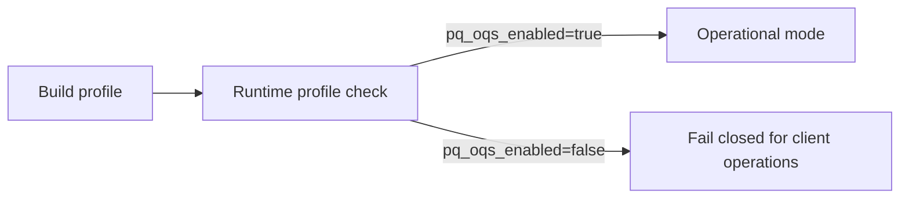

# SECURITY_GATES

## 1. Intent

This document defines minimum security quality gates for ongoing development and review.

## 2. Constant-Time Dependency Policy

1. Secret-dependent arithmetic MUST be delegated to vetted libraries.
2. Project code MUST NOT introduce ad hoc cryptographic primitives.
3. New cryptographic dependencies MUST document side-channel assumptions.

## 3. Zeroization Policy

1. Shared secrets and KDF intermediates SHOULD use zeroizing containers.
2. Temporary key buffers MUST be wiped after use where feasible.
3. Secret-bearing structures SHOULD use `SecretBytes`/`Zeroizing` patterns.

## 4. Parsing Policy

1. All wire parsing MUST be length-delimited and fallible.
2. Strict decoders MUST reject unknown critical TLV types.
3. Strict decoders MUST reject duplicate critical fields.
4. Parser entry points MUST be panic-free on adversarial input.

## 5. Identity and Directory Policy

1. Server identity bindings for `user_id` MUST be immutable after first registration unless authenticated rotation protocol exists.
2. Prekey uploads MUST include ownership proof under registered identity signature keys.
3. Signature verification stubs are prohibited outside explicit test harnesses.

## 6. PQ Backend Gate Policy

Client applications MUST expose the active crypto profile and fail closed when PQ backend support is unavailable.

## 7. Test Policy

Required coverage:

- unit tests for success and tamper/failure paths,
- deterministic handshake KAT vector,
- fuzz targets for parser-facing decode entry points,
- server integration tests for input validation and directory behavior.

## 8. CI Policy

- stable path: `fmt`, `clippy`, `test`,
- optional nightly/manual path: fuzz smoke.

A change that weakens these controls requires explicit security rationale.
