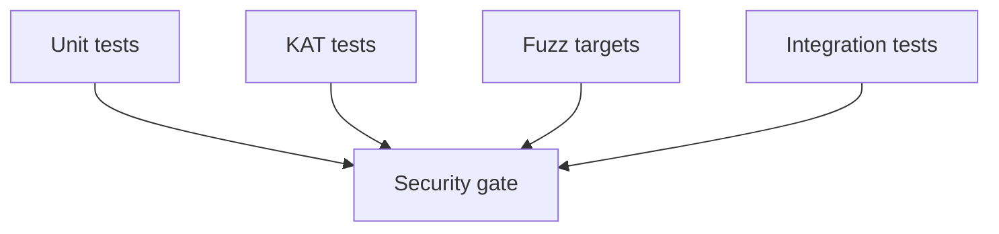

# SECURITY_GATES

## 1. Intent

This document defines the minimum security quality gates for continued development.  
The objective is to preserve defensible baseline security properties without introducing excessive process overhead.

## 2. Constant-Time Dependency Policy

1. Secret-dependent cryptographic operations MUST rely on vetted library primitives.
2. Core cryptographic arithmetic MUST NOT be implemented ad hoc in project code.
3. New cryptographic dependencies MUST document constant-time and side-channel assumptions before merge.

## 3. Zeroization Policy

1. Shared secrets and key-derivation intermediates MUST be stored in zeroizing containers where practical.
2. Temporary buffers holding key material MUST be wiped after use.
3. New secret-bearing structures SHOULD use `SecretBytes`, `Zeroizing`, or equivalent safe wrappers.

## 4. Parsing Policy

1. Parsing of wire inputs MUST be length-delimited and fallible.
2. Strict decoders MUST reject unknown critical TLV tags.
3. Strict decoders MUST reject duplicate critical fields.
4. Parser code MUST avoid panic paths on untrusted input.

## 5. Test Policy

Required layers:

- unit tests for success and tamper/failure paths,
- deterministic KAT coverage for at least one handshake transcript,
- fuzz coverage for parser-facing entry points,
- integration tests for server-side input handling and relay behavior.

## 6. CI Policy

- stable CI path: `fmt`, `clippy`, `test`,
- optional nightly/manual path: short-duration fuzz smoke execution.

A change that weakens these controls requires explicit review rationale.
