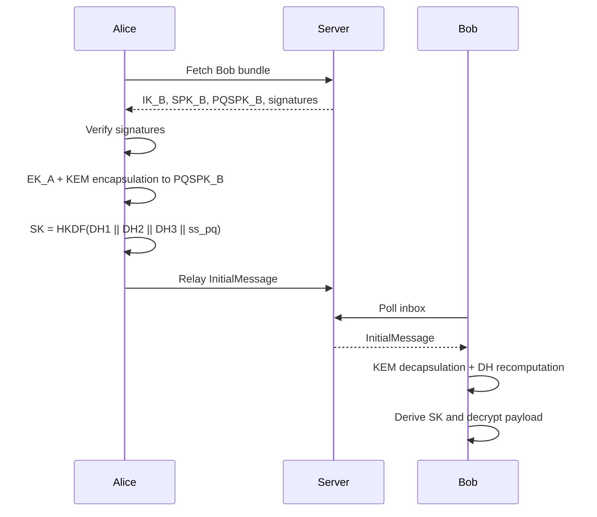

# SPEC

## 1. Document Scope

This document specifies the current protocol behavior of the `pqmsg` prototype at an implementation-oriented level.  
Normative language follows RFC 2119 conventions (`MUST`, `SHOULD`, `MAY`) where relevant.

## 2. Design Objectives

The protocol aims to:

1. provide confidentiality against passive and active network observers,
2. maintain explicit cryptographic suite identification,
3. support incremental post-quantum integration,
4. fail closed on parsing and suite/version inconsistencies.

The protocol does not currently target anonymity, metadata minimization, or production-grade multi-device synchronization.

## 3. Protocol Overview

## 4. Algorithm Suites

The implementation currently defines two suite identifiers:

- `suite_id = 1`: ML-KEM-768 + X25519 + HKDF-SHA256 + ChaCha20Poly1305
- `suite_id = 2`: Kyber768 alias + X25519 + HKDF-SHA256 + ChaCha20Poly1305

Protocol version is fixed to `v1` in the current prototype.

## 5. Handshake Construction

### 5.1 Bob Bundle

Bob publishes:

- `IK_B` (X25519 identity public key),
- `SPK_B` (signed prekey public key),
- `PQSPK_B` (PQ signed prekey public key),
- signatures over `SPK_B` and `PQSPK_B` under bundle signature key.

### 5.2 Alice Initiation

Alice performs:

1. signature verification on Bob bundle,
2. generation of ephemeral `EK_A`,
3. PQ encapsulation to `PQSPK_B` producing `(pq_ct, ss_pq)`,
4. derivation:
   - `DH1 = DH(IK_A, SPK_B)`
   - `DH2 = DH(EK_A, IK_B)`
   - `DH3 = DH(EK_A, SPK_B)`
   - `SK = HKDF(DH1 || DH2 || DH3 || ss_pq)`

Associated data for handshake encryption includes:

- protocol version,
- suite identifier,
- initiator identity key,
- responder identity key.

### 5.3 Bob Reception

Bob decapsulates `pq_ct`, recomputes the DH terms, re-derives `SK`, and decrypts the payload.  
Messages with unknown protocol version or unknown suite identifier are rejected.

## 6. Session and Ratchet Model

`SessionState` is derived from handshake output and maintains:

- root key,
- sending and receiving chain states,
- local and remote ratchet DH keys,
- bounded skipped-message-key cache.

The current ratchet model is intentionally minimal:

- symmetric-key chain advancement per message,
- DH ratchet on sender key changes,
- optional sparse PQ ratchet hook under feature flag.

## 7. Downgrade Resistance Requirements

The implementation enforces:

1. suite and protocol version binding in handshake associated data,
2. suite and protocol version binding in session associated data,
3. rejection of wire messages whose `suite_id` differs from established session state,
4. strict suite identifier decoding at handshake receive path.

## 8. Error and Parsing Semantics

All parser entry points operate on length-delimited data and return typed errors.  
No parser path should panic on adversarial input.

## 9. Validation Status

Current verification artifacts include:

- handshake and session unit tests,
- deterministic handshake KAT test vector (seeded RNG),
- parser and wire fuzz targets (`fuzz_tlv_decode`, `fuzz_wire_decode`),
- server API integration tests.

## 10. Open Items

- formal multi-device semantics,
- signature algorithm productionization,
- replay and transcript-binding refinements,
- long-term interoperability vector suite.
