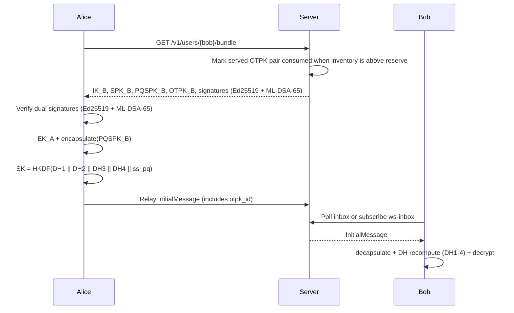

# SPEC

## 1. Scope and Terminology

This document specifies the implemented `pqmsg` prototype semantics at protocol level.  
Normative terms (`MUST`, `SHOULD`, `MAY`) follow RFC 2119 intent.

## 2. Protocol Objective

The design targets a verifiable baseline for hybrid post-quantum asynchronous messaging:

1. hybrid handshake confidentiality against passive archival adversaries,
2. authenticated prekey bundle consumption with hybrid dual signatures (Ed25519 + ML-DSA-65),
3. explicit downgrade checks via version and suite binding,
4. strict parse failure for malformed or ambiguous wire material,
5. one-time prekey (DH4) consumption for single-use initial-contact setup, with relay-side ciphertext deduplication as a separate server replay control.

## 3. Handshake Construction

The key schedule is:

- `DH1 = DH(IK_A, SPK_B)`
- `DH2 = DH(EK_A, IK_B)`
- `DH3 = DH(EK_A, SPK_B)`
- `DH4 = DH(EK_A, OTPK_B)` *(when one-time prekey is available)*
- `SK = HKDF-SHA256(DH1 || DH2 || DH3 || DH4 || ss_pq)`

When no one-time prekey is available (last-resort bundle), the key schedule omits DH4:

- `SK = HKDF-SHA256(DH1 || DH2 || DH3 || ss_pq)`

## 4. Suite Registry

The implementation recognizes:

- `suite_id = 1`: ML-KEM-768 + X25519 + HKDF-SHA256 + ChaCha20Poly1305
- `suite_id = 2`: Kyber768 alias + X25519 + HKDF-SHA256 + ChaCha20Poly1305

Protocol version is currently `v1`.

## 4A. Hybrid Dual-Signature Authentication

Prekey bundles carry dual signatures over SPK and PQSPK:

1. **Ed25519** (`sig_over_spk`, `sig_over_pqspk`): classical signature under identity signing key,
2. **ML-DSA-65** (`pq_sig_over_spk`, `pq_sig_over_pqspk`): post-quantum signature under PQ identity signing key.

Verifiers MUST check BOTH signatures. Security holds under the hybrid assumption: the handshake is authenticated if EITHER the classical OR the PQ signature scheme is secure.

The `AlgorithmSuite` type includes a `signature_algorithm` field:

- `Ed25519`: classical-only signature verification,
- `HybridEd25519MlDsa65`: dual-signature verification (default for PQ-enabled builds).

Bundles from peers that do not include PQ signatures are accepted in `Ed25519` mode for backward compatibility.

## 5. Session Model

`SessionState` maintains:

- root key,
- sending and receiving chain states,
- local/remote DH ratchet keys,
- bounded skipped-message-key cache,
- sparse PQ ratchet state support with configurable interval.

The implementation is intentionally minimal and is not a complete Signal clone.

Current recovery guarantee:

- session snapshots preserve the bounded skipped-message-key cache, allowing
  out-of-order messages that were already derivable at snapshot time to remain
  decryptable after restore,
- snapshot restore is an implementation continuity guarantee, not a claim of
  full production-grade multi-device synchronization semantics by itself.

## 6. Authentication and Identity Rules

Server-side directory behavior is defined as:

1. `user_id` identity binding is immutable after first successful registration,
2. prekey uploads are accepted only when Ed25519 signatures over `SPK` and `PQSPK` transcripts verify under registered `identity_sig_pub`.
3. relay/inbox/identity-log access requires Ed25519-signed transport auth headers bound to registered `user_id` and `device_id`.
4. websocket inbox subscriptions (`/v1/ws/inbox/{user_id}`) require the same Ed25519 transport-auth header model and include `since` in the signature transcript.
5. push-token registration (`/v1/users/{user_id}/push-token`) requires signed transport auth and only permits wake-signal push semantics.
6. relay ciphertext replay is constrained server-side via deduplication over `(sender, recipient, ciphertext)` within a bounded TTL window.
7. inbox `since` cursors are monotonic per authenticated `(user_id, device_id)` session and regressions are rejected.
8. server exposes authenticated prekey inventory status and marks low-inventory conditions with a replenishment recommendation.
9. bundle responses expose remaining one-time prekey inventory and an explicit `last_resort_prekey_only` indicator.

## 6A. Sealed Sender Extension

The implementation supports a sealed-sender transport mode with the following properties:

1. sender identifiers are encrypted inside a sealed envelope payload,
2. server-side sealed relay routing uses only `recipient_user_id`,
3. sealed relay persistence stores only recipient addressing and opaque blob bytes,
4. sealed inbox retrieval is authenticated with the same signed request-header model, using endpoint label `sealed-inbox`,
5. sealed relay enforces IP-based rate limiting (extracted from `X-Forwarded-For`/`X-Real-IP`) alongside per-recipient rate limiting to mitigate anonymous abuse.

## 6B. Memory Protection

All secret key material is zeroized on drop via explicit `Drop` implementations:

- `DhKeyPair`: zeroizes DH secret key,
- `SessionState`: zeroizes root key,
- `SessionSnapshot`: zeroizes root key, sending/receiving chain keys, and local DH secret,
- `RootStepOutput`: zeroizes root key and chain key,
- `PqStepOutput`: zeroizes root key,
- `SkippedMessageKeys`: zeroizes all cached message keys,
- `SkippedMessageKeySnapshot`: zeroizes message key.

## 6C. HSM Integration

The `pqmsg-core::hsm` module provides a PKCS#11 signing abstraction:

- `Signer` trait with `sign()` and `public_key()` methods,
- `KeyHandle` enum supporting `Software` (in-process) and `Hsm` (slot/label reference) variants,
- `SoftwareSigner` implementation for Ed25519 software keys,
- `Pkcs11Signer`: real PKCS#11 implementation via `cryptoki` crate (feature `hsm-pkcs11`), supporting CKM_EDDSA signing and EC_POINT public key extraction; falls back to a feature-disabled stub when compiled without the feature.

## 7. Ratchet Metadata Authentication

Session AEAD associated data MUST include:

1. protocol version,
2. suite id,
3. sender ratchet DH public key,
4. message number,
5. previous chain length,
6. `pq_step_ct` when present on interval-triggered PQ step messages,
7. `pq_target_pub_hash` when present,
8. `pq_next_public_key` when present,
9. external caller AD derived from shared `pqmsg-core` conversation-associated-data construction.

This requirement ensures ratchet header mutation is rejected at AEAD verification time.

## 8. Downgrade Resistance

A compliant implementation MUST:

1. authenticate `version` and `suite_id`,
2. reject unknown suites at decode/dispatch,
3. reject per-message suite mismatch once session state is established.

## 9. Parsing and Error Semantics

All parser entry points are length-delimited and fallible.  
Critical unknown TLV tags and duplicate critical tags are rejected in strict mode.

No parser path should panic on adversarial input.

## 10. Replay Controls

The implementation enforces replay resistance at four layers:

1. transport request nonces (signed header transcripts),
2. relay ciphertext deduplication with TTL on the server,
3. client-side seen-message tracking and per-peer monotonic transport message-id checks,
4. one-time prekey (OTPK) consumption: server marks OTPKs as used on bundle fetch and does not reissue consumed OTPK material in later bundle responses for that device inventory state.

The current server does not parse opaque relayed `InitialMessage` payloads deeply enough to reject replay by `otpk_id` at relay time; replay protection for relayed blobs is currently enforced via relay deduplication plus client-side state.

## 11. Verification Artifacts

Current verification set:

- unit tests for handshake/session success and tamper failure paths,
- snapshot restore coverage for skipped-message-key continuity after out-of-order
  delivery,
- deterministic handshake KAT transcript,
- fuzz targets for TLV and wire decoding,
- integration tests for server endpoint behavior and input validation,
- symbolic handshake model in `verification/proverif/pqxdh_hybrid_model.pv` (7 security queries including DH4 OTPK, PQ dual-signature verification, forward secrecy, and identity misbinding),
- Tamarin Prover model in `verification/tamarin/pqxdh_hybrid.spthy` (6 security lemmas with compromise rules, OTPK single-use linear fact, and hybrid-signature security),
- cross-platform interoperability test suite in `crates/pqmsg-core/tests/interop.rs` (16 tests: wire format round-trip, snapshot persistence, bidirectional exchange, suite tampering, AD mismatch, large/empty messages),
- end-to-end client-to-client test suite in `crates/pqmsg-server/tests/e2e.rs` (9 tests: full message+receipt flow, ephemeral messages, multi-device fan-out, bidirectional messaging, receipt idempotency, security headers),
- penetration smoke runbooks and scripts under `docs/PENETRATION_TESTING.md` and `scripts/security/`.

## 12. Call Signaling

The server provides authenticated REST-based call signaling for 1:1 voice and video calls:

1. `POST /v1/call/offer` — initiator sends SDP offer with callee user ID,
2. `POST /v1/call/:call_id/answer` — callee responds with SDP answer,
3. `POST /v1/call/:call_id/ice` — exchange ICE candidates,
4. `POST /v1/call/:call_id/hangup` — terminate call with reason code,
5. `GET /v1/call/:call_id/signals?since=0` — poll call signals.

All call endpoints use format-string authentication: the signature transcript is `{action}:{user_id}:{device_id}:{callee_or_call_id}` signed with the registered Ed25519 identity key.

Clients perform a PQ key exchange (PQXDH handshake via WASM or UniFFI) before SDP exchange to derive a `media_key`. WebRTC Insertable Streams encrypt/decrypt RTP payloads with ChaCha20-Poly1305 keyed by `media_key`, providing **post-quantum end-to-end encrypted calls**.

## 13. Stories and Channels

The server provides social broadcast features:

### Stories (Ephemeral Broadcasts)

- `POST /v1/stories` — publish story (24-hour TTL, max 512KB content, text/image/video),
- `GET /v1/stories/feed[?user_id=]` — fetch non-expired stories with view counts,
- `POST /v1/stories/:story_id/view` — mark story as viewed (deduplicated per viewer).

### Channels (Admin-Only Broadcasts)

- `POST /v1/channels` — create channel (owner auto-subscribed),
- `GET /v1/channels` — list subscribed channels with subscriber counts,
- `GET /v1/channels/:channel_id/messages[?since=]` — read channel messages (subscribers only),
- `POST /v1/channels/:channel_id/messages` — post message (owner/admin only, max 256KB),
- `POST /v1/channels/:channel_id/subscribe` — subscribe to channel.

All stories and channels endpoints use format-string authentication.
