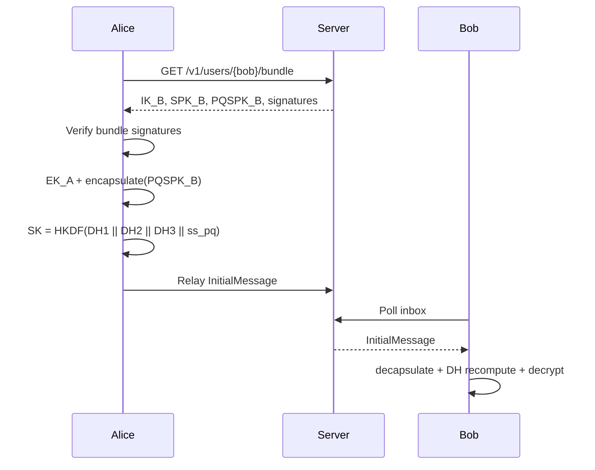

# SPEC

## 1. Scope and Terminology

This document specifies the implemented `pqmsg` prototype semantics at protocol level.  
Normative terms (`MUST`, `SHOULD`, `MAY`) follow RFC 2119 intent.

## 2. Protocol Objective

The design targets a verifiable baseline for hybrid post-quantum asynchronous messaging:

1. hybrid handshake confidentiality against passive archival adversaries,
2. authenticated prekey bundle consumption,
3. explicit downgrade checks via version and suite binding,
4. strict parse failure for malformed or ambiguous wire material.

## 3. Handshake Construction

The key schedule is:

- `DH1 = DH(IK_A, SPK_B)`
- `DH2 = DH(EK_A, IK_B)`
- `DH3 = DH(EK_A, SPK_B)`
- `SK = HKDF-SHA256(DH1 || DH2 || DH3 || ss_pq)`

## 4. Suite Registry

The implementation recognizes:

- `suite_id = 1`: ML-KEM-768 + X25519 + HKDF-SHA256 + ChaCha20Poly1305
- `suite_id = 2`: Kyber768 alias + X25519 + HKDF-SHA256 + ChaCha20Poly1305

Protocol version is currently `v1`.

## 5. Session Model

`SessionState` maintains:

- root key,
- sending and receiving chain states,
- local/remote DH ratchet keys,
- bounded skipped-message-key cache,
- optional sparse PQ ratchet state.

The implementation is intentionally minimal and is not a complete Signal clone.

## 6. Authentication and Identity Rules

Server-side directory behavior is defined as:

1. `user_id` identity binding is immutable after first successful registration,
2. prekey uploads are accepted only when Ed25519 signatures over `SPK` and `PQSPK` transcripts verify under registered `identity_sig_pub`.

## 7. Ratchet Metadata Authentication

Session AEAD associated data MUST include:

1. protocol version,
2. suite id,
3. sender ratchet DH public key,
4. message number,
5. previous chain length,
6. optional `pq_step_ct`,
7. external caller AD.

This requirement ensures ratchet header mutation is rejected at AEAD verification time.

## 8. Downgrade Resistance

A compliant implementation MUST:

1. authenticate `version` and `suite_id`,
2. reject unknown suites at decode/dispatch,
3. reject per-message suite mismatch once session state is established.

## 9. Parsing and Error Semantics

All parser entry points are length-delimited and fallible.  
Critical unknown TLV tags and duplicate critical tags are rejected in strict mode.

No parser path should panic on adversarial input.

## 10. Verification Artifacts

Current verification set:

- unit tests for handshake/session success and tamper failure paths,
- deterministic handshake KAT transcript,
- fuzz targets for TLV and wire decoding,
- integration tests for server endpoint behavior and input validation.
