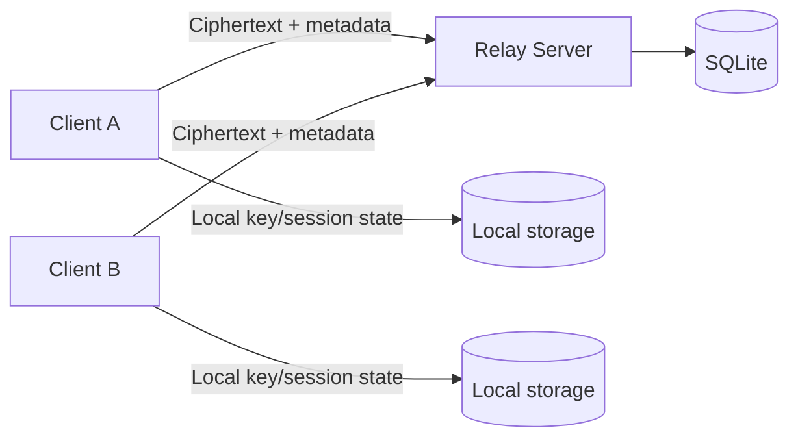

# THREAT_MODEL

## 1. Purpose

This document summarizes the threat model for the `pqmsg` prototype and records security assumptions used by the current implementation.

## 2. Assets

Primary assets are:

1. identity private keys,
2. signed and one-time prekey private material,
3. ratchet state (root keys, chain keys, skipped keys),
4. ciphertext payloads and message metadata,
5. client-side persistence of session snapshots.

## 3. Adversary Classes

The model includes:

- passive network adversary,
- active man-in-the-middle on transport,
- malicious or compromised relay server,
- opportunistic replay and message tampering adversary,
- endpoint compromise adversary.

Supply-chain compromise is acknowledged as a high-impact class and is partially addressed through dependency and CI policy.

## 4. Trust and System Boundaries

The server is not trusted with plaintext and stores only public key material plus opaque message blobs.

## 5. Security Objectives

The implementation seeks:

1. confidentiality of message payloads against network and server observers,
2. authenticated bundle use via signature verification hooks,
3. downgrade resistance through suite/version binding in AEAD associated data,
4. parser safety under adversarial wire input,
5. bounded exposure of skipped-message keys.

## 6. Out-of-Scope Properties

The current prototype does not guarantee:

- traffic analysis resistance,
- recipient/sender unlinkability,
- robust anti-censorship properties,
- hardware-backed endpoint integrity.

## 7. Key Threat Scenarios and Mitigations

| Threat | Current Mitigation |
|---|---|
| Message tampering in transit | AEAD authentication and strict parse validation |
| Suite downgrade attempt | Version/suite binding in associated data and wire suite checks |
| Malformed wire payload DoS | Length-delimited strict parsing, fuzz targets |
| Secret retention in memory | `zeroize` and `Zeroizing` usage for keying material |
| Server plaintext disclosure | Server stores only opaque ciphertext blobs |

## 8. Residual Risk

Residual risk remains significant in:

- endpoint compromise,
- replay semantics beyond current demo assumptions,
- production-grade signature lifecycle and revocation,
- ecosystem supply-chain attacks.

This document should be revised after each major protocol revision or threat-assessment exercise.
