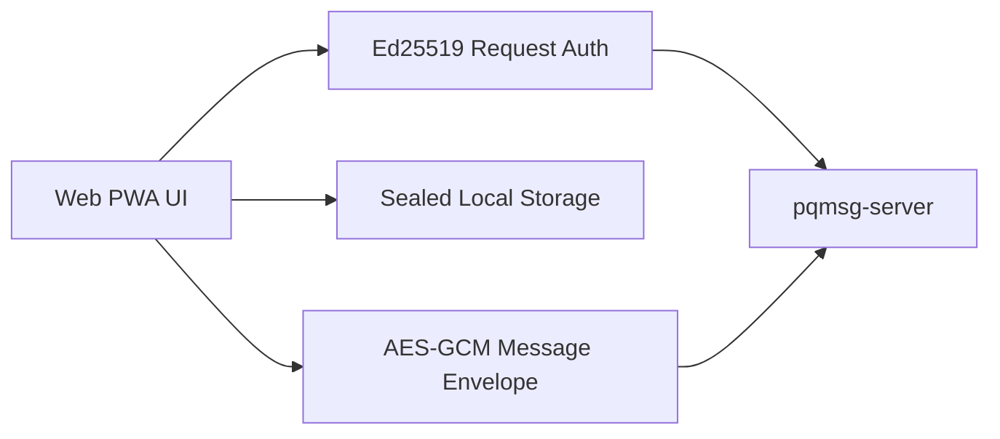

# WEB

## 1. Objective

This document specifies the Web client demonstration path for the PQ messaging prototype.

The current web tier uses a browser-native fallback profile:

- request authentication with Ed25519 signatures,
- local secret persistence sealed with WebCrypto (`PBKDF2 + AES-256-GCM`),
- message payload confidentiality with WebCrypto (`AES-256-GCM`),
- progressive web app shell with service-worker offline bootstrap cache.

## 2. Security Position

The browser runtime currently operates in a **WebCrypto fallback mode** and does not claim full PQ interoperability with native clients.



Implications:

- transport auth and server authorization gates remain active,
- relay blobs remain opaque to server,
- fallback envelope interoperability is intended for web-to-web demo usage.

## 3. Prerequisites

- Node.js 20+,
- running `pqmsg-server` endpoint.

## 4. Development Commands

```bash
cd mobile/web
npm install
npm run dev
```

Default Vite URL:

- `http://127.0.0.1:5173`

## 5. Production Build

```bash
cd mobile/web
npm install
npm run build
npm run preview
```

## 6. Runtime Workflow

1. Setup card:
   - set server URL, user, device, peer, suite, passphrase,
   - generate keys,
   - register user,
   - publish prekeys.
2. Fetch peer bundle before first send.
3. Send encrypted message.
4. Poll inbox to decrypt.
5. Review pinned identities and fallback profile in Security Snapshot.

## 7. PWA Shell Components

- `manifest.webmanifest`
- `sw.js`
- installable app metadata and local cache bootstrap.

## 8. Interoperability Note

Web fallback envelopes are intentionally explicit in wire mode:

- `mode = webcrypto-fallback-v1`.

Clients receiving unknown envelope modes should reject decode and continue polling.
