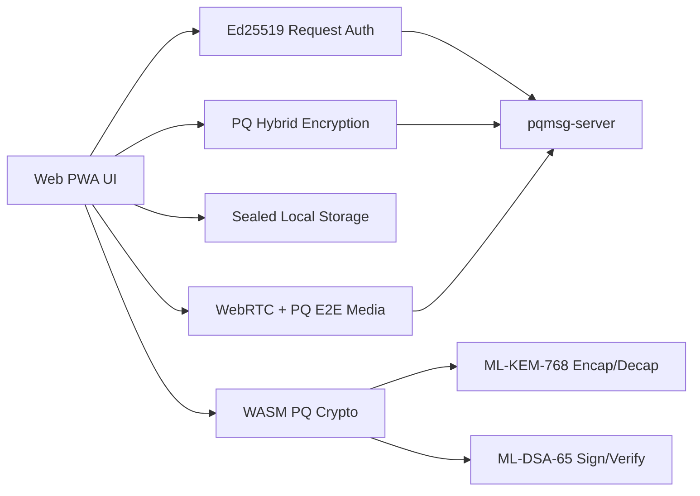

# WEB

## 1. Objective

This document specifies the Web client demonstration path for the PQ messaging prototype.

The web client supports two crypto modes:

- **WASM PQ mode**: real ML-KEM-768 key encapsulation and ML-DSA-65 signatures via compiled Rust WASM bindings,
- **WebCrypto fallback mode**: browser-native Ed25519 request authentication, `PBKDF2 + AES-256-GCM` local storage, and `AES-256-GCM` message payloads.

The web client also includes WebRTC voice and video calling with post-quantum end-to-end media encryption.

## 2. Security Position

When WASM bindings are available, the web client achieves full PQ interoperability with native clients:



When WASM is unavailable, the client falls back to WebCrypto mode for web-to-web demo usage.

## 3. Prerequisites

- Node.js 20+,
- running `pqmsg-server` endpoint,
- optional: `wasm-pack` for building Rust WASM bindings.

## 4. Development Commands

```bash
cd mobile/web
npm install
npm run dev
```

Default Vite URL:

- `http://127.0.0.1:5173`

## 5. Production Build

```bash
cd mobile/web
npm install
npm run build
npm run preview
```

## 6. Runtime Workflow

1. Setup card:
   - set server URL, user, device, peer, suite, passphrase,
   - generate keys,
   - register user,
   - publish prekeys.
2. Fetch peer bundle before first send.
3. Send encrypted message.
4. Poll inbox to decrypt.
5. Review pinned identities and fallback profile in Security Snapshot.

## 7. PWA Shell Components

- `manifest.webmanifest`
- `sw.js`
- installable app metadata and local cache bootstrap.

## 8. Interoperability Note

Web fallback envelopes are intentionally explicit in wire mode:

- `mode = webcrypto-fallback-v1`.

Clients receiving unknown envelope modes should reject decode and continue polling.

When WASM PQ crypto is available, the web client uses real ML-KEM-768 prekey bundles and is fully interoperable with Android and iOS native clients.

## 9. WASM PQ Crypto

The WASM build exports:

- `wasm_kem_keypair()` — generate ML-KEM-768 keypair,
- `wasm_kem_encapsulate(recipient_pk)` — encapsulate shared secret,
- `wasm_kem_decapsulate(secret_key, ciphertext)` — decapsulate shared secret,
- `wasm_ml_dsa_keypair()` — generate ML-DSA-65 signing keypair,
- `wasm_ml_dsa_sign(message, secret_key)` — sign message,
- `wasm_ml_dsa_verify(message, signature, public_key)` — verify signature.

Wrapper functions in `crypto-wasm.ts` provide TypeScript-friendly interfaces.

## 10. Voice and Video Calling

The web client includes WebRTC calling with post-quantum encrypted media:

1. **Call initiation**: `startCall(peerId, video)` creates an `RTCPeerConnection` and sends an SDP offer via the signaling REST API.
2. **PQ key exchange**: Before SDP exchange, the client performs a PQXDH handshake (via WASM when available) to derive a `media_key`.
3. **Media encryption**: WebRTC Insertable Streams (Encoded Transform) encrypt/decrypt RTP payloads with `media_key` + ChaCha20-Poly1305.
4. **Call UI**: Incoming call overlay, in-call controls (mute, video toggle, hangup), call timer, and PQ-encrypted badge.

Call signaling uses format-string authenticated REST endpoints:

- `POST /v1/call/offer` — send SDP offer,
- `POST /v1/call/:call_id/answer` — send SDP answer,
- `POST /v1/call/:call_id/ice` — exchange ICE candidates,
- `POST /v1/call/:call_id/hangup` — terminate call,
- `GET /v1/call/:call_id/signals` — poll call signals.

## 11. Desktop App (Tauri)

The web SPA is also packaged as a native desktop application via Tauri 2:

```bash
cd desktop
npm install
npm run dev     # development with hot-reload
npm run build   # production build (.msi / .dmg / .AppImage)
```

Tauri wraps the same Vite SPA in a native window with:

- system tray support,
- native notifications,
- file drag-and-drop,
- CSP-enforced content security.
