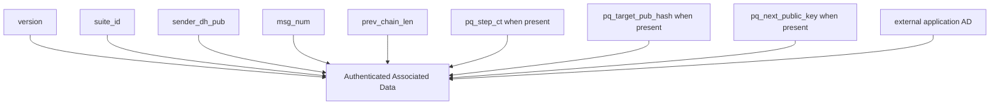

# WIRE_FORMAT

## 1. TLV Encoding

All binary messages use length-delimited TLV encoding:

- `Type`: `u16` big-endian
- `Length`: `u16` big-endian
- `Value`: `Length` bytes

Strict decoders reject unknown critical tags and duplicate critical tags.

## 2. Session WireMessage (v1)

| Tag (effective) | Field | Type |
|---|---|---|
| `0x1001` | `version` | `u16` |
| `0x1002` | `suite_id` | `u16` |
| `0x1003` | `sender_dh_pub` | 32-byte X25519 public key |
| `0x1004` | `msg_num` | `u32` |
| `0x1005` | `prev_chain_len` | `u32` |
| `0x1006` | `pq_step_ct` | byte string present on PQ-step messages |
| `0x1009` | `pq_target_pub_hash` | optional byte string naming the recipient PQ ratchet target |
| `0x100A` | `pq_next_public_key` | optional byte string advertising the sender's next PQ ratchet public key |
| `0x1007` | `aead_nonce` | 12-byte nonce |
| `0x1008` | `ciphertext` | byte string |

`pq_target_pub_hash` and `pq_next_public_key` are present when sparse PQ ratchet metadata is being carried alongside the message.

## 2A. Session WireMessage (v2)

Version 2 keeps the same plaintext semantic fields but encrypts the ratchet header into a single opaque blob before transmission.

Outer TLV fields:

| Tag (effective) | Field | Type |
|---|---|---|
| `0x1101` | `version` | `u16` |
| `0x1102` | `suite_id` | `u16` |
| `0x1103` | `encrypted_header` | byte string |
| `0x1104` | `aead_nonce` | 12-byte nonce |
| `0x1105` | `ciphertext` | byte string |

The encrypted header is the serialized `HeaderPlaintext` structure:

| Field | Type |
|---|---|
| `sender_dh_pub` | 32-byte X25519 public key |
| `msg_num` | `u32` |
| `prev_chain_len` | `u32` |
| `pq_step_ct` | optional byte string |
| `pq_target_pub_hash` | optional byte string |
| `pq_next_public_key` | optional byte string |

The current implementation encrypts this header with AES-256-CTR under a per-ratchet-step header key. Header parse failure after decryption is treated as an invalid header for that key.

## 2B. Sealed Sender Envelope (v1)

| Tag (effective) | Field | Type |
|---|---|---|
| `0xA201` | `version` | `u16` |
| `0xA202` | `suite_id` | `u16` |
| `0xA203` | `recipient_user_id` | UTF-8 string |
| `0xA204` | `aead_nonce` | 12-byte nonce |
| `0xA205` | `ciphertext` | byte string |

Decrypted inner payload fields:

| Tag (effective) | Field | Type |
|---|---|---|
| `0xA301` | `sender_user_id` | UTF-8 string |
| `0xA302` | `sender_device_id` | UTF-8 string |
| `0xA303` | `payload` | byte string |

## 3. Handshake InitialMessage (v1)

The initial handshake message carries:

1. protocol version,
2. suite identifier,
3. sender/recipient identifiers,
4. initiator identity and ephemeral X25519 public keys,
5. PQ KEM ciphertext,
6. initiator PQ ratchet public key,
7. AEAD nonce and ciphertext,
8. consumed one-time prekey ID (`otpk_id`, optional).

| Tag (effective) | Field | Type |
|---|---|---|
| `0x0101` | `protocol_version` | `u16` |
| `0x0109` | `suite_id` | `u16` |
| `0x0102` | `sender_id` | UTF-8 string |
| `0x0103` | `recipient_id` | UTF-8 string |
| `0x0104` | `ik_a_pub` | 32-byte X25519 public key |
| `0x0105` | `ek_a_pub` | 32-byte X25519 public key |
| `0x0106` | `pq_ct` | byte string |
| `0x010B` | `pq_ratchet_pub_a` | byte string |
| `0x0107` | `nonce` | 12-byte nonce |
| `0x0108` | `ciphertext` | byte string |
| `0x010A` | `otpk_id` | optional UTF-8 string |

When `otpk_id` is present, the key schedule includes DH4(EK_A, OTPK_B) before the PQ shared secret.

## 3A. Prekey Bundle Signature Fields

Bundles include dual-signature fields for quantum-resistant authentication:

| Field | Description |
|---|---|
| `sig_over_spk` | Ed25519 signature over SPK transcript |
| `sig_over_pqspk` | Ed25519 signature over PQSPK transcript |
| `pq_sig_over_spk` | ML-DSA-65 signature over SPK transcript (optional) |
| `pq_sig_over_pqspk` | ML-DSA-65 signature over PQSPK transcript (optional) |
| `pq_sig_public_key` | ML-DSA-65 identity public key (optional) |

When PQ signature fields are present, verifiers MUST check both Ed25519 and ML-DSA-65 signatures (hybrid security: holds if EITHER scheme is secure).

## 4. AEAD Associated Data Binding

### 4.1 Session traffic AD

For session traffic, external AD is constructed via the shared `pqmsg-core::ad::conversation_associated_data` function to maintain cross-client interoperability.

### 4.2 Handshake AD

Handshake AD is a TLV-encoded structure that includes:

1. `protocol_version`,
2. `suite_id`,
3. initiator identity public key,
4. responder identity public key,
5. initiator identifier,
6. responder identifier,
7. initiator PQ ratchet public key.

## 5. Integrity and Downgrade Properties

- `version` and `suite_id` are cryptographically bound by AEAD.
- Session decryption rejects suite mismatch relative to established state.
- Ratchet header metadata, including `pq_step_ct`, `pq_target_pub_hash`, and `pq_next_public_key` when present, is authenticated through AD.
- Handshake ciphertext is bound to both parties' identity keys and identifiers, plus the initiator PQ ratchet key.

This prevents unauthenticated metadata mutation that could otherwise induce ratchet divergence.

## 6. Parser Requirements

A conforming decoder MUST:

1. reject truncated headers and over-declared lengths,
2. reject unknown critical TLV types in strict mode,
3. reject duplicate critical fields in strict mode,
4. return typed errors without panic on adversarial input.

## 7. Algorithm Suite Negotiation (SupportedSuites)

Bundle metadata includes a `SupportedSuites` field encoded as a contiguous sequence of big-endian `u16` suite IDs:

| Byte offset | Field | Type |
|---|---|---|
| `0..2` | `suite_id[0]` | `u16` |
| `2..4` | `suite_id[1]` | `u16` |
| ... | ... | ... |

Decoding rules:

1. input length MUST be a multiple of 2,
2. each `u16` MUST correspond to a recognized suite ID,
3. unknown suite IDs are rejected.

Negotiation selects the first local preference that also appears in the remote list (`SupportedSuites::negotiate()`).

## 8. Wire Version Negotiation

Bundle metadata can also advertise supported wire versions as a contiguous sequence of big-endian `u16` values.

Current recognized values are:

- `1` for `WireMessage` v1,
- `2` for `WireMessage` v2.

Negotiation is preference-ordered and currently prefers v2 when both peers advertise support for v1 and v2.
