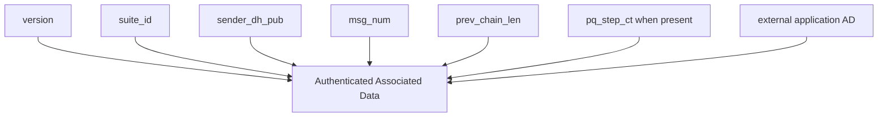

# WIRE_FORMAT

## 1. TLV Encoding

All binary messages use length-delimited TLV encoding:

- `Type`: `u16` big-endian
- `Length`: `u16` big-endian
- `Value`: `Length` bytes

Strict decoders reject unknown critical tags and duplicate critical tags.

## 2. Session WireMessage (v1)

| Tag (effective) | Field | Type |
|---|---|---|
| `0x9001` | `version` | `u16` |
| `0x9002` | `suite_id` | `u16` |
| `0x9003` | `sender_dh_pub` | 32-byte X25519 public key |
| `0x9004` | `msg_num` | `u32` |
| `0x9005` | `prev_chain_len` | `u32` |
| `0x9006` | `pq_step_ct` | optional byte string |
| `0x9007` | `aead_nonce` | 12-byte nonce |
| `0x9008` | `ciphertext` | byte string |

## 3. Handshake InitialMessage (v1)

The initial handshake message carries:

1. protocol version,
2. suite identifier,
3. sender/recipient identifiers,
4. initiator identity and ephemeral X25519 public keys,
5. PQ KEM ciphertext,
6. AEAD nonce and ciphertext.

## 4. AEAD Associated Data Binding

Handshake AD also includes initiator and responder identity public keys.

For session traffic, external AD is constructed via the shared `pqmsg-core::ad::conversation_associated_data` function to maintain cross-client interoperability.

## 5. Integrity and Downgrade Properties

- `version` and `suite_id` are cryptographically bound by AEAD.
- Session decryption rejects suite mismatch relative to established state.
- Ratchet header metadata, including optional `pq_step_ct`, is authenticated through AD.

This prevents unauthenticated metadata mutation that could otherwise induce ratchet divergence.

## 6. Parser Requirements

A conforming decoder MUST:

1. reject truncated headers and over-declared lengths,
2. reject unknown critical TLV types in strict mode,
3. reject duplicate critical fields in strict mode,
4. return typed errors without panic on adversarial input.
