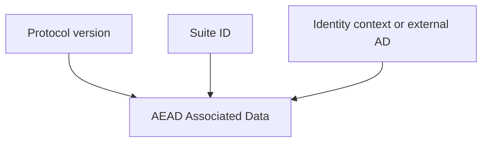

# WIRE_FORMAT

## 1. Encoding Model

All binary wire structures use TLV framing:

- `Type`: `u16` big-endian,
- `Length`: `u16` big-endian,
- `Value`: `Length` bytes.

Unknown critical tags are rejected by strict decoders.

## 2. WireMessage Schema (v1)

`WireMessage` is used by the session ratchet channel.

| Tag (effective) | Field | Type |
|---|---|---|
| `0x9001` | `version` | `u16` |
| `0x9002` | `suite_id` | `u16` |
| `0x9003` | `sender_dh_pub` | 32-byte X25519 public key |
| `0x9004` | `msg_num` | `u32` |
| `0x9005` | `prev_chain_len` | `u32` |
| `0x9006` | `pq_step_ct` | optional byte string |
| `0x9007` | `aead_nonce` | 12-byte nonce |
| `0x9008` | `ciphertext` | byte string |

## 3. Initial Handshake Message (v1)

The initial PQXDH-style message includes:

- protocol version,
- suite identifier,
- sender/recipient identifiers,
- initiator identity public key,
- initiator ephemeral public key,
- PQ ciphertext,
- AEAD nonce and ciphertext.

## 4. Associated Data Binding

The implementation binds version and suite identifiers into associated data.

Handshake AD additionally includes both identity public keys.  
Session AD includes external caller-provided AD bytes.

## 5. Parsing Requirements

A conforming decoder MUST:

1. reject truncated headers and over-declared lengths,
2. reject duplicate critical tags in strict mode,
3. reject unknown critical tags in strict mode,
4. require all mandatory fields for each message class.

A decoder SHOULD be panic-free on untrusted input.

## 6. Downgrade-Relevant Rules

- `version` and `suite_id` are authenticated through associated data.
- session decryption rejects wire messages with suite mismatch against established state.
- unknown suite identifiers are rejected during handshake receive.

## 7. Implementation Note

The current code uses critical-tag encoding with the high bit set, yielding effective wire tags in the `0x9xxx` range for `WireMessage`.
